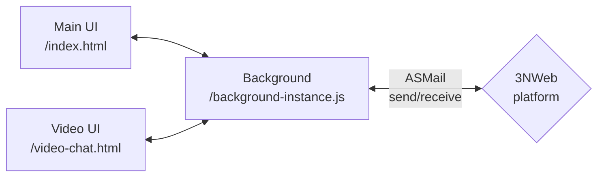

# Chat 3NWeb app

Chat app gives a chat-style communication.


## Overview



Chat app consists of following components:
- a background instance that continuously watching inbox, can raise notifications and control different gui components. This can be launched at system start.
- main window with list of chats and other *main* functionality in a controlling singleton. This is opened by user via main launcher.
- video chat windows, each implementing call within a given chat room. These windows are managed by background instance.

Vue3 framework is used for GUI components. Composition style API of Vue3 allows creating of code that is composable into tests app to run and test different scenarios.

More details are described in [this documentation](./doc/README.md).


## Usage

This uses code base `pnpm` and `deno`.

Initialize tooling with terminal command:
```bash
pnpm install --frozen-lockfile
```

Build Chat app's `app` folder with:
```bash
pnpm run build
```
`app` folder and `manifest.json` constitute runable 3NWeb app.

Building tests app creates respective `app` folder in `tests-app/build` folder:
```bash
pnpm run tests:build
```
Script will also download other app(s) into `tests-app/test-ext-apps` used by integrated tests.

Testing app needs a platform that will run in a test-stand mode:
```bash
pnpm run tests:run-on ./sample-path-to/platform-executable
```


## License

Code is provided here under GNU General Public License, version 3.
