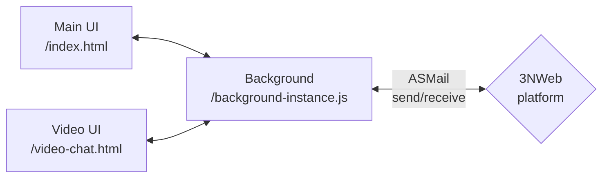

# Chat 3NWeb app

## App structure

Chat app consists of following components:
- a background instance that continuously watching inbox, can raise notifications and control different gui components. This can be launched at system start.
- main window with list of chats and other *main* functionality in a controlling singleton. This is opened by user via main launcher.
- video chat windows, each implementing call within a given chat room. These windows are managed by background instance.

Vue3 framework is used for GUI components.

