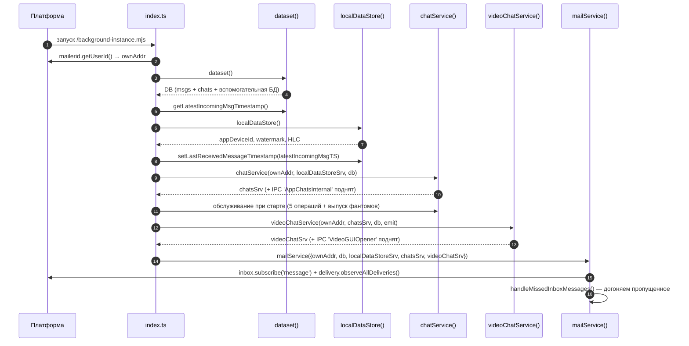
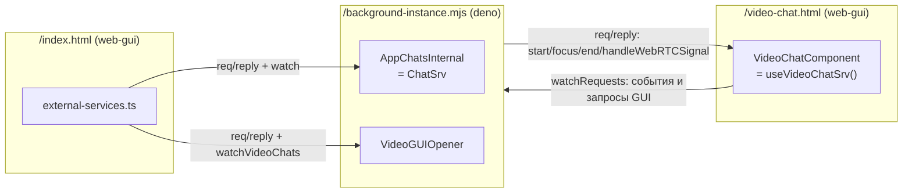

# 01. Компоненты, capabilities и IPC

[← к оглавлению](README.md)

## 1. Состав приложения по манифесту

Приложение объявляет пять компонентов ([manifest.json:8-253](../manifest.json#L8-L253)):

| Компонент | runtime | formFactor | Запускается | Роль |
|---|---|---|---|---|
| `/index.html` | `web-gui` | `desktop`, `tablet` | пользователем | основной GUI чата (десктоп) |
| `/index-mobile.html` | `web-gui` | `phone` | пользователем | основной GUI чата (телефон) |
| `/video-chat.html` | `web-gui` | `desktop`, `tablet` | как сервис `VideoChatComponent` | окно звонка (десктоп) |
| `/video-chat-mobile.html` | `web-gui` | `phone` | как сервис `VideoChatComponent` | окно звонка (телефон) |
| `/background-instance.mjs` | `deno` | — | при старте системы и по требованию | фоновый «бекенд» |

Оба окна звонка помечены `forOneConnectionOnly: true`
([manifest.json:166](../manifest.json#L166), [203](../manifest.json#L203)) — окно
обслуживает ровно одно подключение сервиса, то есть один звонок.

Фоновый инстанс дополнительно прописан в `launchOnSystemStartup`
([manifest.json:284-291](../manifest.json#L284-L291)), поэтому приём сообщений и уведомления
работают без открытого окна.

Кроме компонентов приложение объявляет один **выставленный ресурс ФС** —
`exposedFSResources.ice-servers` ([manifest.json:255-265](../manifest.json#L255-L265)): файл
`/constants/ice-servers.json` в local-хранилище приложения, который платформа инициализирует из
поставляемого [public/ice-servers.json](../public/ice-servers.json). Это конфигурация STUN/TURN
([05-video-calls.md §2.1](05-video-calls.md#21-конфигурация-stunturn)).

### 1.1 Ключевые capabilities

Что именно выдано каждому компоненту, определяет, кто на что имеет право:

| Capability | background | main GUI | video GUI |
|---|---|---|---|
| `mail.sendingTo` / `receivingFrom` | `all` ([231-235](../manifest.json#L231-L235)) | только `preflightsTo: all` ([18-20](../manifest.json#L18-L20)) | `all` ([146-149](../manifest.json#L146-L149)) |
| `mail.config` | `all` | — | — |
| `storage.appFS` | `default` ([248-250](../manifest.json#L248-L250)) | `default` + `sysFS: all` ([41-44](../manifest.json#L41-L44)) | — |
| `mediaDevices` | — | `microphones`/`cameras`/`speakers`: `use` | `all`, все пять ключей |
| `webrtc` | — | — | `all` |
| `shell.userNotifications` | ✔ ([240](../manifest.json#L240)) | ✔ ([24](../manifest.json#L24)) | — |
| `shell.startAppCmds.thisApp` | `incoming-call`, `open-chat-with` ([237-239](../manifest.json#L237-L239)) | — | — |
| `shell.fsResource` | `thisApp: ice-servers` + `ui-settings` лончера ([241-246](../manifest.json#L241-L246)) | `ui-settings` лончера ([25-29](../manifest.json#L25-L29)) | `ui-settings` лончера ([151-156](../manifest.json#L151-L156)) |
| `appRPC` (кого может вызывать) | `VideoChatComponent` ([228](../manifest.json#L228)) | `AppChatsInternal`, `VideoGUIOpener` ([45](../manifest.json#L45)) | — |
| `otherAppsRPC` | — | `contacts.app.privacysafe.io / AppContacts` ([46-51](../manifest.json#L46-L51)) | — |

Следствия, важные при чтении кода:

- **Основной GUI не может ни отправить, ни принять ASMail-сообщение.** Ему выдан только
  `preflightsTo` — проверка существования адреса. Поэтому любое действие пользователя идёт в Deno
  через IPC.
- **Окно звонка может отправлять ASMail самостоятельно** — этим пользуется сигналинг, когда
  DataChannel ещё не открыт ([05-video-calls.md](05-video-calls.md#3-сигналинг)).
- **`mediaDevices` есть и у основного GUI** — это перестало быть привилегией окна звонка, когда
  появилась запись голосовых и видео-сообщений прямо в чате
  ([06-ui-architecture.md §6](06-ui-architecture.md)). Три ключа со значением `use`, и каждое
  значение выбрано по коду платформы (`runner-in-electron/electron/session.ts`):
  `mediaPermissionFrom()` пропускает аудио и видео только при `'all'` или `'use'` — `'select'`
  доступа не даёт, — а `userMediaPermissionFrom()`, обслуживающий синхронную проверку разрешения,
  требует, чтобы были заданы **все три** ключа (`cameras && microphones && speakers`). `screens` и
  `windows` не запрашиваются: захват экрана окну чата не нужен, и без них `display-capture`
  отклоняется, а `setSelectDisplayMediaForCaptureHandler` вообще не появляется в capability.
- **Побочный эффект на macOS, о котором надо знать.** `setPermissionsInSession()` при **любом**
  `mediaDevices` на darwin спрашивает доступ к микрофону, к камере и, если запись экрана не
  разрешена, вызывает `ensureDeviceAllowsScreenCapture()` — а та **открывает System Settings**.
  Условие — `screen !== 'granted'`, то есть настройки открываются при каждом создании окна, пока
  запись экрана не разрешена, независимо от того, просило ли приложение `screens`/`windows`.
  Первые два запроса теперь уместны, третий — нет; правка на стороне платформы (обложить каждый
  вызов проверкой соответствующего под-капабилити) оформлена как заявка её владельцу.
- **`isAudioCaptureAvailable()` не является проверкой микрофона.** Платформа реализует её как
  `platform() === 'win32'`: это ответ про захват *системного* звука (loopback) вместе с экраном,
  как её и использует `src-video`. На macOS и Linux она всегда `false`, на Android
  `w3n.mediaDevices` отсутствует вовсе. Наличие устройств проверяется в
  [media-recording-support.ts](../src-main/common/utils/media-recording-support.ts) — через
  `MediaRecorder`, `navigator.permissions.query` и `enumerateDevices()`.
- **Конфигурацию STUN/TURN читает только фон.** Ресурс `ice-servers` выставлен для
  `/background-instance.mjs` и никому больше, а окно звонка получает готовую `RTCConfiguration` в
  `ChatInfoForCall` (§3.3). Поэтому креды TURN не лежат ни в одном GUI-бандле
  ([05-video-calls.md §2.1](05-video-calls.md#21-конфигурация-stunturn)).
- **Уведомления ОС** умеют показывать и фон, и основной GUI, но в коде это делает фон: новое
  сообщение ([msg-sending.ts:280-299](../src-deno/services/chat-service/utils/msg-sending.ts#L280-L299)),
  приглашение ([chat-creation.ts:107-123](../src-deno/services/chat-service/utils/chat-creation.ts#L107-L123)),
  завершение звонка хостом ([video-chat-service.ts:225-241](../src-deno/services/video-chat-service/video-chat-service.ts#L225-L241)).

## 2. Порядок старта фонового инстанса

[src-deno/index.ts:28-66](../src-deno/index.ts#L28-L66) — строгая последовательность; при любой
ошибке компонент закрывает себя (`w3n.closeSelf()`), а не продолжает работу в половинчатом
состоянии.

Обслуживающие операции при старте ([index.ts](../src-deno/index.ts)):

| Вызов | Что делает |
|---|---|
| `deleteExpiredMessages(now)` | удаляет сообщения с истёкшим `removeAfter` (авто-удаление) |
| `collectGarbageInAuxiliaryDB()` | чистит `orphaned_messages` старше 15 дней |
| `removeExpiredInboxMessages(now)` | реально удаляет из inbox то, что было отложено ≥15 дней назад |
| `resolveStuckSyncingSelfMessages()` | переводит «залипшие» `syncing_self` в `error` |
| `collectGarbageInSyncVersions(now)` | удаляет истёкшие tombstones |
| `db.flush()` | сбрасывает накопленное на диск: записи БД батчатся, поэтому все пять операций выше стоят одной записи на файл ([02-data-model.md](02-data-model.md#111-запись-файла-батчится)) |
| `releasePendingSyncPhantoms()` | отдаёт в доставку фантомы, которые прошлый запуск записал, но отправить не успел ([04-multi-device-sync.md §4.1](04-multi-device-sync.md#41-журнал-исходящих-фантомов)) |

Ещё раньше, до всего перечисленного, читается флаг диагностического логирования
([07-build-test-run.md §3.1](07-build-test-run.md#31-логирование-и-диагностический-режим)).

Важно: подписка на inbox поднимается **последней** — только после того, как БД и все сервисы готовы.
Пропущенное за время старта догоняется явным сканированием
([inbox-dispatcher.ts:108-151](../src-deno/services/mail-service/inbox-dispatcher.ts#L108-L151)).

### 2.1. Что старт о себе сообщает

Каждый шаг последовательности обёрнут в `startupStage()`
([src-deno/utils/startup-progress.ts](../src-deno/utils/startup-progress.ts)): строка о начале,
строка о завершении с длительностью и — **пока шаг не завершился** — повторяющееся предупреждение
каждые 10–30 с. Ничего не прерывается: медленный старт (открытие БД на synced-хранилище у свежего
пользователя) законен, а таймаут превратил бы медленный старт в сломанный.

Отдельно размечены шаги внутри открытия БД (`dataset/synced-fs`, `msgs-db/legacy-check-on-synced`,
`msgs-db/open-main`, `chats-db/open` и т. д.): они обращаются к synced-хранилищу и в инциденте
2026-09-10 были главным подозреваемым.

Первая строка пишется **до всего** — сразу после установки глобального обработчика ошибок, ещё до
чтения флага диагностики. До этого первым, что печатал запуск, была строка `app device id` уже
после открытия баз, поэтому старт, зависший на хранилище, выглядел неотличимо от компонента,
который вообще не запускали.

Тогда же поднимается сердцебиение
([component-heartbeat.ts](../src-deno/utils/component-heartbeat.ts)) — строка раз в 15 с, пока
компонент стартует, и раз в 60 с после: uptime, RSS/heap, число живых звонков, очередь фантомов,
состояние записи БД. Смысл — датировать молчаливую смерть компонента: до этого единственными
периодическими строками были «Holding N sync phantom(s)», которые пишутся только во время звонка с
удержанным журналом.

## 3. IPC-сервисы

Приложение поднимает три сервиса. Обёртки — `MultiConnectionIPCWrap` (сторона сервиса) и
`makeServiceCaller` (сторона клиента) из [shared-libs/ipc](../shared-libs/ipc).

### 3.1 `AppChatsInternal` (`ChatSrv`)

Реализация — [chat-service.ts](../src-deno/services/chat-service/chat-service.ts), публикация —
[ipc-expose.ts:24-66](../src-deno/services/chat-service/ipc-expose.ts#L24-L66), контракт —
[types/chat-srv.types.ts:62-194](../src-deno/types/chat-srv.types.ts#L62-L194).

Группы методов:

| Группа | Методы |
|---|---|
| Чаты | `createOneToOneChat`, `createGroupChat`, `acceptChatInvitation`, `getChatList`, `getChat`, `findChatEntry`, `renameChat`, `chatSetUp`, `deleteChat`, `updateGroupMembers`, `updateGroupAdmins` |
| Сообщения | `sendRegularMessage`, `cancelSendingMessage`, `getMessage`, `getMessagesByChat`, `getMessagesPageByChat`, `updateEarlySentMessage`, `changeMessageReaction`, `markMessageAsReadNotifyingSender`, `makeAndSaveMsgToDb`, `saveAndSyncLocalSystemMsg`, `deleteMessage(s)`, `deleteMessagesInChat` |
| Обслуживание | `deleteExpiredMessages`, `collectGarbageInAuxiliaryDB`, `removeExpiredInboxMessages`, `resolveStuckSyncingSelfMessages`, `collectGarbageInSyncVersions`, `releasePendingSyncPhantoms`, `countPendingSyncPhantoms` |
| Прочее | `getAppDeviceId`, `getRecentReactions`, `getIncomingMessage`, `checkAddressExistenceForASMail`, `sendSystemDeletableMessage`, `syncLocallyMadeSystemEvent`, `handleIncomingMsg`, `logFromGui` (см. §3.4), `ping` (см. ниже) |
| Observable | `watch(obs)` — поток `UpdateEvent` |

##### `ping()` — единственный метод мимо фасада

Все методы выше публикуются через `facadeOver`: он отвечает на рукопожатие мгновенно (у платформы
10 с от запроса сервиса до `exposeService()`, а построение сервиса открывает базы и в этот срок не
укладывается), но каждый вызов затем ждёт готовности реального сервиса. Из-за этого **успешное
подключение не значит ничего**: соединение так же успешно устанавливается с компонентом, который
перестал отвечать несколько часов назад, — ровно это произошло 2026-09-10, и окно показывало
бесконечный спиннер.

`ping(): Promise<ComponentStatus>` собирается отдельно и отвечает из состояния процесса
([startup-progress.ts](../src-deno/utils/startup-progress.ts)), не дожидаясь сервиса. Поэтому он —
единственный способ отличить «ещё открывает базы» от «уже не ответит». Тип `ChatSrvOverIPC` в
[chat-srv.types.ts](../src-deno/types/chat-srv.types.ts) выражает это разделение: `ping` —
свойство канала, а не сервиса.

Со стороны GUI на нём построен
[backend-availability.ts](../src-main/common/services/backend-availability.ts): вызов, не
вернувшийся за окно (~20 с), не отменяется, а сопровождается пингом — компонент отвечает «ещё
стартую» → GUI показывает стадию и ждёт дальше; не отвечает → отказ и экран с «Повторить».

Расхождение, которое стоит знать: `ipc-expose` публикует больше методов, чем перечисляет клиент в
[external-services.ts:43-79](../src-main/common/services/external-services.ts#L43-L79) (клиент не
использует `findChatEntry`, `resolveStuckSyncingSelfMessages`, `collectGarbageInSyncVersions`,
`getLatestIncomingMsgTimestamp`, `syncLocallyMadeSystemEvent`). Список у
клиента — это и есть его реальная поверхность API.

`handleIncomingMsg` публикуется ради спеков: устройство пропускает собственные фантомы по
`sourceDeviceId`, а второго устройства того же пользователя на стенде нет, поэтому иначе приёмную
сторону синхронизации не проверить вовсе
([07-build-test-run.md §5.1](07-build-test-run.md#51-состав-tests-app)).

#### События `UpdateEvent`

[types/services.types.ts](../types/services.types.ts). Эмитируются через `createChatEvents(ownAddr, data)`
([events.ts](../src-deno/services/chat-service/events.ts)), где `ObserversSet` рассылает событие всем
подписчикам.

| `updatedEntityType` | `event` | Полезная нагрузка |
|---|---|---|
| `chat` | `added` / `updated` | `ChatListItemView` (уже с `unread` и `lastMsg`) |
| `chat` | `removed` | `chatId` |
| `chat` | `messages-removed` | `chatId` (очищена история) + `chatSummary` |
| `chat` | `webRTCCall` | сообщение + `{sender, subType, chatId}` — отмена входящего/исходящего звонка |
| `message` | `added` / `updated` | `ChatMessageView` + `chatSummary` |
| `message` | `removed` / `removed-multiple` | id сообщения(ий) + `chatSummary` |
| `message` | `sending-progress` | `{id, progress}` от delivery-подсистемы |

Агрегаты чата (`unread`, `lastMsg`) — забота эмиттера, а не вызывающих. Записи чатов приходят из
таблиц без них (`getGroupChat()` / `getOTOChat()` читают строку как есть, заполняет агрегаты только
`findChat()`), поэтому `events.ts` досчитывает их сам — в одном месте, вместо ~45 call-site'ов
`emit.*`. Message-события и `messages-removed` несут те же значения в `chatSummary` (`ChatSummary`), так что GUI
не запрашивает их обратно через `getChat` на каждое сообщение. У `sending-progress` поля нет: прогресс
доставки не меняет ни счётчик, ни последнее сообщение.

Событие собирается лениво, внутри проверки `observers.isEmpty()`: при закрытом GUI получателей нет, и
ни message-view, ни SQL-запросы агрегатов не выполняются.

### 3.2 `VideoGUIOpener`

Реализация и публикация — [video-chat-service.ts:72-81](../src-deno/services/video-chat-service/video-chat-service.ts#L72-L81),
контракт — [types/services.types.ts:120-128](../types/services.types.ts#L120-L128).

| Метод | Назначение |
|---|---|
| `startVideoCallForChatRoom(chatId)` | начать звонок или переподключиться к активному |
| `endVideoCallInChatRoom(chatId)` | завершить звонок (закрыть окно) |
| `joinOrDismissCallInRoom(chatId, join, sender?)` | принять или отклонить входящий звонок |
| `getCallsState()` | снимок состояния всех звонков (`CallStateForGui[]`) |
| `watchVideoChats(obs)` | поток `VideoChatEvent` |

`getCallsState()` — способ догнать события, которых окно не слышало. Push-события остаются
основным путём, но их два раза оказалось недостаточно: окно, открытое посреди звонка, о звонке не
знало вовсе, а 2026-09-10 замолчавший компонент оставил кнопку End Call, которую нечему было
снять. Снимок берётся сразу после подписки в `useInitialize`, по клику End Call и раз в минуту
([05-video-calls.md §8](05-video-calls.md)).

`VideoChatEvent` ([types/services.types.ts:130-155](../types/services.types.ts#L130-L155)):
`gui-closed`, `gui-opened`, `call-started`, `call-ended`, `call-ended-by-host`,
`call-active` (+ `isCallActive`, + `reason: 'self-left'`). Как их обрабатывает UI — см.
[06-ui-architecture.md](06-ui-architecture.md#3-события-из-бекенда).

### 3.3 `VideoChatComponent`

Направление обратное: сервис реализует **окно звонка**, а вызывает его Deno.
Контракт — [types/services.types.ts:163-202](../types/services.types.ts#L163-L202), реализация —
[video-chat-srv.ts:124-328](../src-video/common/services/video-chat-service/video-chat-srv.ts#L124-L328),
клиентская обёртка на стороне Deno —
[video-component-instance.ts:21-58](../src-deno/services/video-chat-service/video-component-instance.ts#L21-L58).

| Метод (Deno → окно) | Назначение |
|---|---|
| `startVideoCallComponentForChat(chat)` | передать `ChatInfoForCall` и инициализировать стор |
| `focusWindow()` | вывести окно вперёд (сейчас no-op, окном управляет платформа) |
| `endCall()` | полный teardown: закрыть каналы, остановить треки, `closeSelf()` |
| `handleWebRTCSignal(peerAddr, msg)` | передать пришедший по ASMail сигнал в нужный канал |
| `notifyOfUndeliveredSignal(peerAddr, stage)` | платформа не доставила сигнал; для `'start'` окно отличает «не дозвонились» от «не ответили» |
| `notifyOfRejoiningPeer(peerAddr)` | пир объявил возвращение в звонок раньше своего offer |
| `watchRequests(obs)` | обратный поток `CallFromVideoGUI` |

**Два списка методов обязаны совпадать.** Окно выставляет их наружу списком
`VIDEO_WINDOW_IPC_METHODS` ([service-provider.ts](../src-video/common/services/service-provider.ts)),
Deno строит по своему списку `VIDEO_WINDOW_METHODS_CALLED_HERE`
([video-component-instance.ts](../src-deno/services/video-chat-service/video-component-instance.ts))
обёртку `makeServiceCaller`. Метод, забытый в первом списке, отвечает `Method … not found`;
забытый во втором — молча `undefined` в точке вызова. Так и вышло с
`notifyOfUndeliveredSignal` и `notifyOfRejoiningPeer`: реализованы в окне, названы у Deno, не
выставлены — обе мертвы с 12–13 августа до живого прогона 2026-08-16. Списки поэтому вынесены в
константы, а спека (`tests/gui-log-relay.ts`) их сверяет.

Обратный поток `CallFromVideoGUI` ([types/services.types.ts](../types/services.types.ts)):
`call-started-event`, `host-ended-call`, `peer-left-call`, `gui-log` — ровно те, что обрабатывает
[call.ts](../src-deno/services/video-chat-service/utils/call.ts). Типы `start-channel`,
`close-channel` и `send-webrtc-signal` остались от предыдущей (Mesh) схемы, никогда не отправлялись
и не обрабатывались — удалены вместе с остальным мёртвым кодом (P3-4).

### 3.4 Логи окон в выводе фонового инстанса

Части приложения пишут в три разных места: `w3n.log` фонового компонента виден в stdout стенда, а
`w3n.log` окна — только в консоли devtools **этого** окна. Окно звонка живёт ровно столько, сколько
звонок, так что его строки исчезают вместе с ним; файл лога платформы не помогает — там записи
только ядра. Поэтому строки окон зеркалятся в фоновый компонент, который печатает их у себя:

- общий логгер [shared-libs/logger.ts](../shared-libs/logger.ts) (`makeLogger(scope)`) отдаёт
  готовую строку в реле, установленное через `setLogRelay`; в Deno реле не ставится — оттуда и так
  всё видно, и петли не возникает;
- батчинг и предельный буфер — [shared-libs/log-relay.ts](../shared-libs/log-relay.ts): строки
  уходят пачками раз в 250 мс, буфер ограничен 200 строками, вытесненные считаются и о них
  сообщается отдельной строкой (провал в логе должен читаться как провал, а не как тишина);
- **главное окно** шлёт их методом `ChatSrv.logFromGui`, включает реле после подъёма сервисов
  ([gui-log-relay.ts](../src-main/common/services/gui-log-relay.ts));
- **окно звонка** исходящих RPC не открывает вовсе, поэтому пользуется единственным каналом наверх —
  observer'ом `watchRequests`, событием `gui-log`. Deno обрабатывает его **до** гарда по стадии
  звонка: самые нужные строки пишутся, когда звонок уже разваливается. Реле включается до подписки
  Deno, а строки до неё ждут в буфере; перед `complete()` буфер прокачивается принудительно.

Строка печатается как есть, с меткой `[GUI:main]` или `[GUI:video]`: время, адрес пользователя и
scope в ней уже стоят, и вторая отметка времени записала бы момент доставки пачки вместо момента
события. Отсюда требование: в GUI логировать **через `makeLogger`**, а не через `w3n.log` напрямую —
прямой вызов в реле не попадёт.

`ChatInfoForCall` ([types/services.types.ts](../types/services.types.ts)) — единственный «пакет
данных», который окно получает при открытии: `chatId`, `ownAddr`/`ownName`, список `peers`,
`chatName`, `rtcConfig`, `direction`, `hostAddr`, `callSessionId`, `participantCount`,
`isRejoiningActiveCall`. Собирается в
[video-chat-service.ts](../src-deno/services/video-chat-service/video-chat-service.ts)
(`chatInfoForNewCall()`). `callSessionId` окно не разбирает, а лишь штампует в каждый сигнал, который
отправляет по ASMail (см. [05-video-calls.md §3.1](05-video-calls.md)). `rtcConfig` — единственный
источник конфигурации STUN/TURN для окна: своей копии у него нет
([05-video-calls.md §2.1](05-video-calls.md#21-конфигурация-stunturn)).

## 4. Команды запуска

Приложение принимает две команды ([types/chat-commands.types.ts](../types/chat-commands.types.ts)):

| Команда | Кто отправляет | Аргумент | Обработка в GUI |
|---|---|---|---|
| `open-chat-with` | любое приложение (`otherApps: "*"`) и сам фон из уведомлений | `{peerAddress, chatId?}` | [useCommandHandler.ts:26-47](../src-main/common/composables/useCommandHandler.ts#L26-L47): переход в чат, либо предложение создать новый |
| `incoming-call` | только фоновый инстанс | `{peerAddress, chatId}` | [useCommandHandler.ts:49-51](../src-main/common/composables/useCommandHandler.ts#L49-L51): переход в чат с `?call=yes` |

Фон запускает команду при входящем звонке
([video-chat-service.ts:557-572](../src-deno/services/video-chat-service/video-chat-service.ts#L557-L572)),
за счёт чего окно чата открывается и показывает звонок, даже если GUI был закрыт.

Подписка на команды — [useCommandHandler.ts](../src-main/common/composables/useCommandHandler.ts)
(`watchStartCmds` + однократный `getStartedCmd` для случая «приложение подняли этой командой»).

**Доставка команды в уже запущенное окно ничем не гарантирована.** На стороне платформы это
observable **без реплея**, а `handle()` возвращается синхронно: команда, пришедшая до того, как
композабл подписался (окно ещё внутри `initializeServices()` / инициализации сторов), пропадает, и
`getStartedCmd()` её не подберёт — оно отдаёт лишь ту команду, которой окно **подняли**. Вызывающая
сторона об этом не узнаёт: `startAppWithParams` резолвится в любом случае, поэтому строка бэкенда
`Incoming-call UI requested` доставку **не** доказывает. Именно так входящий звонок 2026-08-15
зазвонил на одном устройстве пользователя и не зазвонил на другом.

Поэтому `process()` пишет строку уровня `info` о каждой полученной команде **до** маршрутизации:
она отделяет «команда до окна не дошла» от «дошла и потерялась дальше», а без неё обе ситуации
выглядят одинаково — то есть никак. По той же причине отказ `process()` теперь ловится в `next:`:
раньше он становился unhandled rejection и не попадал в лог вовсе.

## 5. Внешняя зависимость: контакты

Основной GUI обращается к приложению контактов за именами и аватарами:
[external-services.ts:32-41](../src-main/common/services/external-services.ts#L32-L41),
контракт — [types/contact.types.ts:18-36](../types/contact.types.ts#L18-L36).
Если контактов нет, отображаемое имя выводится из адреса — например
[video-chat-service.ts:398-400](../src-deno/services/video-chat-service/video-chat-service.ts#L398-L400)
и `getContactName()` в [use-in-calls.ts:112-119](../src-video/common/composables/use-in-calls.ts#L112-L119).

---

Далее: [02-data-model.md](02-data-model.md) — что и как хранится.
