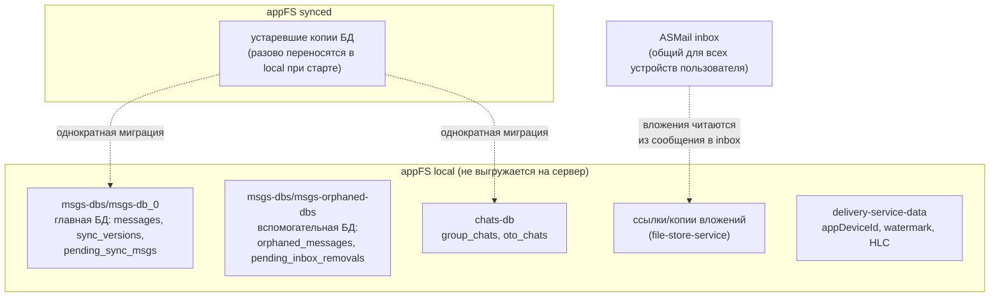
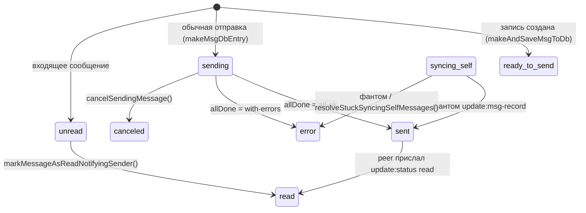
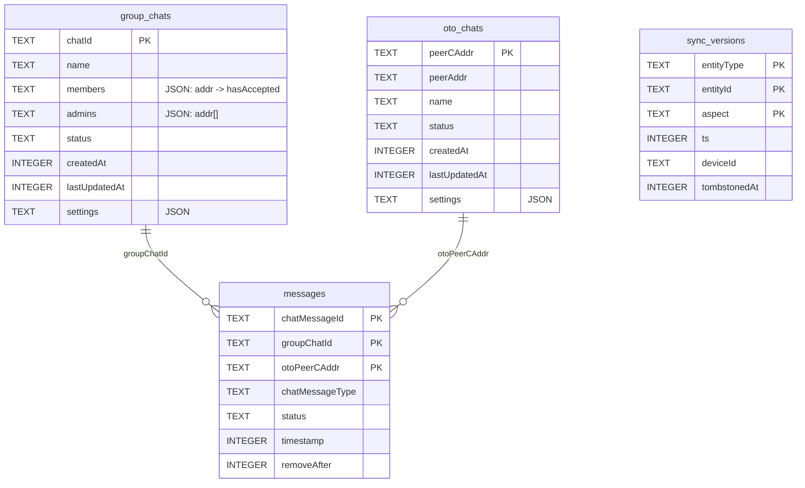
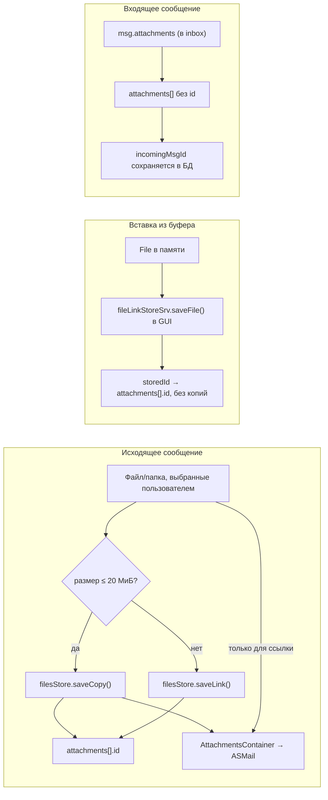

# 02. Модель данных и хранилища

[← к оглавлению](README.md)

Все данные принадлежат фоновому инстансу. GUI хранит только производные view-модели в памяти
(см. [06-ui-architecture.md](06-ui-architecture.md)).

## 1. Три хранилища

Имена файлов — [shared-libs/constants/db.ts:18-34](../shared-libs/constants/db.ts#L18-L34).

### 1.1 Почему БД лежат в local FS

Создание БД: [dataset/index.ts:21-27](../src-deno/dataset/index.ts#L21-L27) — берутся обе ФС
(`getAppSyncedFS()` и `getAppLocalFS()`), но рабочие файлы открываются в **local**:

- главная БД сообщений — [msgs-db.ts:215-225](../src-deno/dataset/msgs-db.ts#L215-L225);
- БД чатов — [chats-db.ts:104-114](../src-deno/dataset/chats-db.ts#L104-L114).

Если файл ещё лежит в synced FS (сборка предыдущих версий), он **однократно переносится** в local и
удаляется из synced. Записи идут с `skipUpload: true` — выгрузка на сервер намеренно отключена.
(Фактически флаг ни на что не влияет: он учитывается только в `SQLiteOnSyncedFS`, а файлы в local FS
открываются как `SQLiteOnLocalFS`, который `saveToFile` не переопределяет.)

Следствие: **БД не синхронизируется платформой между устройствами**. Согласованность обеспечивает
слой фантомных сообщений ([04-multi-device-sync.md](04-multi-device-sync.md)).

### 1.1.1 Запись файла батчится

`SQLiteOn3NStorage.saveToFile()` сериализует **всю** базу (`database.export()`) и переписывает файл
целиком, а внутренняя очередь библиотеки выполняет такие вызовы подряд, не схлопывая их. Поэтому
мутации не пишут файл сами, а помечают базу «грязной»
([db-writer.ts](../src-deno/dataset/db-writer.ts)); физическая запись происходит один раз на пачку —
не позже `DB_FLUSH_DELAY_MS` (250 мс) либо по достижении `DB_FLUSH_MAX_PENDING` (64) отложенных
мутаций ([constants/db.ts](../shared-libs/constants/db.ts)).

На чтения это не влияет: все `SELECT` идут к базе sql.js в памяти, файл — только персистентный
снапшот. Поэтому «прочитать сразу после записи» (`updateMessageRecord`, `updateMessageStatus`,
`addGroupChat` и т. п.) работает как раньше.

Плата — durability, и она возвращается явными вызовами `DB.flush()` в четырёх точках, где изменение
становится наблюдаемым снаружи устройства:

| Где | Зачем |
|---|---|
| `addMessageToDeliveryList()` перед `delivery.addMsg` ([sending-primitives.ts](../src-deno/services/mail-sending-service/sending-primitives.ts)) | всё исходящее: фантом не должен уйти раньше, чем его локальное изменение на диске (токен версии уже израсходован), а сообщение — раньше, чем оно сохранено |
| `processQueuedChatMsg()` / `processQueuedWebRTCMsg()` ([inbox-dispatcher.ts](../src-deno/services/mail-service/inbox-dispatcher.ts)) | согласованность с watermark inbox (см. [03-message-flows.md](03-message-flows.md#2-приём-от-inbox-до-события-в-ui)) |
| конец стартового обслуживания ([index.ts](../src-deno/index.ts)) | пять операций обслуживания дают одну запись на файл |

Вызов в слое отправки идёт через маленький хук [db-flush.ts](../src-deno/dataset/db-flush.ts):
`sending-primitives.ts` — набор голых функций без фабрики, а протаскивать колбэк через 13
вызывающих модулей ради одной строки незачем; поэтому реализацию публикует сам слой БД
(`dataset()` регистрирует её при открытии баз), а слой отправки только вызывает `flushDb()`.

Замер эффекта — `pnpm bench:db` ([07-build-test-run.md](07-build-test-run.md#6-замер-записи-бд)).

### 1.2 Версии схем

Отдельного слоя миграций нет — существующая база доводится до текущей схемы прямо при открытии.
Версия схемы хранится в расширенном атрибуте файла (`DATASET_META_ATTR = 'chat-dataset'`), но
источником истины не является: перенос файла из synced FS в local FS копирует только байты, и
xattr теряется. Поэтому все решения — и «создавать таблицы или нет», и «мигрировать или нет» —
принимаются по `PRAGMA table_info(...)` / `sqlite_master`; xattr после изменений лишь
записывается как диагностический след:

| БД | Проверка | Версия в xattr |
|---|---|---|
| `messages` | `getSqliteDb` в [msgs-db.ts](../src-deno/dataset/msgs-db.ts) | `{datasetVersion: 2, db: 'msgs'}` |
| `orphaned_messages` | там же | `{datasetVersion: 3, db: 'msgs-orphaned'}` |
| `pending_inbox_removals` | там же | (версии нет, только наличие таблицы) |
| `sync_versions` | там же | (версии нет) |
| `pending_sync_msgs` | там же | (версии нет) |
| `group_chats` / `oto_chats` | `getSqliteDb` в [chats-db.ts](../src-deno/dataset/chats-db.ts) | `{datasetVersion: 3, db: 'chats'}` |

Фиксапы при открытии, все устроены так, что не могут испортить данные:

- **колонки `removeAfter`/`settings` в `messages` и `settings` в обеих таблицах чатов**
  (`migrateLegacyMsgsTable` в [msgs-db.ts](../src-deno/dataset/msgs-db.ts),
  `addLegacyChatSettingsColumns` в [chats-db.ts](../src-deno/dataset/chats-db.ts)): базы,
  созданные приложением ≤0.10.x, этих колонок не имеют — их добавляла только ветка `2.1` старого
  диспетчера версий (удалён в 0.11.0), срабатывавшая к тому же лишь со второго запуска 0.10.x.
  `ALTER TABLE ... ADD COLUMN` повторяют тот мигратор дословно (nullable `removeAfter DEFAULT 0`),
  чтобы в проде оставались две формы схемы, а не три; `DEFAULT '{"autoDeleteMessages":"0"}'` у
  чатов обязателен — строка с `NULL settings` роняет отправку сообщения. `ADD COLUMN` с
  константным `DEFAULT` строк не переписывает. Заодно досоздаются индексы `*_lifetime`
  (`CREATE INDEX IF NOT EXISTS`) — старый мигратор их не создавал;
- таблица `orphaned_messages` версии 2 гарантированно была пустой (её `INSERT` всегда падал),
  поэтому при `datasetVersion !== 3` она просто пересоздаётся (здесь xattr использовать можно:
  худший исход его потери — пересоздание заведомо пустой таблицы);
- в БД чатов версии 2 были `UNIQUE INDEX` на `name` (см. §4); при старте они удаляются
  ([chats-db.ts:61-93](../src-deno/dataset/chats-db.ts#L61-L93)). Условие — наличие самого индекса
  в `sqlite_master`: `DROP INDEX` не трогает строк и не может упасть на существующих данных.

Датасеты v0/v1 (до появления таблиц текущей формы) не поддерживаются осознанно: у всех живых
старых профилей чаты открываются, т.е. v2-таблицы присутствуют.

## 2. Главная БД: `messages`, `sync_versions`, `pending_sync_msgs`

### 2.1 Таблица `messages`

DDL — [msgs-db.ts:53-110](../src-deno/dataset/msgs-db.ts#L53-L110), TS-тип `MsgDbEntry` —
[msgs-db.types.ts:26-42](../src-deno/types/msgs-db.types.ts#L26-L42), преобразования значений —
[dataset/utils.ts:158-176](../src-deno/dataset/utils.ts#L158-L176).

| Колонка | Тип | Смысл |
|---|---|---|
| `groupChatId` | TEXT | id группового чата или `''` для 1-1 |
| `otoPeerCAddr` | TEXT | канонический адрес собеседника или `''` для группового |
| `chatMessageId` | TEXT NOT NULL | id, сгенерированный отправителем; уникален внутри чата |
| `isIncomingMsg` | INTEGER NOT NULL | 0/1 |
| `incomingMsgId` | TEXT | id сообщения в inbox — заполняется **только когда в inbox остались байты** (вложения) |
| `groupSender` | TEXT | автор в групповом чате |
| `body` | TEXT | текст для `regular`; JSON для `system` и `invitation` |
| `attachments` | TEXT (JSON) | `ChatMessageAttachmentsInfo[]` |
| `chatMessageType` | TEXT NOT NULL | `regular` / `system` / `invitation` |
| `relatedMessage` | TEXT (JSON) | ответ/пересылка |
| `status` | TEXT | статус сообщения (см. §2.2) |
| `timestamp` | INTEGER NOT NULL | время сообщения |
| `removeAfter` | INTEGER NOT NULL | момент авто-удаления; `0` — не удалять |
| `history` | TEXT (JSON) | изменения текста/реакций/ошибки доставки |
| `reactions` | TEXT (JSON) | `Record<адрес, ChatMessageReaction>` |
| `settings` | TEXT (JSON) | `ChatSettings`; для сообщений здесь лежит `msgOwnersDeviceId` |

**PRIMARY KEY (`chatMessageId`, `groupChatId`, `otoPeerCAddr`)**. Поскольку поля первичного ключа не
могут быть NULL, отсутствующие значения пишутся как пустая строка
(`optStringAsEmptyTransform`, [for-sqlite.ts](../src-deno/utils/for-sqlite.ts)) — иначе сравнение
на равенство в SQL не работало бы (`NULL <> NULL`). Это же преобразование продублировано для
`orphaned_messages` ([utils.ts:178-187](../src-deno/dataset/utils.ts#L178-L187)).

Индексы (8 штук, [msgs-db.ts:75-109](../src-deno/dataset/msgs-db.ts#L75-L109)) покрывают три
типовых запроса: лента чата по времени, выборка на авто-удаление, подсчёт непрочитанных по статусу.
Постраничное чтение ленты (`getMessagesPageInChat`) обслуживают те же `grchat_id_msg_ts` и
`oto_peer_msg_ts`: выборка идёт `ORDER BY timestamp DESC, chatMessageId DESC LIMIT`, а курсор страницы —
**пара** `(timestamp, chatMessageId)`. Пара, а не один `timestamp`, потому что `timestamp` берётся из
`Date.now()` и не уникален: сообщение, разделившее миллисекунду с тем, что оказалось на границе
страницы, при сравнении только по времени выпало бы из выдачи.

Важная деталь: `chatMessageType` в БД **не** включает `webrtc-call` и `synchronization` — эти типы
никогда не сохраняются, они обрабатываются на лету
(см. [03-message-flows.md](03-message-flows.md#1-форматы-сообщений)).

### 2.2 Статусы сообщения

Тип — [types/chat.types.ts:187-198](../types/chat.types.ts#L187-L198).

- `syncing_self` — статус записи **на других устройствах того же пользователя**: они не участвуют в
  отправке и не могут на неё влиять ([_msgs-related-methods.ts:400-411](../src-deno/services/chat-service/utils/_msgs-related-methods.ts#L400-L411)).
- Терминальные статусы: `sent`, `error`, `canceled`, `read`, `unread`
  ([_msgs-related-methods.ts:411](../src-deno/services/chat-service/utils/_msgs-related-methods.ts#L411)).
  Из терминального состояния фантом не может вернуть сообщение в `syncing_self`
  ([handle-incoming-sync.ts:335-353](../src-deno/services/chat-service/utils/handle-incoming-sync.ts#L335-L353)).

### 2.3 Таблица `sync_versions`

DDL и обоснование — [msgs-db.ts:141-166](../src-deno/dataset/msgs-db.ts#L141-L166).

| Колонка | Смысл |
|---|---|
| `entityType` | `chat` \| `msg` |
| `entityId` | `g/<chatId>` / `s/<peerCAddr>` для чата, `<chatKey>/<chatMessageId>` для сообщения ([sync-versions.ts:51-57](../src-deno/services/chat-service/utils/sync-versions.ts#L51-L57)) |
| `aspect` | `name`, `settings`, `members`, `admins`, `status`, `body`, `reactions`, `deleted`, `historyCleared` ([msgs-db.types.ts:71-88](../src-deno/types/msgs-db.types.ts#L71-L88)) |
| `ts`, `deviceId` | токен упорядочивания (гибридные логические часы + id устройства) |
| `tombstonedAt` | заполняется только у «надгробий» (`deleted`, `historyCleared`) |

PK — `(entityType, entityId, aspect)`. Почему версии живут отдельной таблицей, а не внутри
`settings`: настройки чата сами являются синхронизируемым аспектом и переписываются целиком при
получении фантома `update:settings`, поэтому версии внутри них затирались бы и утекали в фантомы
([msgs-db.ts:143-155](../src-deno/dataset/msgs-db.ts#L143-L155)).

Таблица живёт в **главной** БД, а не во вспомогательной: версия должна существовать столько же,
сколько сущность, тогда как вспомогательная БД чистится по возрасту. По возрасту здесь удаляются
только надгробия ([msgs-db.ts:1059-1071](../src-deno/dataset/msgs-db.ts#L1059-L1071)).

Правило `deleteSyncVersionsOf()` намеренно **не** удаляет строки с `tombstonedAt`
([msgs-db.ts:933-941](../src-deno/dataset/msgs-db.ts#L933-L941)): смысл надгробия — переживать
сущность и не давать позднему фантому её воскресить.

### 2.4 Таблица `pending_sync_msgs` — журнал исходящих фантомов

DDL и обоснование — [msgs-db.ts:170-200](../src-deno/dataset/msgs-db.ts#L170-L200), тип
`PendingSyncMsgEntry` — [msgs-db.types.ts](../src-deno/types/msgs-db.types.ts).

| Колонка | Смысл |
|---|---|
| `id` | автоинкремент; вместе с `ts` задаёт порядок выпуска |
| `entityType`, `entityId`, `aspect` | что описывает фантом; `aspect` — либо аспект из `sync_versions`, либо `record` для фантома, несущего саму сущность (запись сообщения, приглашение) |
| `ts` | штамп изменения (тот же, что записан в `sync_versions`) |
| `payload` | тело фантома (`ChatSyncMsgV1`) в JSON — достаточно, чтобы отдать его в доставку как есть |
| `attempts` | неудачные попытки — как постановки в доставку, так и самой доставки; только для диагностики |

Зачем таблица нужна. Токен упорядочивания изменения тратится в момент, когда изменение применено:
если фантом после этого потерян (компонент закрыт, доставка недоступна), повторной отправки нет —
и другие устройства пользователя **никогда** не узнают об изменении. Поэтому намерение отправить
записывается вместе с изменением, а сама отправка — отдельный проход, снимающий строку после того,
как доставка **подтвердила** отправку сообщения.

Атомарность обеспечивается тем, что запись журнала и версии пишутся **одной** операцией
`queueSyncPhantom()` ([msgs-db.ts:985-1002](../src-deno/dataset/msgs-db.ts#L985-L1002)) — без `await`
между ними, в один и тот же файл БД, так что ни одна запись файла не может застать потраченный токен
без его фантома. Таблица живёт в главной БД именно поэтому.

Повторная отправка фантома, который на самом деле успел уйти до сбоя, безвредна: входящий фантом с
уже применённым токеном проигрывает сохранённому (`isNewerToken()` даёт `false` на равном токене) и
пропускается. Это и позволяет снимать строку **после** доставки, а не до, и делает безопасным любой
путь восстановления.

Строка уходит из журнала тремя путями: **доставка подтверждена**, вытеснена или устарела. Первый —
именно подтверждение, а не постановка в очередь: `delivery.addMsg()` лишь принимает сообщение к
отправке, и строка, снятая в этот момент, не оставляла ничего, из чего повторить отказавшую доставку
(механика и два бакстопа —
[04-multi-device-sync.md §4.1](04-multi-device-sync.md#41-журнал-исходящих-фантомов)).
**Вытеснение** —
схлопывание перед выпуском: из нескольких строк с одним `(entityType, entityId, aspect)` едет только
строка с наибольшим `ts`, остальные снимаются неотправленными, поскольку получатель применил бы всё
равно только последнюю. Аспект `record` и надгробия из схлопывания исключены — почему именно, см.
[04-multi-device-sync.md §4.1](04-multi-device-sync.md#41-журнал-исходящих-фантомов). За неудачу строку
не отбрасывают ни на постановке (доставка не принимает сообщение, когда недоступен сервер), ни на
самой доставке (сервер отвечает отказом): выбросить фантом в этот момент значило бы потерять ровно то
изменение, ради которого журнал и заведён — строка остаётся, `attempts += 1`, и её подберёт проход
повтора. Устаревание —
`dropExpiredSyncPhantoms()`, по тому же окну в 15 дней, что и остальная сборка мусора: устройство,
пробывшее офлайн дольше, всё равно не сможет объявить изменение осмысленно (у принимающих устройств
за это время истекают надгробия и буфер), а заодно это не даёт заведомо непригодному телу навсегда
занять голову очереди.

Механика выпуска описана в
[04-multi-device-sync.md §4.1](04-multi-device-sync.md#41-журнал-исходящих-фантомов).

## 3. Вспомогательная БД

### 3.1 `orphaned_messages`

DDL — [msgs-db.ts:112-134](../src-deno/dataset/msgs-db.ts#L112-L134), тип
`OrphanedMsgDbEntry` — [msgs-db.types.ts:52-60](../src-deno/types/msgs-db.types.ts#L52-L60).

Буфер для фантомов, пришедших раньше того, к чему они относятся:

| Колонка | Смысл |
|---|---|
| `targetMessageId` | id сообщения, которого ещё нет; `NULL` — ждём появления самого чата |
| `groupChatId` / `otoPeerCAddr` | адресация чата (та же нормализация в `''`) |
| `rawPayload` | полное тело фантома (JSON) для повторной обработки |
| `bufferedAt` | время буферизации; по нему идёт сборка мусора (15 дней) |

Дренаж буфера: по появлении сообщения —
[handle-incoming-sync.ts:814-837](../src-deno/services/chat-service/utils/handle-incoming-sync.ts#L814-L837),
по появлении чата —
[handle-incoming-sync.ts:843-869](../src-deno/services/chat-service/utils/handle-incoming-sync.ts#L843-L869).
Перед применением записи сортируются **по времени изменения** (`rawPayload.timestamp`), а не по
времени буферизации ([handle-incoming-sync.ts:175-181](../src-deno/services/chat-service/utils/handle-incoming-sync.ts#L175-L181)).

### 3.2 `pending_inbox_removals`

DDL — [msgs-db.ts:136-141](../src-deno/dataset/msgs-db.ts#L136-L141), API —
[msgs-db.ts:842-882](../src-deno/dataset/msgs-db.ts#L842-L882).

Inbox — общий на всех устройствах пользователя. Если устройство удалит сообщение сразу после
обработки, остальные устройства его никогда не увидят. Поэтому обработанное сообщение
регистрируется здесь с `removeAfter = Date.now() + 15 дней`, а физическое удаление делает
`removeExpiredInboxMessages()` при старте
([msg-deletion.ts:205-213](../src-deno/services/chat-service/utils/msg-deletion.ts#L205-L213)).

Сразу из inbox удаляются только сообщения, которые **не** попадают в БД или заведомо непригодны:
не прошли проверку тела, относятся к неизвестному чату, отправитель не участник группы, неизвестный
тип ([chat-service.ts:185-257](../src-deno/services/chat-service/chat-service.ts#L185-L257)), а
также служебные WebRTC-сигналы ([05-video-calls.md](./05-video-calls.md)).

## 4. БД чатов

DDL — [chats-db.ts:35-59](../src-deno/dataset/chats-db.ts#L35-L59), типы —
[chat-db.types.ts:21-56](../src-deno/types/chat-db.types.ts#L21-L56).

Особенности:

- **Идентификатор чата** (`ChatIdObj`, [types/asmail-msgs.types.ts:472-482](../types/asmail-msgs.types.ts#L472-L482)):
  у группового — случайная строка, у 1-1 — канонический адрес собеседника. Отсюда постоянная пара
  полей `groupChatId`/`otoPeerCAddr` во всех запросах.
- **Имя чата не уникально.** Два групповых чата с одним именем — и даже с одним составом
  участников — нормальная ситуация; чат 1-1 уникален по собеседнику, а не по имени, под которым
  показан (`peerCAddr` — PK), причём имя ему даёт запись контакта, а одноимённых контактов бывает
  двое. До версии 3 схемы на `name` в обеих таблицах стоял `UNIQUE INDEX`, из-за чего приглашение с
  уже занятым именем падало на стороне получателя и чат не создавался вовсе; индексы сняты, а
  различение одноимённых чатов делает UI
  ([06-ui-architecture.md §4.1](06-ui-architecture.md#41-имена-чатов-в-списках)).
- **Get-or-create семантика**: при нарушении уникальности PK возвращается существующая запись
  ([chats-db.ts:239-248](../src-deno/dataset/chats-db.ts#L239-L248)).
- **`findChat()` — не чистое чтение строки**: он дополняет запись полями `lastMsg` и `unread`,
  выполняя два дополнительных запроса к БД сообщений
  ([chats-db.ts:188-196](../src-deno/dataset/chats-db.ts#L188-L196)). То же делает `getChatList()`
  для каждого чата ([chats-db.ts:352-370](../src-deno/dataset/chats-db.ts#L352-L370)) и эмиттер
  событий для тех записей, что пришли из таблиц без агрегатов
  ([events.ts](../src-deno/services/chat-service/events.ts)). Остальные пути — `getGroupChat()`,
  `getOTOChat()`, `update*ChatRecord()` — возвращают строку как есть, без этих полей.
- **Статусы чата** ([types/chat.types.ts:71](../types/chat.types.ts#L71),
  [80](../types/chat.types.ts#L80)): 1-1 — `initiated | on | invited | accepted | no-members`;
  группа — те же плюс `partially-on`. От статуса зависит, принимаются ли обычные сообщения
  ([_msgs-related-methods.ts:271-280](../src-deno/services/chat-service/utils/_msgs-related-methods.ts#L271-L280)).
- **Удаление чата** каскадно удаляет его сообщения
  ([chats-db.ts:398-406](../src-deno/dataset/chats-db.ts#L398-L406)).

### 4.1 `ChatSettings`

[chat-db.types.ts:21-25](../src-deno/types/chat-db.types.ts#L21-L25) — открытый словарь; в коде
используются два поля:

| Поле | Где живёт | Смысл |
|---|---|---|
| `autoDeleteMessages` | настройки чата | id интервала авто-удаления (`'0'` — выключено), таблица значений — [shared-libs/constants/chat-settings.ts](../shared-libs/constants/chat-settings.ts); превращается в `removeAfter` сообщения |
| `msgOwnersDeviceId` | настройки **сообщения** | id устройства, на котором запись создана; проставляется только записям, пришедшим фантомом ([handle-incoming-sync.ts:375](../src-deno/services/chat-service/utils/handle-incoming-sync.ts#L375)) |

`msgOwnersDeviceId` определяет два поведения: UI отличает «своё» сообщение от синхронизированной
копии ([useChatMessages.ts:129-142](../src-main/common/components/messages/chat-messages/useChatMessages.ts#L129-L142)),
а при удалении не трогаются вложения, чьи id принадлежат другому устройству
([msg-deletion.ts:76-92](../src-deno/services/chat-service/utils/msg-deletion.ts#L76-L92)).

## 5. Вложения

Два независимых источника байтов:

- Исходящие: [msg-sending.ts:63-174](../src-deno/services/chat-service/utils/msg-sending.ts#L63-L174)
  — на каждое вложение создаётся запись в `file-store-service`, её id попадает в
  `attachments[].id`. Какая именно запись, решает размер
  ([attachment-limits.ts](../shared-libs/constants/attachment-limits.ts)):
  - до `ATTACHMENT_COPY_THRESHOLD` (20 МиБ) — копия, и в ASMail уходит **копия**, а не файл
    пользователя. Это то, ради чего копия и делается: своё отправленное сообщение остаётся
    читаемым после того, как пользователь переместил или удалил оригинал, а доставка, которая
    читает вложения лениво и много позже постановки в очередь, читает копию;
  - больше порога — симлинк, и в ASMail уходит исходная сущность: дублировать большой файл дороже
    риска, который это снимает. Такое вложение живо ровно настолько, насколько жив файл
    пользователя;
  - у папки размер считается обходом, который прекращается на пороге
    ([folder-size.ts](../shared-libs/folder-size.ts)), поэтому обход никогда не стоит дороже
    порога; у прервавшегося обхода размер в записи — 0, как было всегда;
  - `MAX_ATTACHMENT_SIZE` (200 МиБ) — верхний предел, проверяется в GUI при выборе файла, тем же
    числом поднимается лимит анонимных отправителей на своём сервере
    ([index.ts](../src-deno/index.ts));
  - вставленный из буфера файл GUI обязан записать в хранилище ещё до отправки, поэтому он
    приходит с уже готовым `storedId`, и ни копии, ни ссылки для него не делается — его байты
    лежат ровно один раз. Пока сообщение не отправлено, эта запись принадлежит композеру и
    удаляется им ([useChatView.ts](../src-main/common/composables/useChatView.ts));
  - если ни копия, ни ссылка не удались, вложение записывается **без** `id`: получателю файл
    уходит как обычно, а у отправителя честно нет локального id вместо ссылки в пустоту.
- Повторная отправка (`resendMsg`) вложений не передаёт: запись сообщения уже существует, и
  контейнер собирается из её id (`containerOfStoredAttachments`). Иначе каждая попытка оставляла бы
  в хранилище ещё по одной записи на файл.
- Входящие: [msg-sending.ts:105-130](../src-deno/services/chat-service/utils/msg-sending.ts#L105-L130)
  — байты остаются в inbox, поэтому сообщение с вложениями **не** удаляется из inbox сразу, а
  `incomingMsgId` сохраняется в записи
  ([msg-sending.ts:239](../src-deno/services/chat-service/utils/msg-sending.ts#L239),
  [261](../src-deno/services/chat-service/utils/msg-sending.ts#L261)).
- В фантоме id вложений **вырезается** и ставится метка `hasNoLocalSource` + `originDeviceId`: чужой
  id бессмысленен на другом устройстве
  ([_msgs-related-methods.ts](../src-deno/services/chat-service/utils/_msgs-related-methods.ts)).
  Поэтому на других устройствах вложение отображается, но не скачивается локально.
- Сообщение **без** файлов не несёт поля `attachments` вовсе, и приёмная сторона нормализует в `null`
  пустой массив, который присылают фантомы прежних сборок
  ([handle-incoming-sync.ts](../src-deno/services/chat-service/utils/handle-incoming-sync.ts)).
  Различие не косметическое: пустой массив истинен, доезжает до колонки как строка `"[]"`, а не
  `NULL`, и в UI читается как «файлы есть, просто не на этом устройстве» — подпись про файлы под
  сообщением, у которого файлов нет.
- Чтение вложений в UI — [messages.store.ts:191-217](../src-main/common/store/messages.store.ts#L191-L217):
  для входящих через `getIncomingMessage(incomingMsgId)`, для исходящих через `fileLinkStoreSrv.getFile(id)`.

## 6. Локальное состояние устройства

Файл `DELIVERY_SERVICE_DATA_FILE_NAME` в local FS,
[local-data-store.ts:22-121](../src-deno/services/local-data-store/local-data-store.ts#L22-L121):

| Поле | Смысл |
|---|---|
| `appDeviceId` | `<formFactor>-<random20>`, создаётся один раз при первом запуске ([local-data-store.ts:33-38](../src-deno/services/local-data-store/local-data-store.ts#L33-L38)) |
| `lastReceivedMessageTimestamp` | watermark inbox: с какого момента сканировать при старте |
| `lastSyncClockTs` | состояние гибридных логических часов ([04-multi-device-sync.md](./04-multi-device-sync.md#2-гибридные-логические-часы)) |

Запись — через `SingleProc` с флагом «нужно сохранить», то есть подряд идущие изменения
сливаются в одну запись файла
([local-data-store.ts:59-67](../src-deno/services/local-data-store/local-data-store.ts#L59-L67)).

## 7. Как это выглядит для UI

Записи БД не отдаются в GUI напрямую. Конвертация:

| Из | В | Функция |
|---|---|---|
| `MsgDbEntry` | `ChatMessageView` (`regular` \| `system` \| `invitation`) | [_msgs-related-methods.ts:127-218](../src-deno/services/chat-service/utils/_msgs-related-methods.ts#L127-L218) |
| `ChatDbEntry` | `ChatListItemView` (+ `unread`, `lastMsg`) | [_chats-related-methods.ts](../src-deno/services/chat-service/utils/_chats-related-methods.ts) |

При конвертации `body` разбирается из JSON для системных сообщений и приглашений; при ошибке разбора
подставляется пустой объект, а не выбрасывается исключение
([_msgs-related-methods.ts:178-217](../src-deno/services/chat-service/utils/_msgs-related-methods.ts#L178-L217)).

---

Далее: [03-message-flows.md](./03-message-flows.md) — как сообщения проходят через систему.
