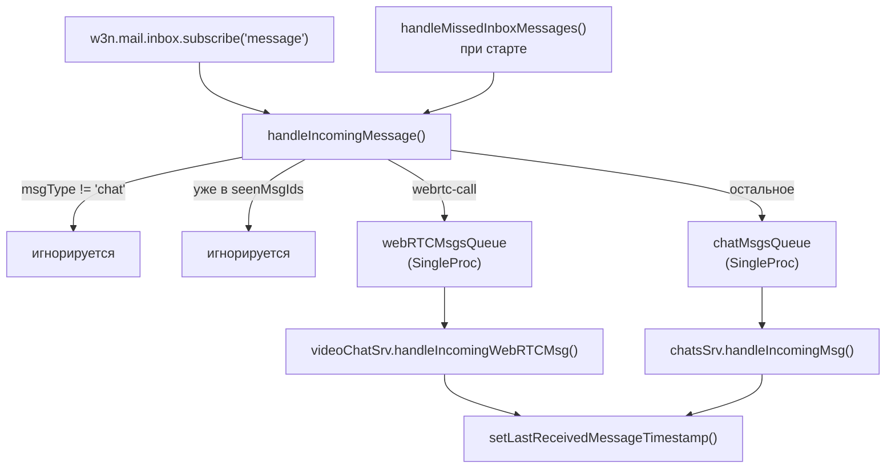
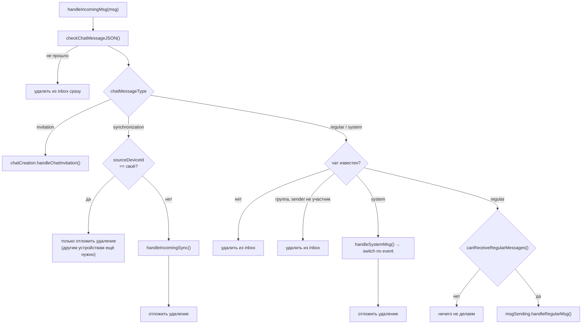
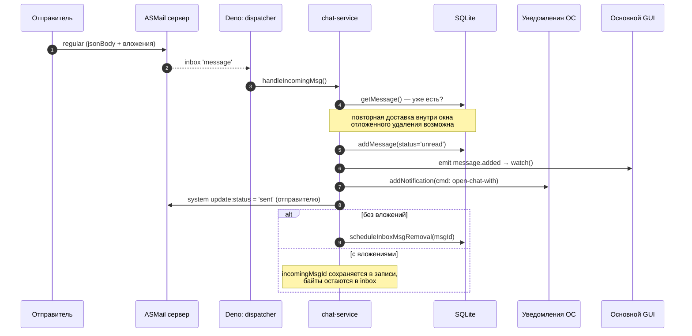
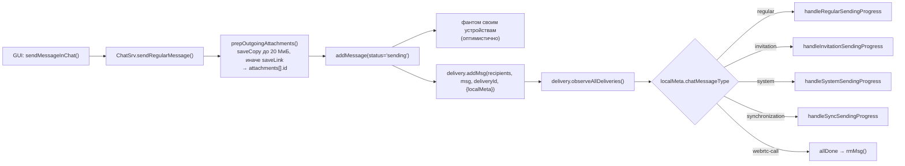
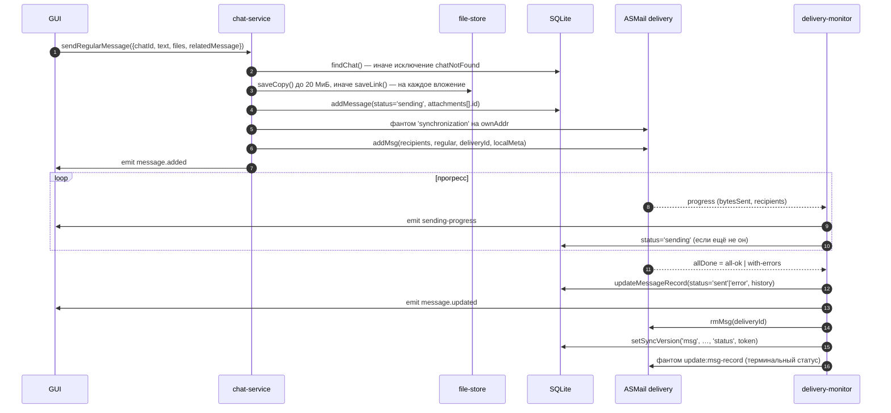
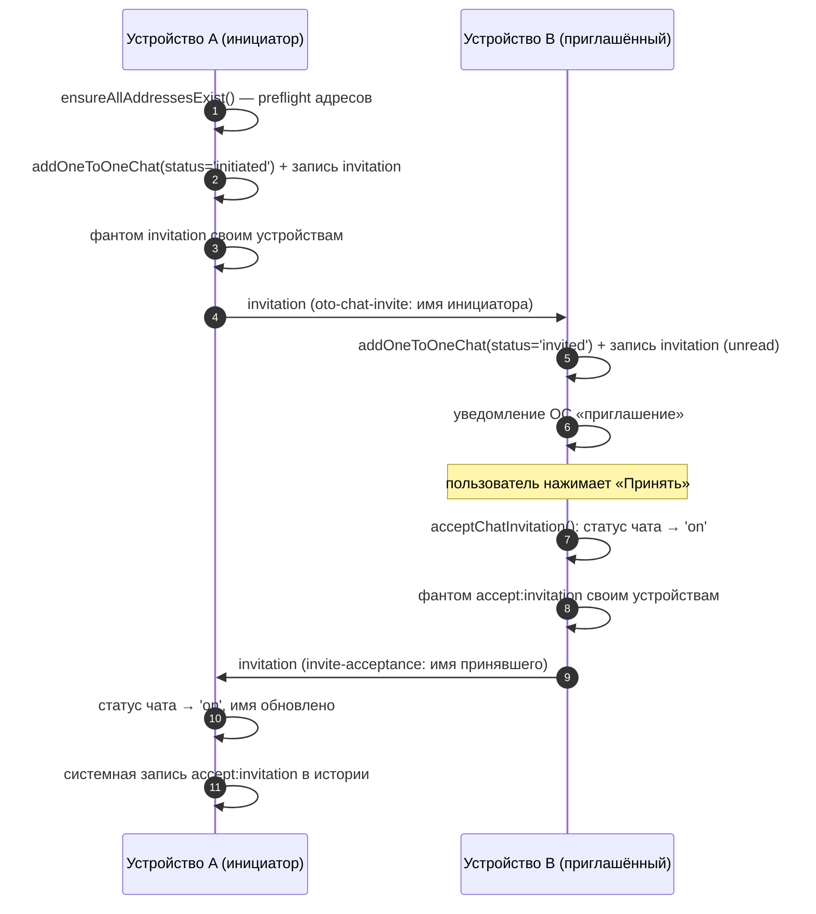

# 03. Форматы сообщений и потоки приёма/отправки

[← к оглавлению](./README.md)

ASMail переносит сообщение как «конверт»: адресат, `msgType`, `plainTxtBody`, вложения и
произвольный `jsonBody`. Все понятия чата приложение упаковывает в `jsonBody`. Ниже — какие бывают
тела, как приходящее сообщение проходит по системе и что происходит при отправке.

## 1. Форматы сообщений

Все тела имеют `v: 1` и опциональный `groupChatId` (его отсутствие означает чат 1-1, идентификатор
которого — адрес отправителя из конверта). Двум типам тел этого недостаточно, потому что они
адресуются **собственному** адресу пользователя, где выводить чат 1-1 не из чего: `synchronization` и
`webrtc-call` несут ещё и явное поле `chatId: ChatIdObj`. У фантомов оно обязательное, у сигналов
звонка — необязательное (рядом продолжает отправляться `groupChatId`) и читается только когда
отправитель — этот же пользователь, см. [05-video-calls.md §3.1](05-video-calls.md).

Объединение — `ChatMessageJsonBody` ([types/asmail-msgs.types.ts:217-223](../types/asmail-msgs.types.ts#L217-L223)),
`msgType` всегда `'chat'` ([types/asmail-msgs.types.ts:453-461](../types/asmail-msgs.types.ts#L453-L461)).

| `chatMessageType` | Тип | Кому отправляется | Сохраняется в БД |
|---|---|---|---|
| `regular` | [ChatRegularMsgV1:74-87](../types/asmail-msgs.types.ts#L74-L87) | участникам чата | да |
| `system` | [ChatSystemMsgV1:59-72](../types/asmail-msgs.types.ts#L59-L72) | участникам чата | только те, у которых есть `chatMessageId` |
| `invitation` | [ChatInvitationMsgV1:89-101](../types/asmail-msgs.types.ts#L89-L101) | приглашаемым | да |
| `webrtc-call` | [ChatWebRTCMsgV1:211-215](../types/asmail-msgs.types.ts#L211-L215) | участникам звонка | нет (обрабатывается на лету) — стадия и `callSessionId`, см. [05-video-calls.md §3.1](05-video-calls.md) |
| `synchronization` | [ChatSyncMsgV1:121-131](../types/asmail-msgs.types.ts#L121-L131) | **самому себе** (`ownAddr`) | нет, применяется к записям |

`chatMessageId` генерируется отправителем и имеет вид `<epoch-в-секундах>-<random10>`
([chat-ids.ts:45-53](../shared-libs/chat-ids.ts#L45-L53)). Из него извлекается примерное время,
что упрощает поиск в БД. Идентификатор доставки (`deliveryId`) — отдельная сущность:
`<timestamp>_<chatMessageId>` с префиксом `sync_` для фантомов
([chat-ids.ts:55-57](../shared-libs/chat-ids.ts#L55-L57),
[sending-primitives.ts:57-66](../src-deno/services/mail-sending-service/sending-primitives.ts#L57-L66)).

### 1.1 Системные события

`ChatSystemMessageData` — 14 вариантов
([types/asmail-msgs.types.ts:359-373](../types/asmail-msgs.types.ts#L359-L373)):

| Событие | Смысл | Отображается в истории |
|---|---|---|
| `update:status` ([301](../types/asmail-msgs.types.ts#L301)) | «доставлено»/«прочитано» для конкретного сообщения | нет |
| `update:msg-record` ([309](../types/asmail-msgs.types.ts#L309)) | авторитетный статус + `history` записи (только между своими устройствами) | нет |
| `update:body` ([325](../types/asmail-msgs.types.ts#L325)) | правка текста сообщения | нет (меняет само сообщение) |
| `update:reactions` ([317](../types/asmail-msgs.types.ts#L317)) | новый набор реакций | нет |
| `delete:message` ([240](../types/asmail-msgs.types.ts#L240)) | удалить одно / несколько / всю историю | нет |
| `update:chatName` ([269](../types/asmail-msgs.types.ts#L269)) | переименование чата | да |
| `update:settings` ([276](../types/asmail-msgs.types.ts#L276)) | смена настроек (авто-удаление) | да |
| `update:members` ([251](../types/asmail-msgs.types.ts#L251)) | изменение состава группы | да |
| `update:admins` ([260](../types/asmail-msgs.types.ts#L260)) | изменение администраторов | да |
| `member-left` ([283](../types/asmail-msgs.types.ts#L283)) | отправитель покинул чат | да |
| `member-removed` ([293](../types/asmail-msgs.types.ts#L293)) | получателя исключили / чат удалён | да |
| `accept:invitation` ([333](../types/asmail-msgs.types.ts#L333)) | приглашение принято | да |
| `call` ([341](../types/asmail-msgs.types.ts#L341)) | запись о звонке (создаётся локально, наружу не уходит) | да |
| `webrtc-call` ([350](../types/asmail-msgs.types.ts#L350)) | звонок отменён (исходящий/входящий) | да |

Различие «отображается / не отображается» технически сводится к наличию `chatMessageId` в теле:
только с ним событие получает запись в `messages` и попадает в ленту
([addVisibleSystemSyncMsg](../src-deno/services/chat-service/utils/handle-incoming-sync.ts#L190-L224)).

**Штамп записи о событии пира — `deliveryTS`, а не `Date.now()`.** Правило общее для всех
отображаемых событий, приходящих от пира: сообщение лежит в общем ящике, и каждое устройство
пользователя создаёт запись из него самостоятельно (фантома для такой записи нет). История
сортируется строго по `timestamp` (`ORDER BY timestamp` в
[msgs-db.ts](../src-deno/dataset/msgs-db.ts)), поэтому устройство, подобравшее то же сообщение
catch-up-сканом часом позже, штампом собственных часов поставило бы событие в конец ленты — так
запись «приглашение принято» уехала за все последующие сообщения в прогоне 2026-08-14. `deliveryTS`
ставит сервер ASMail один раз, и все устройства выводят из него одну и ту же метку; из этого же
соображения от него берётся и токен упорядочивания (обоснование —
[chat-renaming.ts:146-154](../src-deno/services/chat-service/utils/chat-renaming.ts#L146-L154)).
Идиома — `msgDbEntryForIncomingSysMsg()`
([_msgs-related-methods.ts:100-125](../src-deno/services/chat-service/utils/_msgs-related-methods.ts#L100-L125));
`createDisplayableSystemMessage()` в
[chat-creation.ts](../src-deno/services/chat-service/utils/chat-creation.ts) получает `timestamp`
теми же соображениями и при повторной встрече того же inbox-сообщения **правит** штамп уже созданной
записи — идентификатор такой записи детерминирован, а сообщение переигрывается сканами все 15 дней,
пока лежит в ящике, так что испорченные ранее записи выравниваются без миграции.

## 2. Приём: от inbox до события в UI

[inbox-dispatcher.ts:31-193](../src-deno/services/mail-service/inbox-dispatcher.ts#L31-L193).
Существенные решения:

- **Две независимые очереди**, каждая на своём `SingleProc`
  ([inbox-dispatcher.ts:40-44](../src-deno/services/mail-service/inbox-dispatcher.ts#L40-L44)):
  медленная обработка чата не задерживает латентно-критичный WebRTC-сигналинг.
- **Дедупликация по `seenMsgIds`**
  ([inbox-dispatcher.ts:56](../src-deno/services/mail-service/inbox-dispatcher.ts#L56)): одно и то
  же сообщение может попасть и в подписку, и в стартовое сканирование.
- **Watermark продвигается только после успешной обработки и после сброса БД на диск**
  ([inbox-dispatcher.ts](../src-deno/services/mail-service/inbox-dispatcher.ts)): падение между
  постановкой в очередь и обработкой не «съедает» сообщение. Порядок «`db.flush()` → watermark»
  существенен: watermark пишется в свой файл сразу и назад не откатывается, а записи БД батчатся
  ([02-data-model.md](02-data-model.md#111-запись-файла-батчится)) — при обратном порядке сбой
  оставил бы сообщения, которых уже нет в окне догона и ещё нет ни в одной БД. Сброс и продвижение
  делаются **на пачку** (по опустошении очереди либо каждые `INBOX_COMMIT_BATCH = 32` сообщения), а
  не на каждое сообщение: пакетный приём — как раз тот случай, ради которого записи и батчатся.
  Худший исход при сбое — повторная обработка пачки, а она идемпотентна (см. §7).
- **Стартовое сканирование** ([inbox-dispatcher.ts:108-151](../src-deno/services/mail-service/inbox-dispatcher.ts#L108-L151))
  берёт сообщения с `watermark - 60 c` и сортирует WebRTC-сигналы так, чтобы `start` шёл первым
  (`startStageFirst`, [_common.ts:74-84](../src-deno/services/video-chat-service/utils/_common.ts#L74-L84)) —
  иначе offer мог бы прийти раньше, чем создан объект звонка.

### 2.1 Разбор сообщения чата

[chat-service.ts:181-258](../src-deno/services/chat-service/chat-service.ts#L181-L258):

Ключевые точки:

- Фантом от **собственного** устройства не применяется повторно, но и не удаляется мгновенно
  ([chat-service.ts:206-212](../src-deno/services/chat-service/chat-service.ts#L206-L212)).
- `scheduleInboxMsgRemoval()` для системного сообщения вызывается **после** успешного применения
  ([chat-service.ts:356-359](../src-deno/services/chat-service/chat-service.ts#L356-L359)): если
  обработчик упал, сообщение останется в inbox и будет обработано при следующем старте.
- Маршрутизация системных событий — `switch` на 11 ветвей
  ([chat-service.ts:267-354](../src-deno/services/chat-service/chat-service.ts#L267-L354)); каждая
  делегирует своему модулю (`msg-status-updating`, `msg-deletion`, `chat-members-updating`,
  `chat-renaming`, `chat-setting-up`, `chat-member-removal`, `webrtc-call-reaction`, `msg-editing`,
  `msg-reactions`).

### 2.2 Сценарий: приём обычного сообщения

Код: [msg-sending.ts:232-312](../src-deno/services/chat-service/utils/msg-sending.ts#L232-L312).
Обратите внимание: подтверждение `update:status: 'sent'` формирует **получатель**, поэтому у
отправителя статус «доставлено» появляется независимо от прогресса доставки.

Пометка «прочитано» — отдельное действие UI
([msg-status-updating.ts:87-103](../src-deno/services/chat-service/utils/msg-status-updating.ts#L87-L103)):
обновляется локальная запись, отправляется `update:status: 'read'` участникам и фантом своим
устройствам.

## 3. Отправка

- Примитивы отправки — [sending-primitives.ts](../src-deno/services/mail-sending-service/sending-primitives.ts):
  `sendRegularMessage`, `sendSystemMessage`, `sendSystemDeletableMessage`, `sendChatInvitation`.
- Фантомы своим устройствам живут отдельно, в
  [sync-phantoms.ts](../src-deno/services/mail-sending-service/sync-phantoms.ts): они не отправляются
  напрямую, а записываются в журнал и выпускаются оттуда
  (см. [04-multi-device-sync.md §4.1](./04-multi-device-sync.md#41-журнал-исходящих-фантомов)).
- `localMeta` (`LocalMetadataInDelivery`, [types/chat.types.ts:296-302](../types/chat.types.ts#L296-L302))
  — то, по чему монитор доставки понимает, что за сообщение он видит
  ([delivery-monitor.ts:48-102](../src-deno/services/mail-service/delivery-monitor.ts#L48-L102)).
- `sendImmediately: !message.attachments`
  ([sending-primitives.ts:69-72](../src-deno/services/mail-sending-service/sending-primitives.ts#L69-L72)):
  сообщения без вложений отправляются вне очереди, с вложениями — через обычную очередь доставки.

### 3.1 Сценарий: отправка обычного сообщения

Код: [msg-sending.ts:132-199](../src-deno/services/chat-service/utils/msg-sending.ts#L132-L199),
[handle-regular-sending-progress.ts:29-122](../src-deno/services/mail-sending-service/progress-handlers/handle-regular-sending-progress.ts#L29-L122).

Повторная отправка (`resend`) идёт тем же методом с уже существующим `chatMessageId`
([msg-sending.ts:153-168](../src-deno/services/chat-service/utils/msg-sending.ts#L153-L168)):
запись не создаётся заново, а переводится в `sending`, и своим устройствам уходит фантом статуса.

Отмена (`cancelSendingMessage`) — `delivery.rmMsg(deliveryId, true)` + статус `canceled` + **явный**
фантом, потому что удалённая доставка уже не пришлёт терминальный прогресс
([chat-service.ts:477-494](../src-deno/services/chat-service/chat-service.ts#L477-L494)).

### 3.2 Ошибки доставки

При `allDone === 'with-errors'` ошибки по адресатам складываются в `history.changes` записью типа
`error` ([handle-regular-sending-progress.ts:80-102](../src-deno/services/mail-sending-service/progress-handlers/handle-regular-sending-progress.ts#L80-L102)),
после чего статус становится `error`. Перед записью каждая ошибка проходит через
`serializeDeliveryError()` ([delivery-errors.ts](../src-deno/utils/delivery-errors.ts)), которая
приводит `DeliveryException`/`RuntimeException`/нативный `Error` к единому плоскому
`SerializedDeliveryError` (`{ message, type?, ...булевы флаги }`, [types/chat.types.ts](../types/chat.types.ts))
— без этого шага `history` сохраняется как JSON (`optJsonTransform`), а `JSON.stringify(new Error(...))`
даёт `{}`, и причина сбоя терялась (в частности, для `resolveStuckSyncingSelfMessages`,
[msg-status-updating.ts:152-184](../src-deno/services/chat-service/utils/msg-status-updating.ts#L152-L184),
которая создаёт такую ошибку напрямую). UI показывает нормализованную ошибку в «информации о
сообщении» ([chat-message-info-errors.vue](../src-main/common/components/messages/chat-message/chat-message-info/chat-message-info-errors.vue)),
с текстом `message` как запасным вариантом, если флаг ошибки не распознан.

Сообщение находится для обновления статуса через `progress.localMeta` (`LocalMetadataInDelivery`,
несёт и `chatId`, и `chatMessageId` — заполняется в `sendRegularMessage()` до постановки в очередь
доставки), а не разбором `deliveryId`: `chatMessageId` сам по себе не уникален в БД (первичный ключ
таблицы `messages` — `(chatMessageId, groupChatId, otoPeerCAddr)`), поэтому поиск только по нему мог
бы задеть чужую запись с тем же `chatMessageId` в другом чате.

## 4. Создание чата и приглашения

Единый модуль — [chat-creation.ts](../src-deno/services/chat-service/utils/chat-creation.ts).

- Проверка адресов до создания: `ensureAllAddressesExist()`
  ([chat-service.ts:365-373](../src-deno/services/chat-service/chat-service.ts#L365-L373),
  [address-checks.ts](../src-deno/utils/address-checks.ts)); при отказе бросается
  `chat-creation`-исключение со списком проблемных адресов.
- Группа: создатель всегда добавляется в участники и админы
  ([chat-service.ts:391-415](../src-deno/services/chat-service/chat-service.ts#L391-L415)); статус
  проходит `initiated → partially-on → on` по мере принятия приглашений
  ([chat-creation.ts:439-456](../src-deno/services/chat-service/utils/chat-creation.ts#L439-L456)).
- Принятие в группе рассылается всем участникам отдельным телом
  `updated-members-invitation-data` ([chat-creation.ts:460-483](../src-deno/services/chat-service/utils/chat-creation.ts#L460-L483)),
  которое принимается только от администратора
  ([chat-creation.ts:538-541](../src-deno/services/chat-service/utils/chat-creation.ts#L538-L541)).
- Видимая запись «X принял приглашение» дедуплицируется по детерминированному id
  `accept-invitation:<msgId>` ([chat-creation.ts:125-168](../src-deno/services/chat-service/utils/chat-creation.ts#L125-L168)) —
  повторная доставка не создаёт вторую запись.
- **`initiator` в теле `invite-acceptance`** — адрес, приславший исходное приглашение: в группе это
  `groupSender` записи приглашения, в чате 1-1 — собеседник чата (только входящее приглашение
  переводит чат в статус `invited`, поэтому собеседник и есть пригласивший),
  [chat-creation.ts:677-691](../src-deno/services/chat-service/utils/chat-creation.ts#L677-L691).
  Туда же уходит и само принятие. Получатель по этому полю понимает, он ли инициатор чата, и от
  этого зависит статус группы
  ([chat-creation.ts:443-460](../src-deno/services/chat-service/utils/chat-creation.ts#L443-L460)).
- Флаг `neverContactedInitiator` выводится из отсутствия `establishedSenderKeyChain`
  ([chat-creation.ts:581-582](../src-deno/services/chat-service/utils/chat-creation.ts#L581-L582)) —
  UI использует его, чтобы предупредить о приглашении от незнакомого адреса.

## 5. Удаление

Три разных операции ([msg-deletion.ts](../src-deno/services/chat-service/utils/msg-deletion.ts)):

| Операция | Локально | Своим устройствам | Участникам |
|---|---|---|---|
| `deleteMessage(id, forEveryone)` | удалить запись, удалить байты (inbox / вложения) | tombstone + фантом `delete:message` | `system delete:message`, если `forEveryone` |
| `deleteMessages(ids, forEveryone)` | то же пакетно; возвращает `{deleted, failed}` | tombstone на каждое **удавшееся** + один фантом | один `system delete:message` |
| `deleteMessagesInChat(chatId, forEveryone)` | удалить все записи чата и связанные байты | маркер `historyCleared` + фантом `allInChat` | `system delete:message` c `allInChat` |
| `deleteExpiredMessages(now)` | удалить истёкшие по `removeAfter` | **ничего** — каждое устройство истекает само | ничего |

Особенности:

- Синхронизация удаления идёт **всегда**, даже при «удалить только у себя»: это изменение локальной
  БД, и другие устройства пользователя должны его повторить
  ([msg-deletion.ts:108-113](../src-deno/services/chat-service/utils/msg-deletion.ts#L108-L113)).
- Пакетное удаление может пройти **частично**: удаление одного сообщения — это несколько шагов
  (строка БД, сообщение в inbox, файлы вложений), и любой может отказать для одного сообщения,
  удавшись для другого. Поэтому событие `messages-removed` несёт только фактически удалённые id,
  фантом и уведомление участникам — тоже, а вызывающему возвращается и список отказов
  ([msg-deletion.ts](../src-deno/services/chat-service/utils/msg-deletion.ts)). Безусловное «удалены
  все» оставляло бы интерфейс показывающим не то, что в БД, до следующей полной перезагрузки; GUI
  на непустой `failed` показывает уведомление
  ([messages.store.ts](../src-main/common/store/messages.store.ts)).
- Тем же правилом обрабатывается удаление, пришедшее от собеседника: сообщения, которых в БД нет,
  в событие не попадают.
- Очистку истории «для всех» в группе может сделать только администратор
  ([msg-deletion.ts:220-222](../src-deno/services/chat-service/utils/msg-deletion.ts#L220-L222)).
- При удалении не трогаются вложения записи, синхронизированной с другого устройства (её id
  принадлежат тому устройству) —
  [msg-deletion.ts:76-92](../src-deno/services/chat-service/utils/msg-deletion.ts#L76-L92).

## 6. Правки и реакции

Обе операции устроены одинаково: изменить запись → отправить участникам `system`-событие → вернуть
обновлённую view-модель в UI; фантом своим устройствам отправляет соответствующий модуль:

| Действие | Метод | Событие участникам |
|---|---|---|
| Правка текста | [chat-service.ts:513-550](../src-deno/services/chat-service/chat-service.ts#L513-L550) + [msg-editing.ts](../src-deno/services/chat-service/utils/msg-editing.ts) | `update:body` |
| Реакция | [chat-service.ts:552-593](../src-deno/services/chat-service/chat-service.ts#L552-L593) + [msg-reactions.ts](../src-deno/services/chat-service/utils/msg-reactions.ts) | `update:reactions` |

Оба события отправляются через `sendSystemDeletableMessage()` — то есть доставка сообщения
удаляется из очереди сразу после завершения
([handle-system-sending-progress.ts](../src-deno/services/mail-sending-service/progress-handlers/handle-system-sending-progress.ts)).

## 7. Что важно помнить

1. Один и тот же `chatMessageId` используется и как id записи, и как часть `deliveryId` — но
   пространства id фантомов и обычных сообщений разделены префиксом `sync_`
   ([sending-primitives.ts:57-66](../src-deno/services/mail-sending-service/sending-primitives.ts#L57-L66)).
2. Повторная доставка (в пределах 15-дневного окна отложенного удаления) — нормальная ситуация;
   обработчики обязаны быть идемпотентными, и в коде это сделано проверкой «запись уже есть»
   ([msg-sending.ts:242-251](../src-deno/services/chat-service/utils/msg-sending.ts#L242-L251),
   [chat-creation.ts:135-142](../src-deno/services/chat-service/utils/chat-creation.ts#L135-L142)).
3. Обычные сообщения принимаются только в чатах с подходящим статусом
   ([_msgs-related-methods.ts:271-280](../src-deno/services/chat-service/utils/_msgs-related-methods.ts#L271-L280)),
   поэтому сообщение в непринятый чат просто не сохранится.

---

Далее: [04-multi-device-sync.md](./04-multi-device-sync.md) — как расходятся и сходятся устройства
одного пользователя.
