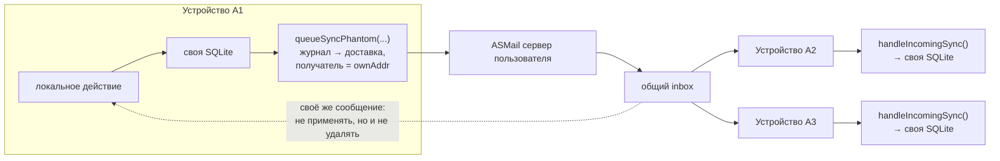
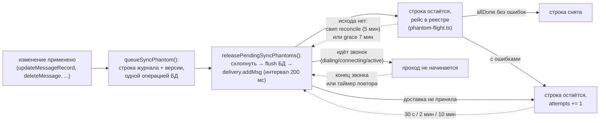
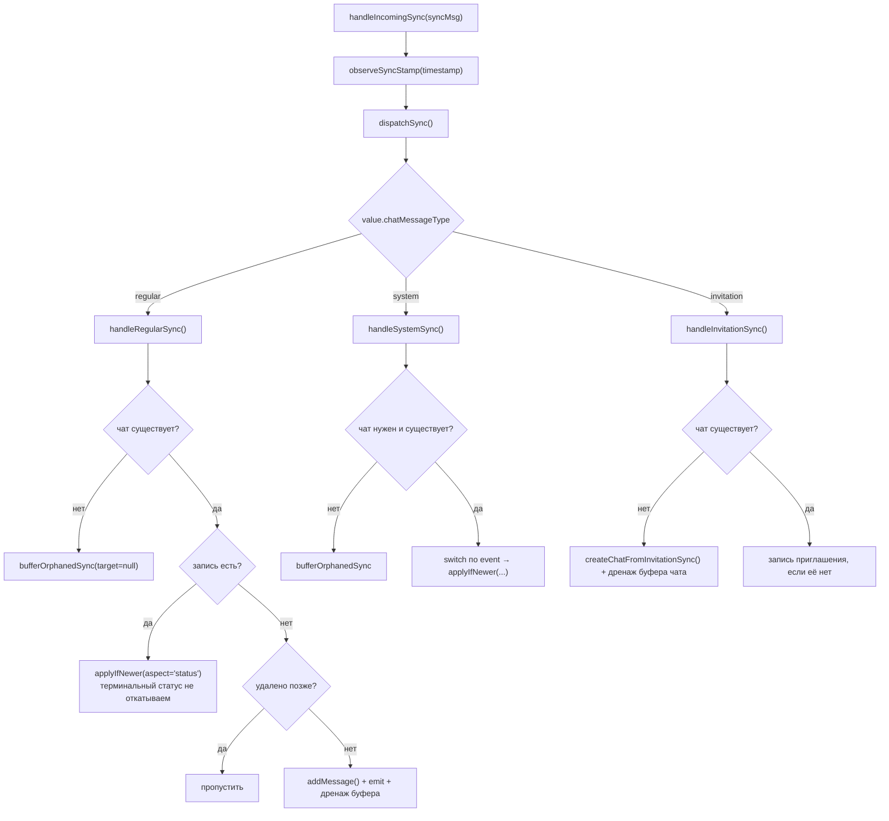
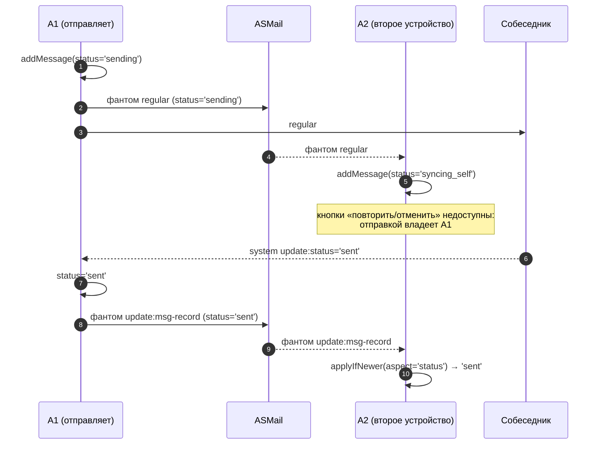

# 04. Синхронизация устройств одного пользователя

[← к оглавлению](./README.md)

Базы данных лежат в local FS и не выгружаются на сервер
([02-data-model.md](./02-data-model.md#11-почему-бд-лежат-в-local-fs)). Значит, у каждого устройства
своя копия состояния, и сходиться они должны сами. Механизм — «фантомные» (ghost) ASMail-сообщения
на **собственный адрес** плюс правило last-write-wins по каждому аспекту сущности.

## 1. Общая схема



Свойства такой схемы, заложенные в код:

- **Фантом отправляется в момент локального изменения**, а не по факту доставки участникам чата.
  Иначе фантом не ушёл бы, когда собеседник недоступен или получателей нет вовсе, а метка времени
  соответствовала бы окончанию доставки — что ломает LWW
  ([sync-phantoms.ts](../src-deno/services/mail-sending-service/sync-phantoms.ts)).
- **Фантом сначала записывается, потом отправляется**: намерение отправить хранится в БД рядом с
  токеном изменения, поэтому потерянная отправка повторяется, а не пропадает насовсем (§4.1).
- **Своё же сообщение из inbox не применяется** (иначе двойное применение), но и не удаляется сразу:
  inbox общий, остальным устройствам оно ещё нужно
  ([chat-service.ts:206-212](../src-deno/services/chat-service/chat-service.ts#L206-L212)).
- **Устройство идентифицируется** `appDeviceId` вида `<formFactor>-<random20>`, созданным один раз
  ([local-data-store.ts:33-38](../src-deno/services/local-data-store/local-data-store.ts#L33-L38)).

## 2. Гибридные логические часы

`nextSyncStamp()` / `observeSyncStamp()` —
[local-data-store.ts:84-110](../src-deno/services/local-data-store/local-data-store.ts#L84-L110).

```
nextSyncStamp() = max(Date.now(), lastSyncClockTs + 1)   → сохраняется в lastSyncClockTs
observeSyncStamp(ts): если ts > lastSyncClockTs → lastSyncClockTs = ts
```

Смысл: изменение, сделанное **после** того, как устройство увидело чужое изменение, всегда получает
больший штамп, даже если системные часы устройства отстают. Для по-настоящему конкурентных изменений
(ни одно устройство не знало о другом) порядок задают стенные часы, но решение у всех устройств
получается одинаковым, потому что сравнение — полный порядок (см. §3).

`observeSyncStamp()` вызывается только при **первом** получении фантома
([handle-incoming-sync.ts:88-95](../src-deno/services/chat-service/utils/handle-incoming-sync.ts#L88-L95)):
повторная обработка из буфера штамп не «наблюдает» второй раз.

## 3. Токен и правило LWW

[sync-versions.ts:28-49](../src-deno/services/chat-service/utils/sync-versions.ts#L28-L49):

```ts
SyncToken = { ts: number; deviceId: string }

isNewerToken(incoming, stored):
  если stored отсутствует       → true
  если ts различаются           → incoming.ts > stored.ts
  иначе                         → incoming.deviceId > stored.deviceId
```

Сравнение по `deviceId` при равных `ts` даёт **полный порядок**: без него ничья осталась бы
неразрешённой и устройства могли бы разойтись.

Единственное место, где применяется правило —
`applyIfNewer()` ([sync-versions.ts](../src-deno/services/chat-service/utils/sync-versions.ts)):
берётся сохранённый токен аспекта, сравнивается с входящим, и только при «новее» выполняется
действие и записывается новый токен.

`applyIfNewer()`, `isDeletedLaterThan()` и `recordDeletion()` принимают не всю `DB`, а
`SyncVersionStore` — три метода работы с версиями, которых им хватает. Узкий тип не только
документирует зависимость: он позволяет спеке передать обычный объект в памяти **без**
`as unknown as DB`, а такое приведение выключает проверку соответствия интерфейсу (мина из P4-2,
из-за которой моки WebRTC расходились с интерфейсом три месяца). Эти правила покрыты спеками
«Test Suite 1» в [sync-conflicts.ts](../tests-app/src/tests/sync-conflicts.ts).

### 3.1 Аспекты

Версия хранится **по аспекту**, а не по записи
([msgs-db.types.ts:71-88](../src-deno/types/msgs-db.types.ts#L71-L88)), иначе изменение состава
группы делало бы «устаревшим» более новое переименование того же чата.

| Сущность | Аспекты |
|---|---|
| `chat` | `name`, `settings`, `members`, `admins`, `status`, `deleted`, `historyCleared` |
| `msg` | `body`, `reactions`, `status`, `deleted` |

Идентификаторы: `chatEntityId()` = `g/<chatId>` либо `s/<peerCAddr>`; `msgEntityId()` =
`<chatKey>/<chatMessageId>` ([sync-versions.ts:51-57](../src-deno/services/chat-service/utils/sync-versions.ts#L51-L57)).

### 3.2 Надгробия (tombstones)

- `recordDeletion()` ([sync-versions.ts:114-125](../src-deno/services/chat-service/utils/sync-versions.ts#L114-L125))
  удаляет обычные версии сущности и ставит аспект `deleted` с `tombstonedAt`.
- `isDeletedLaterThan()` ([sync-versions.ts:100-108](../src-deno/services/chat-service/utils/sync-versions.ts#L100-L108))
  не даёт фантому воскресить удалённую сущность.
- Очистка всей истории чата помечается **одним** маркером `historyCleared`, а не надгробием на каждое
  сообщение: множество удалённых сообщений открытое
  ([handle-incoming-sync.ts:508-514](../src-deno/services/chat-service/utils/handle-incoming-sync.ts#L508-L514),
  [msg-deletion.ts:231-240](../src-deno/services/chat-service/utils/msg-deletion.ts#L231-L240)).
- Проверка «запись удалена позже, чем сделано это изменение» учитывает и то, и другое —
  `isRecordDeletedLater()` ([handle-incoming-sync.ts:161-167](../src-deno/services/chat-service/utils/handle-incoming-sync.ts#L161-L167)).
- Надгробия — единственные строки `sync_versions`, которые удаляются по возрасту (15 дней,
  [msgs-db.ts:1059-1071](../src-deno/dataset/msgs-db.ts#L1059-L1071)).

## 4. Какие события синхронизируются и чем

Все функции — [sync-phantoms.ts](../src-deno/services/mail-sending-service/sync-phantoms.ts).
Каждая только **собирает** тело фантома; запись в журнал и отправку делает `queueSyncPhantom()`
(см. §4.1).

| Функция | Когда вызывается | Тело фантома | Аспект |
|---|---|---|---|
| `createSyncMsgBasedOnRegularMsg` | запись обычного сообщения создана ([msg-sending.ts](../src-deno/services/chat-service/utils/msg-sending.ts)) | `regular` + текст, вложения, статус, history | `record` |
| `makeMsgRecordPhantom` | доставка завершилась / отмена ([handle-regular-sending-progress.ts](../src-deno/services/mail-sending-service/progress-handlers/handle-regular-sending-progress.ts), [chat-service.ts](../src-deno/services/chat-service/chat-service.ts)) | `update:msg-record` (авторитетный статус) | `msg.status` (при завершении доставки) |
| `makeMsgStatusPhantom` | локальная смена статуса ('read'/'sent') ([msg-status-updating.ts](../src-deno/services/chat-service/utils/msg-status-updating.ts)) | `update:status` | `msg.status` |
| `makeDeleteMessagePhantom` | любое удаление сообщений ([msg-deletion.ts](../src-deno/services/chat-service/utils/msg-deletion.ts)) | `delete:message` | `msg.deleted` / `chat.historyCleared` |
| `makeInvitationPhantom` | чат создан / состав обновлён ([chat-creation.ts](../src-deno/services/chat-service/utils/chat-creation.ts)) | `invitation` (+ `status`, `settings`) | `record` |
| `makeInvitationAcceptedPhantom` | приглашение принято ([chat-creation.ts](../src-deno/services/chat-service/utils/chat-creation.ts)) | `accept:invitation` | `chat.status` |
| `makeMemberRemovedPhantom` | чат удалён/покинут локально ([chat-deletion.ts](../src-deno/services/chat-service/utils/chat-deletion.ts)) | `member-removed` | `chat.deleted` |
| `makeSystemEventPhantom` | универсальный: переименование, настройки, участники, админы, правка текста, реакции, запись о звонке | соответствующее `system`-событие | по месту вызова |

Отдельно: `syncLocallyMadeSystemEvent()`
([chat-service.ts](../src-deno/services/chat-service/chat-service.ts)) — для событий, которые
**никому наружу не отправляются** (запись о звонке, обновление её `endTimestamp`): без явного
фантома они вообще не попали бы на другие устройства. Его парный метод
`saveAndSyncLocalSystemMsg()` пишет запись и ставит её фантом одним вызовом, и существует именно
потому, что разделить эти два шага однажды уже удалось: запись «звонок отменён» создавалась в
GUI-сторе через `makeAndSaveMsgToDb()` и оставалась навсегда только на том устройстве, где нажали
«Отклонить» — восстановить её остальным было неоткуда, на проводе о ней ничего нет.

Обратная сторона того же правила: синхронизировать так можно **только** запись, id которой все
устройства выведут одинаково. Записи, которые каждое устройство пишет само по входящему системному
сообщению пира (отмена звонка звонившим, отказ пира), это правило раньше не проходили —
`chatMessageId` у них генерировался локально, собственная копия плюс присланная дали бы две строки
об одной отмене, — и потому оставались чисто локальными. Теперь их id выводится из события так же,
как у записи о звонке (`recordCallEvent` в [chats.store.ts](../src-main/common/store/chats.store.ts)),
и они синхронизируются. Это важно не только ради согласия: пишет их **окно**, а устройство с
закрытым окном не запишет ничего и получит запись только фантомом. Если сессия неизвестна (пир на
сборке, которая ещё не шлёт `callSessionId`), запись остаётся локальной — недетерминированный id
синхронизировать нельзя.

**Идентичность записи вместо её уникальности.** «Решение одного устройства» — предположение, которое
ломается на glare: звонок можно принять (или отклонить) на двух устройствах разом, тай-брейк
разведёт их лишь через секунды, и к тому моменту каждое уже написало свою запись. Живой прогон
2026-08-15 дал ровно это — две строки об одном звонке, причём длительность (`update:body`, который
называет конкретный `chatMessageId`) могла лечь только на одну из них, вторая уходила в буфер сирот.
Лечится не запретом второй записи, а тем, что записи оказываются **одной**:
`chatMessageIdForCallEvent(kind, callSessionId, by?)` ([chat-ids.ts](../shared-libs/chat-ids.ts))
выводит id из сессии звонка, одинаковой на всех устройствах, и приходящий фантом упирается в уже
имеющуюся проверку «запись есть — пропустить». Тем же приёмом живёт `accept-invitation:${dedupeKey}`
([chat-creation.ts:179](../src-deno/services/chat-service/utils/chat-creation.ts#L179)).

Схлопывание должно быть ровно по границе одного события, и её держат два аргумента помимо сессии:

- `kind` разделяет записи, которые у одной сессии сосуществуют: сам звонок, отказ от него,
  отзыв его звонившим. В one-to-one последние две ещё и называют один и тот же адрес.
- `by` — адрес, который запись кладёт в `sender`, а **не** устройство-автор. В групповом звонке
  каждый участник отказывается за себя, и это отдельные строки; id, знающий только сессию, потерял
  бы второй отказ как «запись уже есть». Адрес в `sender` одинаков на всех наших устройствах,
  поэтому согласие между ними от этого не страдает.

Сама сессия обязана быть уникальной, и это не даётся даром: `nextCallSessionId()`
([local-data-store.ts](../src-deno/services/local-data-store/local-data-store.ts)) собирает id из
адреса **пользователя** и счётчика **устройства**, так что без appDeviceId первый звонок, захостенный
одним устройством, и первый, захостенный другим, — один и тот же id. Пока сессии только сравнивали,
это было безобидно; с выводом id записи из сессии второй звонок пропал бы из истории целиком, как
запись, которая уже есть. Разбирать `callSessionId` вправе только `hostAddrOfCallSession()` и только
до первого `#`.

Цена приёма — писать такую запись обязан тот, кто готов встретить её уже существующей: `addMessage`
это голый INSERT, а на один и тот же id выходят и повторный вход в тот же звонок, и фантом соседнего
устройства, пришедший раньше. Проверка живёт в `doAfterStartCall`
([video-chat-service.ts](../src-deno/services/video-chat-service/video-chat-service.ts)) и в
`saveAndSyncLocalSystemMsg` ([chat-service.ts](../src-deno/services/chat-service/chat-service.ts)),
а не у каждого вызывающего.

**Вторая цена — алфавит.** `chatMessageId` в базе непрозрачен, но за её пределами он попадает в два
места с ограничениями, и оба узнались дорого (живой прогон 2026-08-15, отклонение звонка не создало
записи вообще):

- **id доставки ASMail.** `generateOutgoingMsgId(chatMessageId, prefix)` вклеивает id записи в id
  доставки, а платформа делает из него имя папки и отвергает `/` и `.` (`idToMsgFolder` в
  `core/asmail/delivery`). Точка есть в любом доменном имени, то есть в любом `callSessionId`.
- **CSS-селектор.** Список сообщений телепортирует по `#msg-<chatMessageId>`
  (`chat-messages.vue`), где незаконны уже `:` и `@`.

Поэтому производный id кодируется base64url и целиком лежит в `[A-Za-z0-9_-]`. Независимо от этого
`generateOutgoingMsgId` санитизирует то, что получает: она существует ровно для того, чтобы выдать id
платформе, и это единственное место, где строка становится путём. Санитизация здесь, а не у восьми
отправителей, закрывает заодно `accept-invitation:${dedupeKey}`
([chat-creation.ts:179](../src-deno/services/chat-service/utils/chat-creation.ts#L179)) — он
содержит `:` и `@` и безопасен сегодня лишь потому, что до доставки не доходит, — и **чужой**
`chatMessageId`: принятие приглашения отправляет обратно тот id, который прислал пир.

Записи, порождаемые системным сообщением пира, живут по тому же правилу: их id тоже выводится из
события (`recordCallEvent` в [chats.store.ts](../src-main/common/store/chats.store.ts)), а значит,
тоже целиком лежит в `[A-Za-z0-9_-]`.

Особый случай в фантоме `regular`: id вложений вырезается, добавляются `hasNoLocalSource: true` и
`originDeviceId` — чужие id указывают в чужой file-store
([_msgs-related-methods.ts:364-371](../src-deno/services/chat-service/utils/_msgs-related-methods.ts#L364-L371)).

### 4.1 Журнал исходящих фантомов

Токен упорядочивания тратится в момент, когда изменение применено локально. Если фантом после этого
не ушёл — компонент закрыли, доставка недоступна, сервер ответил отказом, — повторной отправки нет, и
другие устройства **никогда** не узнают об изменении: токен уже «занят». Поэтому отправка разведена
на три шага: запись намерения, выпуск в доставку и снятие строки по подтверждённому исходу.



- **Запись.** `queueSyncPhantom()` кладёт тело фантома в `pending_sync_msgs` и записывает версии
  изменения (`sync_versions`) — одной операцией, без `await` между записями, в один файл БД. Ни одна
  запись файла не может застать потраченный токен без его фантома (см.
  [02-data-model.md §2.4](02-data-model.md#24-таблица-pending_sync_msgs--журнал-исходящих-фантомов)).
- **Выпуск.** `releasePendingSyncPhantoms()` отдаёт фантомы в доставку. Вызывается сразу после записи
  (обычный путь не изменился — фантом уходит немедленно), один раз при старте
  ([index.ts](../src-deno/index.ts)), где подбирает всё, что осталось от прошлого запуска, по
  завершении звонка и по таймеру повтора.
- **Строка живёт до подтверждения доставки.** `addMsg()` лишь ставит сообщение в очередь платформы,
  поэтому снятие строки сразу после него означало «отправлено» там, где на деле было «принято к
  отправке». Отказ доставки после этого не оставлял ни строки для повтора, ни строки в логе —
  изменение исчезало для остальных устройств навсегда и молча (так пропала запись о принятом звонке
  в прогоне 2026-08-14). Теперь строка передаётся в доставку и **остаётся** в журнале, а факт «этот
  ряд сейчас в доставке» лежит в реестре рейсов
  ([phantom-flight.ts](../src-deno/services/mail-sending-service/phantom-flight.ts)), ключуемом
  `deliveryId`. Терминальный исход разбирается в `notePhantomDeliveryOutcome()`: без ошибок — строка
  снимается, с ошибками (`allDone === 'with-errors'` **или** непустой `recipients[…].err` при
  `all-ok`) — строка остаётся, `attempts += 1`, в лог идёт `error` с ошибками получателя, и взводится
  проход повтора. Реестр — в памяти процесса намеренно: «в доставке» верно лишь относительно живой
  записи доставки и живой подписки на прогресс, а после перезапуска правильное действие — отправить
  строку заново.
- **Проход не переотправляет то, что в доставке.** `partitionByFlight()` делит строки прохода на
  выпускаемые, ждущие исхода и «заброшенные»; без этого каждое локальное изменение переотправляло бы
  всё, что ещё ждёт подтверждения. Реестр сверяется с журналом в начале каждого прохода
  (`flightsToForget()`): строка могла уйти путём, о котором реестр не знает (вытеснена, устарела,
  нечитаемое тело), и оставшийся рейс продолжал бы вычитаться из счётчика индикатора.
- **Два бакстопа на случай, когда исход не пришёл вообще.** Первый — свип
  `delivery-reconcile.sweep()`: доставка без прогресса дольше `STUCK_MSG_MS` = 5 мин отменяется, и
  `settleStuckSyncPhantom()` возвращает строку в пул (для `regular` рядом стоит зеркальная
  `settleStuckChatMessage`, и она намеренно другая: у сообщения есть запись, которую видит
  пользователь, у фантома — только обязанность довезти изменение). Тот же свип разбирает и обратный
  случай — терминальный `allDone` есть, а запись всё ещё в очереди, то есть монитор доставки событие
  пропустил (перезапуск, потерянный IPC-эвент). Второй бакстоп — `PHANTOM_FLIGHT_GRACE_MS` = 7 мин:
  рейс старше него считается не сообщившим исход, и строка выпускается снова. Grace выставлен **выше**
  окна свипа, чтобы два механизма не действовали на одну строку; ему остаются случаи, до которых свип
  не доходит (звонок, который не кончается, — свип уступает звонку; запись доставки, которой нет в
  `listMsgs()`; мёртвая подписка).
- **Повторы безвредны.** Все перечисленные пути восстановления могут сработать дважды: повторно
  отправленный фантом с уже применённым токеном проигрывает сохранённому (`isNewerToken()` на равном
  токене даёт `false`) и на принимающем устройстве пропускается. Это и есть причина, по которой везде
  выбрано «лучше отправить второй раз, чем не отправить».
- **Схлопывание.** `planJournalRelease()` перед выпуском оставляет по одной строке на
  `(entityType, entityId, aspect)` — с наибольшим `ts`; остальные снимаются, не отправляясь.
  Получатель применил бы только последнюю (`applyIfNewer`), поэтому не теряется ничего, а три
  фантома `update:status` одного сообщения превращаются в одну доставку. Аспект `record` и надгробия
  (`deleted`, `historyCleared`) **исключены**: первый несёт саму сущность, а ответ на
  `resync:msg-record` повторяет запись с её **оригинальным** `timestamp` — правило «больший ts
  побеждает» отбросило бы именно этот ответ; надгробие же может покрывать больше сущностей, чем та,
  которой названа его строка (строка описана первой записанной версией).
- **Разнесение отправок.** Между сообщениями одного прохода — пауза `PHANTOM_SEND_SPACING_MS` = 200 мс
  (та же величина и та же причина, что у `SIGNAL_SEND_SPACING_MS` в сигналинге). Перед первым
  сообщением паузы нет: обычный путь «одно изменение — один фантом» не должен становиться медленнее.
  Устройство, включённое после паузы, иначе начинает десятки доставок одновременно — измеренный
  профиль серверных 500-х ([05-video-calls.md §3.1](05-video-calls.md#31-уровень-asmail-webrtcmsg)).
- **Уступка звонку.** Пока идёт звонок, проход не начинается (`setPhantomReleaseBusyCheck()`, та же
  идиома, что `ResyncCtx.isBusy`): фантомы делят доставку с сигналингом, а ждать им безопасно — на то
  и журнал. Выпуск запускается в `doAfterEndCall()`
  ([video-chat-service.ts](../src-deno/services/video-chat-service/video-chat-service.ts)).
  Гейт **узкий**: `hasAnyCallSignalling()` — состояния `dialing | connecting | active`
  (`SIGNALLING_STATES` в
  [call-state.ts](../src-deno/services/video-chat-service/utils/call-state.ts)), а не широкий
  `hasAnyCallInProgress()`, который остаётся у resync и у свипа reconcile. В `ringing` это устройство
  наружу ничего не отправляет, и держать журнал до `RINGING_NO_ANSWER_TIMEOUT_MILLIS` = 90 с на
  неотвеченном входящем незачем.
- **Неудача останавливает проход.** Постановка в доставку на практике не удаётся по одной причине —
  сервер недоступен, — и причина эта общая для всех строк. Проход, который после отказа шёл бы
  дальше, заставлял бы каждое локальное изменение выждать по таймауту соединения на каждый
  накопленный фантом: офлайн-устройство замедлялось бы с каждым сделанным изменением.
- **За неудачу строку не отбрасывают** — иначе офлайн-устройство теряло бы именно те изменения, ради
  которых журнал заведён. Строка уходит либо доставленной подтверждённо, либо вытесненной, либо
  устаревшей: `dropExpiredSyncPhantoms()` чистит фантомы изменений старше 15 дней (то же окно, что у
  надгробий и буфера).
- **Повтор прохода.** Проход, оставивший работу, сам взводит следующий: 30 с / 2 мин / 10 мин, со
  сбросом backoff'а при успехе (отложенный из-за звонка проход backoff не тратит). До этого таймера
  отказ не повторялся вообще — изменение ждало следующего локального изменения или перезапуска, то
  есть при сервере, отвечающем 500-ми, устройство молча расходилось с остальными на часы.
- **Диагностика.** `countPendingSyncPhantoms()` — сколько изменений записано, но ещё **не отдано** в
  доставку: это `countPhantomsAwaitingRelease(db)`, то есть строки журнала минус рейсы в пределах
  grace. Устойчиво ненулевое значение означает, что другие устройства отстают от этого. Оно же питает
  индикатор синхронизации (§8). Рядом — `countSyncPhantomsInDelivery()`: сколько строк ждёт исхода
  доставки прямо сейчас. Логи прохода: `info` с итогом («handed N, M awaiting an outcome, …»),
  `debug` на каждую передачу и на каждое подтверждение, `error` на отказ доставки
  («…kept, attempt N; a retry pass is armed»), `warn` на оба бакстопа. До этой работы на всём пути не
  было ни одной строки — потому потеря записи о звонке и осталась незамеченной.

Что осталось за пределами атомарности: само изменение (запись сообщения, запись чата) применяется
шагом раньше и в общем случае лежит в другой таблице, а для чатов — и в другом файле БД. Полное
«изменение + токен + журнал одной операцией» потребовало бы единой точки записи для всех мутаций;
сейчас закрыт разрыв между токеном и фантомом — тот, из-за которого изменение оставалось невидимым
для других устройств навсегда.

## 5. Применение фантома на принимающем устройстве

[handle-incoming-sync.ts:73-150](../src-deno/services/chat-service/utils/handle-incoming-sync.ts#L73-L150):



### 5.1 Обработка по событиям

`handleSystemSync()`
([handle-incoming-sync.ts:393-735](../src-deno/services/chat-service/utils/handle-incoming-sync.ts#L393-L735)):

| Событие | Аспект | Дополнительно |
|---|---|---|
| `update:chatName` | `chat.name` | плюс видимая запись в истории (`addVisibleSystemSyncMsg`) |
| `update:settings` | `chat.settings` | то же |
| `update:members` | `chat.members` | то же |
| `update:admins` | `chat.admins` | то же |
| `accept:invitation` | `chat.status` | — |
| `member-left` | `chat.members` | если остался один участник — статус `no-members` |
| `member-removed` | `chat.deleted` либо `chat.members` | при `chatDeleted` — надгробие + удаление чата |
| `delete:message` | надгробия `msg.deleted` / `chat.historyCleared` | буферизация не нужна: надгробие ставится независимо от наличия записи |
| `update:body` | `msg.body` | если записи нет — в буфер с `targetMessageId` |
| `update:reactions` | `msg.reactions` | то же |
| `update:status` | `msg.status` | то же |
| `update:msg-record` | `msg.status` | порядок решает только токен: «первый терминальный побеждает» дал бы разные состояния на устройствах ([565-573](../src-deno/services/chat-service/utils/handle-incoming-sync.ts#L565-L573)) |
| `call` / `webrtc-call` | — | одна ветка на оба: создаёт запись, если её нет; не обновляет существующую |
| `restore:snapshot` | все аспекты записей и чатов, что несёт чанк | анонс восстановления из архива. **Не** требует чата из конверта (чанк охватывает много чатов), применяется той же `applyRestoreSnapshot()`, что и на восстанавливающем устройстве — см. [08-backup-and-restore.md](./08-backup-and-restore.md) |

**У записей о звонках `isIncomingMsg` всегда `false`** — и у локальной копии, и у применённой из
фантома: две копии одной записи не имеют права различаться, а на «непрочитанное» флаг всё равно не
влияет (статус ставится только у `regular`). Отсюда правило для отображения: **направление звонка в
записи `webrtc-call` выводится из `callSessionId`**, а не из этого флага — адрес перед первым `#` в
сессии принадлежит хосту, то есть звонившему (`callCancelWording()` в
[shared-libs/call-record-wording.ts](../shared-libs/call-record-wording.ts), спеки — Suite 23).
Пока рендер смотрел на `isIncomingMsg`, отказ пира от **нашего** звонка и наш отказ от **его** звонка
читались одной строкой «The incoming call from X was cancelled», а отозванный звонящим звонок — вовсе
пустой строкой (живой прогон 2026-08-16). У записей `call` направление по-прежнему в теле
(`value.direction`), потому что там оно есть.

### 5.2 Причинная согласованность (буфер)

Фантом может прийти раньше того, к чему относится. Тогда он кладётся в `orphaned_messages`
([handle-incoming-sync.ts:226-253](../src-deno/services/chat-service/utils/handle-incoming-sync.ts#L226-L253)):

- `targetMessageId = <id сообщения>` — ждём появления сообщения;
- `targetMessageId = null` — ждём появления самого чата.

Дренаж: `processOrphanedForTarget()` после создания записи и `processOrphanedForChatCreation()`
после создания чата — **любым** путём: из фантома приглашения, из настоящего приглашения пира или
локально пользователем (`drainOrphanedSyncsOf()` в
[chat-creation.ts](../src-deno/services/chat-service/utils/chat-creation.ts)).
Перед применением записи сортируются по времени изменения (`rawPayload.timestamp`), а не по времени
буферизации — иначе для аспектов с per-aspect разрешением конфликтов последним записалось бы более
старое изменение ([175-181](../src-deno/services/chat-service/utils/handle-incoming-sync.ts#L175-L181)).

### 5.2.1 Повторный запрос записи (resync:msg-record)

Ожидание в буфере пассивно, а носитель записи может быть потерян безвозвратно (например, сообщение
в inbox, чья доставка началась и не завершилась, не читается ни одним устройством). Поэтому
устройство, буферизующее фантом с `targetMessageId`, одновременно **просит свои другие устройства
повторить запись**: фантом `resync:msg-record {chatMessageId}`
([msg-resync.ts](../src-deno/services/chat-service/utils/msg-resync.ts)). Устройство, у которого
запись есть, отвечает повторным record-фантомом с **оригинальным** `timestamp` записи (ответ
восстанавливает запись и не должен перебивать более поздние изменения); не имеющее — молчит.
Повторные ответы безопасны: создание записи идемпотентно (проверка существования, надгробия,
токены). Запрос дедуплицируется в рамках сессии, а при каждом старте повторяется для всех ещё
живых orphan'ов с target (`requestResyncForStuckOrphans()`) — retry с backoff'ом в форме
перезапусков приложения.

Resync-трафик делит ASMail-доставку с сигналингом звонков, поэтому он приглушён:

- стартовый проход запускается по таймеру ~90 с после старта и откладывается, пока идёт звонок
  (`hasAnyCallInProgress()` из video-chat-service; таймер — в [index.ts](../src-deno/index.ts));
- и запрос, и ответ молчат при активном звонке (`ResyncCtx.isBusy`), не помечая цель сделанной —
  работа подбирается позже;
- не больше `MAX_RESYNC_ASKS_PER_SESSION` (16) запросов за сессию, остальное — со следующего
  старта;
- ответ на каждый target отправляется не чаще раза за сессию (`answeredTargets`): запрос живёт в
  общем inbox и может быть повторно проигран catch-up-сканом.

Ответ на запрос записи *входящего* сообщения несёт `isIncomingMsg`/`groupSender`
([asmail-msgs.types.ts](../../types/asmail-msgs.types.ts)) — иначе восстановленное чужое сообщение
стало бы выглядеть собственным.

Сбой буферизации не прерывает обработку остального inbox: фантом теряется, состояние остаётся как
было ([241-252](../src-deno/services/chat-service/utils/handle-incoming-sync.ts#L241-L252)).

Покрыто спеками «Test Suite 2» в [sync-conflicts.ts](../tests-app/src/tests/sync-conflicts.ts):
фантом раньше чата, фантом раньше сообщения и порядок дренажа (два изменения, поданных в порядке,
обратном их `timestamp`, оставляют состояние по более новому). Повторная доставка того же фантома —
«Test Suite 3»: запись не удваивается, устаревшее изменение отбрасывается.

### 5.3 Создание чата из фантома приглашения

`createChatFromInvitationSync()`
([handle-incoming-sync.ts:259-290](../src-deno/services/chat-service/utils/handle-incoming-sync.ts#L259-L290)).
Поля `status` и `settings` в теле приглашения заполняются **только для канала своих устройств** и
никогда не уходят реальному приглашаемому
([types/asmail-msgs.types.ts:112-119](../types/asmail-msgs.types.ts#L112-L119),
[143-150](../types/asmail-msgs.types.ts#L143-L150)) — благодаря этому чат, созданный из фантома,
повторяет состояние оригинала, а не угадывает его.

## 6. Сценарии

### 6.1 Отправка сообщения: что видят остальные устройства



Если A1 ушёл офлайн, не завершив доставку, у A2 запись останется в `syncing_self`. Через 15 дней
`resolveStuckSyncingSelfMessages()` при старте переведёт её в `error` с пометкой в history
([msg-status-updating.ts:152-184](../src-deno/services/chat-service/utils/msg-status-updating.ts#L152-L184)).

### 6.2 Конкурентное изменение: кто победит

Два устройства одновременно переименовывают один чат, ничего не зная друг о друге.

```mermaid
sequenceDiagram
    autonumber
    participant A1 as A1 (deviceId = "desktop-aaa")
    participant A2 as A2 (deviceId = "phone-zzz")
    participant SRV as ASMail

    A1->>A1: renameChat("Проект") ; ts = 1000
    A2->>A2: renameChat("Работа") ; ts = 1000
    A1->>SRV: фантом update:chatName {ts:1000, dev:"desktop-aaa"}
    A2->>SRV: фантом update:chatName {ts:1000, dev:"phone-zzz"}
    SRV-->>A1: фантом от A2
    SRV-->>A2: фантом от A1
    A1->>A1: isNewerToken({1000,"phone-zzz"}, {1000,"desktop-aaa"}) → true → "Работа"
    A2->>A2: isNewerToken({1000,"desktop-aaa"}, {1000,"phone-zzz"}) → false → остаётся "Работа"
    Note over A1,A2: оба устройства сошлись на "Работа"<br/>(выиграл лексикографически больший deviceId)
```

Тот же принцип действует и при разных `ts`: побеждает больший, а благодаря гибридным часам
«позже по причинности» всегда означает «больше по `ts`».

### 6.3 Удаление против запоздавшего фантома

```mermaid
sequenceDiagram
    autonumber
    participant A1 as A1
    participant A2 as A2
    participant SRV as ASMail

    A1->>A1: правка текста сообщения M ; ts = 100
    A1->>SRV: фантом update:body {ts:100}
    A2->>A2: удаление сообщения M ; ts = 200
    A2->>SRV: фантом delete:message {ts:200}
    SRV-->>A2: фантом update:body {ts:100}
    A2->>A2: записи M нет → буферизуем (target = M)
    SRV-->>A1: фантом delete:message {ts:200}
    A1->>A1: recordDeletion(msg M, {ts:200}) + удаление записи
    Note over A2: если M когда-нибудь придёт фантомом,<br/>isRecordDeletedLater() не даст его воссоздать
```

## 7. Ограничения текущей реализации

Зафиксировано как факт поведения (обсуждение улучшений — вне этого документа):

1. Цепочка «изменить БД → записать токен → отправить фантом» не атомарна: сбой между шагами
   оставляет расхождение (например,
   [msg-status-updating.ts:44-64](../src-deno/services/chat-service/utils/msg-status-updating.ts#L44-L64)).
2. Буферизованный фантом теряется, если запись/чат так и не появятся в течение 15 дней — сборка
   мусора удалит его ([msgs-db.ts:842-854](../src-deno/dataset/msgs-db.ts#L842-L854)). Для orphan'ов
   с `targetMessageId` это смягчено повторным запросом записи (§5.2.1); orphan, ждущий **сам чат**,
   по-прежнему только ждёт.
3. Авто-удаление по `removeAfter` **не** синхронизируется: каждое устройство истекает само
   ([msg-deletion.ts:199-203](../src-deno/services/chat-service/utils/msg-deletion.ts#L199-L203)).
   Если на устройствах разные настройки чата, момент удаления разойдётся.
4. Вложения сообщения, синхронизированного с другого устройства, локально недоступны
   (`hasNoLocalSource`), пересылка такого сообщения идёт без вложений
   ([useChatMessages.ts:389-414](../src-main/common/components/messages/chat-messages/useChatMessages.ts#L389-L414)).
5. Несколько изменений **не** объединяются в одно ASMail-сообщение: схлопывание журнала (§4.1)
   уменьшает число доставок, но каждая уцелевшая строка едет отдельным сообщением. Настоящий батч
   потребовал бы формата, который старая сборка не выбросит из общего ящика: новый
   `chatMessageType` не проходит `checkChatMessageJSON()`, и такое сообщение удаляется **немедленно**
   ([chat-service.ts](../src-deno/services/chat-service/chat-service.ts)), то есть старое устройство
   отняло бы батч у новых.

   **Исключение — анонс восстановления** (`restore:snapshot`, §5.1): он везёт много записей в одном
   сообщении, потому что оформлен как новое `system`-событие внутри обычного
   `synchronization`-фантома `v: 1`. Старая сборка такое сообщение валидирует, доводит до
   `handleSystemSync`, роняет в `default:` (одна строка `warning`) и затем планирует
   **отложенное** удаление на 15 дней — то есть не отнимает снапшот у новых устройств. Это же и есть
   единственный безопасный путь для любого будущего батча; подробнее —
   [08-backup-and-restore.md](./08-backup-and-restore.md).

## 8. Что видно снаружи: индикатор и подмена устройства

Синхронизация — единственная подсистема, которая работает вся целиком в фоне, и до появления этого
раздела о ней нельзя было сказать ни «идёт», ни «встала».

**Индикатор.** `makeSyncActivityTracker()`
([utils/sync-activity.ts](../src-deno/utils/sync-activity.ts)) складывает три вида работы —
catch-up-скан диспетчера, входящие фантомы в очереди и применении, строки журнала исходящих — и
отдаёт GUI одно состояние `SyncActivityView` (`syncing`, `pending`, `phase`, `stalled`) через
`emit.common` плюс req-reply `getSyncActivityState()`. Геттер обязателен: события строятся только при
подключённом GUI (`emitChatEvent` ленив), а стартовый скан часто заканчивается раньше. Гонку между
геттером и событиями снимает монотонный `seq`.

Решения — чистые функции с переданным `now` (`isSyncWorkOn`, `pendingUnits`, `dominantPhase`,
`stepGate`), таймеры — только оболочка вокруг них; иначе антидребезг нельзя было бы проверить, не
выжидая его. Показ не раньше 600 мс непрерывной работы (обычное действие даёт фантом, уходящий за
десятки миллисекунд), гашение через 500 мс тишины (в дренаже есть паузы на `db.flush()` каждые
`INBOX_COMMIT_BATCH` сообщений), минимум 1200 мс на экране. `stalled` ставится по **факту отказа**
прохода, а не по таймауту бездействия: «Synchronizing…», висящее над недостижимым сервером, говорит
пользователю обратное правде. Спека — `sync-activity.ts` в [tests-app](../tests-app/src/tests).

**Пока второго устройства не видели, индикатор молчит вовсе.** У пользователя с одним устройством
синхронизироваться не с кем, а фантомы в его ящике — его же собственные копии: ящик принадлежит
пользователю, а не устройству, поэтому доставка возвращает отправленный фантом отправителю. Признак
«видели фантом с другого устройства» хранится в локальном состоянии устройства рядом с `appDeviceId`
(`otherDeviceSeen: { deviceId, at }` в `delivery-service-data.json`, методы `hasSeenOtherDevice()` /
`noteOtherDeviceSeen()` в
[local-data-store.ts](../src-deno/services/local-data-store/local-data-store.ts)), взводится один раз
— при первом **получении** чужого фантома, ещё до его применения, потому что сам факт получения и
есть доказательство. Пока признака нет, трекер ведёт счётчики как обычно, но наружу отдаёт пустое
состояние (`idleViewOf()`), так что в момент взвода индикатор показывает реальное положение дел без
перезапуска. Идентификатор и время, а не голый флаг, — по той же причине, по которой `appDeviceId`
печатается при старте: когда что-то пойдёт не так, нужно знать, какое устройство и когда.

**Своё эхо работой не считается.** Фантом с собственным `sourceDeviceId` по-прежнему обрабатывается
(ему нужно отложенное удаление из общего ящика), но во входящую работу не попадает —
`isSyncPhantomFromOtherDevice()` в
[inbox-dispatcher.ts](../src-deno/services/mail-service/inbox-dispatcher.ts), симметрично в двух
местах: при постановке в очередь и при завершении обработки. До этого двух своих фантомов на старте
хватало, чтобы перешагнуть порог показа в 600 мс.

**Чего индикатор не показывает ещё.** Работа, отложенная намеренно, — не работа в процессе и не
застрявшая работа. Проход, уступивший звонку, сообщает исход `deferred`
(`noteOutboundPass(outcome: 'sent' | 'failed' | 'deferred')`), тот ставит `outboundHeld`, и при нём
`isOutboundActive()` даёт false, а `stalled` не выставляется. Без этого различия каждый звонок
показывал пользователю «Synchronizing…» и полосу прогресса — включая пользователей с единственным
устройством, которым синхронизироваться не с кем (прогон 2026-08-14). Строки, ждущие подтверждения
доставки, индикатор тоже не считает: провайдер числа — `countPhantomsAwaitingRelease()` (§4.1), иначе
лоадер горел бы всё то время, пока платформа сообщает исход, — десятки секунд, а иногда никогда.

**Исход сообщает сам проход, а не тот, кто его начал.** `releasePendingSyncPhantoms()` отдаёт исход в
модульный sink (`setSyncPassOutcomeSink()`, та же идиома, что `setPhantomReleaseBusyCheck()`), и
делает это **одним местом на все пять точек возврата** — включая исключение, которое тоже исход.
Первая версия считала исход в IPC-методе `ChatSrv`, и это было ошибкой: проходов оттуда за всё время
жизни процесса ровно два (старт и конец звонка), а всё, что делает пользователь, идёт другими путями
— из `queueSyncPhantom()` и из таймера повтора. Поэтому `deferred` не приходил никогда, и лоадер
горел весь звонок, хотя механизм удержания был написан и работал. Отображение результата в исход —
чистая `syncPassOutcome()`, и `deferred` в ней важнее `failed`: проход, уступивший звонку, до попытки
не дошёл, и читать его как отказ значило бы показать «не удаётся синхронизировать» исправному
устройству.

**Отказ доставки — отдельный доклад.** `notePhantomDeliveryOutcome()` сообщает исход доставки узким
методом `noteOutboundDeliveryOutcome()`, который трогает **только** `outboundFailing`: доставка
ничего не знает про то, удерживает ли журнал звонок, и общий доклад сбрасывал бы `outboundHeld`
посреди звонка — ровно тот дефект, ради которого доклад и заводился. При отказе (в прогоне
2026-08-14 сервер отвечал 500 на `PUT /asmail/delivery/msg/meta`) в тулбаре появляется «Changes are
waiting to be sent» вместо «Synchronizing…», и гаснет само, когда проход повтора отправит изменение.
Блок в тулбаре показывается по `isSyncing || syncStalled`: гейт показа рассуждает о работе в
процессе, а застрявшая работа по определению не в процессе — узкий `isSyncing` прятал бы
единственное состояние, на которое пользователь может отреагировать. Полоса прогресса остаётся на
`isSyncing`: бесконечная полоса над работой, которая не движется, говорит обратное правде. В
mobile полосы достаточно, текста там нет — места в тулбаре нет.

В GUI это текст между `.toolbarTitle` и `.user` плюс `ui3n-progress-linear indeterminate` по нижней
границе тулбара ([desktop/pages/app.vue](../src-main/desktop/pages/app.vue)); в mobile — только
полоса, там в тулбаре нет места. Полоса позиционирована абсолютно: высота тулбара зафиксирована
`--main-toolbar-height`, от которой отсчитывается контент.

**Подмена устройства.** Две копии приложения, запущенные на одной папке данных
(`--allow-multi-instances`), читают один `delivery-service-data.json`, а значит и один `appDeviceId`.
Дальше каждый фантом в общем ящике опознаётся как «свой» на обоих, не применяется ни один, и обе
копии пишут одни и те же БД — снаружи это выглядит ровно как сломанная синхронизация. Прогон
2026-08-13 был именно таким, и в логах его ничто не опровергало. Поэтому:

- `appDeviceId` печатается при старте на уровне `info` ([index.ts](../src-deno/index.ts)), рядом —
  строка «sync state at startup» с числом фантомов в журнале, числом orphan'ов и watermark'ом;
- строка про свой фантом называет deviceId, а строка про применённый — устройство-источник, событие и
  штамп;
- итог catch-up-скана считает фантомы отдельно и «свои» отдельно: `8 sync phantom(s), 8 of them from
  this device` на двух устройствах одновременно и есть эта ошибка конфигурации;
- `startForeignInstanceWatch()`
  ([local-data-store.ts](../src-deno/services/local-data-store/local-data-store.ts)) раз в 30 с
  перечитывает `delivery-service-data.json`. Вердикт дают два признака, и второй нашёлся именно в
  живой проверке: **чужой `instanceStamp`** в файле либо **невозможность прочитать файл** — ядро
  другого инстанса записало новую версию объекта и удалило ту, которую знает наше, так что наш
  собственный файл читается как отсутствующая версия (`ENOENT` на `objs/.../181.v`). Этот файл пишет
  только этот компонент, и при старте он прочитался, поэтому исчезновение версии под нами означает то
  же самое. Признак узкий намеренно: любая другая ошибка чтения (расшифровка, IO) ничего не говорит о
  чужом писателе, и нужны **три** подряд «не найдено» — полторы минуты, — потому что настоящий случай
  не проходит сам, а одно странное чтение не должно обвинять здоровый прогон.
  Результат — один `error` в лог и одноразовое предупреждение в GUI; watch после этого
  останавливается, потому что свои же записи файла возвращают штамп обратно и проверка иначе печатала
  бы поток одинаковых ошибок.

---

Далее: [05-video-calls.md](./05-video-calls.md) — видеозвонки.
