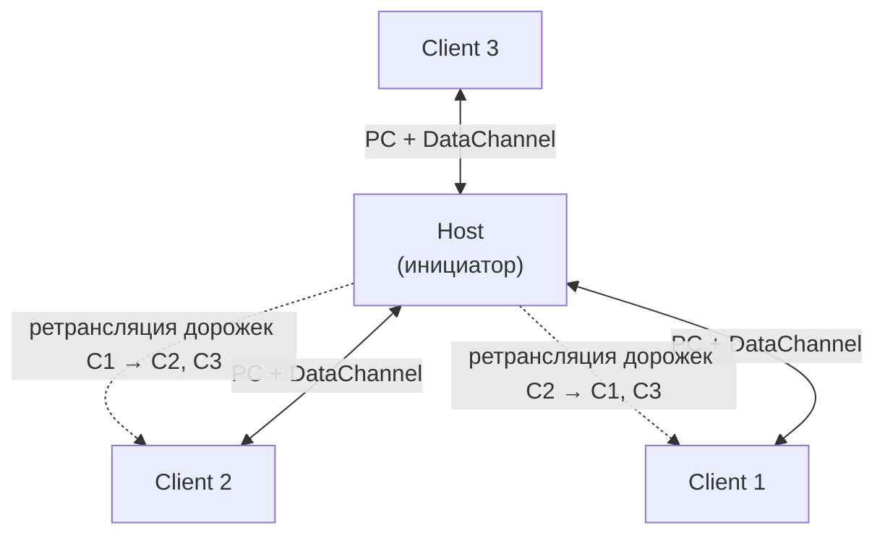
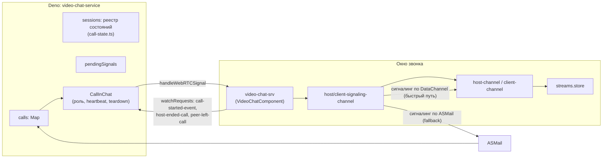
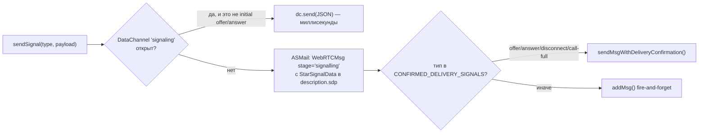
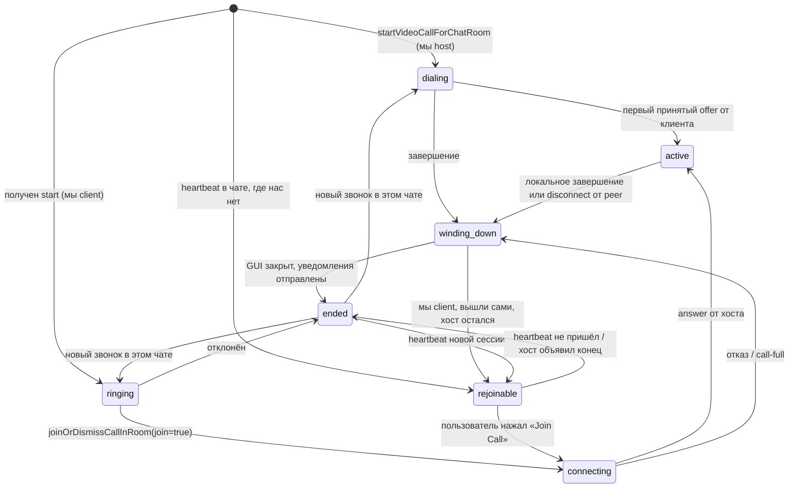
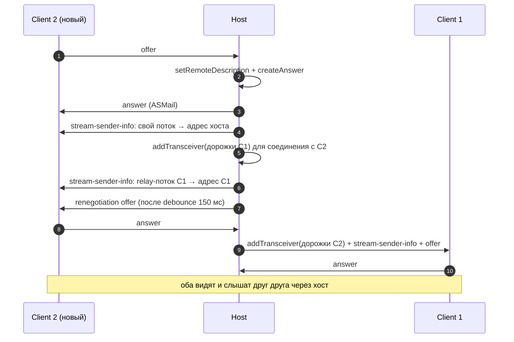
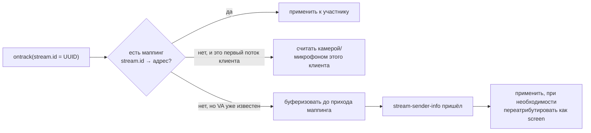
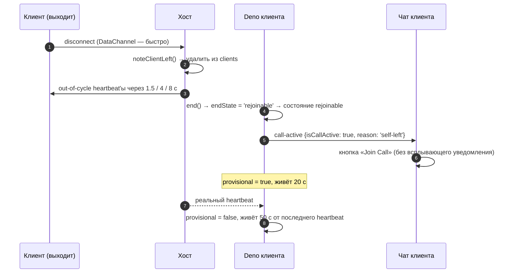

# 05. Видеозвонки: топология Star (START)

[← к оглавлению](./README.md)

## 1. Идея топологии

У приложения нет медиасервера. Роль сервера берёт на себя приложение того участника, который начал
звонок:

- **Host** — инициатор (`direction: 'outgoing'`). Держит по одному `RTCPeerConnection` на каждого
  клиента, принимает их дорожки и **ретранслирует** остальным (mini-SFU без перекодирования).
- **Client** — приглашённый (`direction: 'incoming'`). Держит одно соединение с хостом: отдаёт своё
  видео/аудио и получает потоки всех остальных.

Роль однозначно выводится из направления вызова
([call.ts:80-82](../src-deno/services/video-chat-service/utils/call.ts#L80-L82)).



Лимит участников — `MAX_CALL_PARTICIPANTS = 8`, включая хоста
([video-call.ts:36](../shared-libs/constants/video-call.ts#L36)). Файл
[shared-libs/constants/video-call.ts](../shared-libs/constants/video-call.ts) — единственный
источник константы для Deno и GUI; оба слоя её реэкспортируют
([src-deno/.../constants.ts:30-34](../src-deno/services/video-chat-service/constants.ts#L30-L34),
[star-constants.ts:25-31](../src-video/common/services/star-constants.ts#L25-L31)).

## 2. Разделение между Deno и окном звонка



Ответственность:

| Слой | Что делает |
|---|---|
| `video-chat-service.ts` | приём сигналов из inbox и решения по ним, буфер опережающих сигналов, ссылки на живые объекты звонка, очистка inbox от сигналов, открытие/закрытие окна |
| `call-state.ts` | состояние звонка каждого чата и все правила «принять / отбросить сигнал»; чистый модуль |
| `call.ts` (`CallInChat`) | жизненный цикл одного звонка: роль, отправка `start`/`disconnect`, heartbeat, маршрутизация сигналов в окно, teardown |
| `video-chat-srv.ts` | реализация сервиса на стороне окна, маршрутизация сигнала в host/client-канал, обработка `disconnect` |
| `host-channel.ts` / `client-channel.ts` | собственно WebRTC: PC, offer/answer, ICE, ретрансляция, screen share |
| `*-signaling-channel.ts` + `signaling-channel-core.ts` | транспорт сигналов: DataChannel, иначе ASMail |
| `streams.store.ts` | состояние звонка для UI: участники, потоки, статусы |

### 2.1 Конфигурация STUN/TURN

`RTCConfiguration` принадлежит Deno-инстансу, а не окну: окно получает её в `ChatInfoForCall`
при открытии ([01-components-and-ipc.md §3.3](01-components-and-ipc.md#33-videochatcomponent)) и своей
копии не имеет — `startCall()` без переданной конфигурации бросает исключение вместо того, чтобы
подставить встроенную ([streams.store.ts](../src-video/common/store/streams.store.ts)).
Так креды TURN не попадают в бандл окна звонка.

Сама конфигурация — данные, а не код:

| Где | Что |
|---|---|
| [public/ice-servers.json](../public/ice-servers.json) | поставляемые значения; попадают в папку приложения как есть |
| `exposedFSResources.ice-servers` ([manifest.json](../manifest.json)) | ресурс `/constants/ice-servers.json` в local-хранилище приложения; платформа инициализирует его из поставляемого файла (`initValueSrc`), читать разрешено только `/background-instance.mjs` |
| [ice-config.ts](../src-deno/services/video-chat-service/ice-config.ts) | чтение ресурса на каждый старт звонка (правка файла действует без перезапуска фонового инстанса) и резерв — тот же JSON, вкомпилированный в Deno-бандл |
| [utils/ice-servers-json.ts](../src-deno/services/video-chat-service/utils/ice-servers-json.ts) | разбор JSON в `RTCConfiguration`; переносятся только поля ICE, чтобы файл не стал способом настроить `RTCPeerConnection` целиком |

Ротация кред — замена JSON: ни правки кода, ни пересборки окон. Резерв в Deno-бандле существует,
чтобы сбой чтения ресурса деградировал до прежнего поведения, а не отключал релей; он вкомпилирован
из того же файла, поэтому разойтись с поставляемым не может. Разбор проверяется спекой
[ice-config.ts](../tests-app/src/tests/ice-config.ts).

## 3. Сигналинг

Два уровня.

### 3.1 Уровень ASMail: `WebRTCMsg`

[types/asmail-msgs.types.ts](../types/asmail-msgs.types.ts) — четыре стадии:

| `stage` | Смысл | Подтверждение доставки | Штамп `id` |
|---|---|---|---|
| `start` | «звоню тебе» — создаёт объект звонка у получателя | да; при неудаче — `onUndelivered` (пользователю сообщается «не дозвонились до X») | `Date.now()` |
| `signalling` | SDP/ICE — нет (fire-and-forget); прикладные поля-идиомы ниже — да | по полю | `Date.now()` |
| `disconnect` | завершение | да + до 2 повторов с паузой 5 с | `Date.now()` |
| `heartbeat` | «звонок ещё идёт» (группы; от хоста, а с маркером `relayedRejoin` — и от собственного устройства, §5), а также запрос «повтори `start`» | нет; реактивный ресенд по сообщённой ошибке доставки | `Date.now()` |

**Штамп `id` обязателен и для heartbeat.** Получатель измеряет возраст сигнала по двум независимым
часам (`signalAgeOf()` в
[webrtc-msg-body.ts](../src-deno/services/video-chat-service/utils/webrtc-msg-body.ts)): по штампу
отправителя (`WebRTCMsg.id`) и по локальному `deliveryTS`. Heartbeat какое-то время штамповался
константой `id: 0`, и `admitsHeartbeat` отбрасывала **каждый** такой beat как `drop-stale` (гейт
`HEARTBEAT_MAX_AGE_MILLIS`) — то есть механика re-join была мертва целиком и молча, потому что вердикт
пишется на уровне `debug`. Сейчас `signalAgeOf()` трактует `id === 0` как «штампа нет» (возраст по
`fromSenderClock` = 0), а не как 1970 год, и штамп в будущем клампится к нулю; спека на это —
регресс-гард в Suite 16.

| `stage` | Слепые повторы | Живут ли при `CONFIRM_DELIVERY_ENABLED = true` |
|---|---|---|
| `start` | 3/12/30 с, и только при переданном `stillNeeded` | **да** (`evenWhenConfirmed`) |
| `disconnect` | 4/20/60 с | нет |

При включённом подтверждении (текущее состояние, см. ниже) слепые повторы по умолчанию
**пропускаются** — вместо четырёх безусловных копий на каждый выход участника уходит одна доставка
плюс повтор только при реально сообщённой ошибке.

**Исключение — `start`, и оно про многодевайсность.** Подтверждение доказывает, что приглашение
легло в ящик **адреса**, а ящик принадлежит адресу, а не устройству. Из «сообщение в ящике» не
следует «каждое устройство этого адреса его увидело», а `start` — единственный сигнал, которому надо
дойти до **всех** устройств: за любым из них может сидеть пользователь. Живой прогон 2026-08-15:
подтверждённый `start` зазвонил на одном устройстве двухдевайсного пользователя и не был показан
ядром второго — при живой подписке на ящик и 55 секундах, в течение которых сообщение в общем ящике
лежало (разбор — [core-platform-issues-2026-08-14.md §7](../plans/core-platform-issues-2026-08-14.md)).
Гейт `stillNeeded` (`inviteStillPending`) при этом не ослаблен: повторы гаснут, как только этот пир
ответил или отклонил, так что «фантомного» звонка они не рождают. При подтверждённой отправке отсчёт
задержек идёт от **конца** окна подтверждения (15–20 с на практике), а не от вызова: сервер, которому
некогда подтвердить, — последний, кому стоит подсовывать копии.

**«Ответил» — это прислал свой сигнал, а не «был приглашён».** Правило живёт чистой функцией
`inviteStillPending()` ([call-state.ts](../src-deno/services/video-chat-service/utils/call-state.ts),
спеки — Suite 22) и смотрит на два множества: `peersThatAnswered` (пополняется на первом настоящем
offer'е пира) и `peersThatDeclined`. До 2026-08-16 гейт был closure и читал `clients` — а карта
клиентов у хоста заполняется **всеми приглашёнными** ещё в `initializeRole`, то есть отвечала на
вопрос «кого позвали», а не «кто ответил». Повторы были мертвы с момента написания: в логе каждого
звонка `Blind repeats of 'start' … cancelled at #1/3: no longer needed` через 3 с после отправки, в
том числе там, где пир отвечал десятью секундами позже. Множество ответивших не чистится при выходе
участника: тот, кто успел войти и выйти внутри расписания 3/12/30 с, уже дозвонился, и лишняя копия
позвала бы его обратно.

Тот же гейт — у повторной отправки по просьбе пира (`request-start`, §6): один вопрос, один ответ,
`CallInChat.isInvitePending()`.

**Копия повтора остаётся в общем ящике.** Устройство, которое уже звонит, принятый повтор `'start'`
из ящика **не** удаляет — запоминает в `signalsLeftInInbox`, как и первичный `'start'` (§5.1), и
удаляет пакетом на teardown. Иначе устройство, из-за которого повторы и существуют, теряло бы каждую
копию раньше, чем её увидит его ядро.

Внутри `signalling` есть, кроме SDP/ICE, четыре «прикладных» поля-идиомы
([asmail-msgs.types.ts](../types/asmail-msgs.types.ts)): `callFull` (отказ по ёмкости), `callDeclined`
(«я нажал Отклонить»), `callHandledElsewhere` — единственное в этой четвёрке, что адресуется
**собственному адресу** пользователя, а не собеседнику: см. §5.1, — и `rejoining` («возвращаюсь в
звонок», §5.3). Первые три
отправляются с подтверждением доставки, в отличие от SDP/ICE того же `stage`: это одиночные сообщения,
у которых нет своего цикла повторов, а у `callHandledElsewhere` нет и никакого другого пути
восстановления (§5.1). `rejoining` — наоборот, намеренно fire-and-forget: его ценность целиком в
скорости, а потеря стоит ровно возврата к прежнему поведению.

Пятое поле того же рода, `relayedRejoin`, едет не здесь, а на стадии `heartbeat`, и адресуется, как и
`callHandledElsewhere`, собственному адресу пользователя (§5).

**Чат в теле, а не только в конверте.** Одиночный `groupChatId` в теле означает «групповой чат», его
отсутствие — «чат 1-1, и его идентификатор — адрес отправителя из конверта». Для сообщения,
адресованного **собственному** адресу, такой вывод даёт «чат с самим собой», которого не существует,
и сообщение отбрасывалось бы как «нет такого чата». Поэтому тело несёт и явное поле `chatId`
(`ChatWebRTCMsgV1.chatId`) — симметрично `ChatSyncMsgV1.chatId` у sync-фантомов, которые ходят тем же
маршрутом и по той же причине несут его. Правило доверия узкое: поле читается **только когда
отправитель — этот же пользователь**; сигнал пира по-прежнему привязывается к чату по конверту, иначе
пир мог бы положить свой сигналинг в чат 1-1, к которому не имеет отношения. Поле необязательное, и
`groupChatId` продолжает отправляться рядом, поэтому сборка, которая `chatId` не читает, работает
по-прежнему.

Плюс поле **`callSessionId`** — идентификатор сессии звонка вида `<hostAddr>#<appDeviceId>-<счётчик>`.
Хост выпускает его при создании звонка (`LocalDataStore.nextCallSessionId()`,
[local-data-store.ts](../src-deno/services/local-data-store/local-data-store.ts); счётчик персистентный,
поэтому перезапуск компонента не может выдать уже использованный id, а appDeviceId разводит устройства
одного пользователя — адрес-то в id общий, и без него первые звонки двух наших устройств получили бы
один id), клиент узнаёт из `start` (при re-join — из heartbeat) и подставляет во все свои сигналы.
Разбирать id вправе только `hostAddrOfCallSession()` ([chat-ids.ts](../shared-libs/chat-ids.ts)) и
только до первого `#`; остальное — непрозрачный хвост, который лишь сравнивают. Благодаря этому «сигнал прошлого звонка»
отличается от «сигнала текущего» по идентификатору, а не по возрасту — см. §6. Поле необязательное:
сигнал без него обрабатывается по прежним временным правилам, так что звонок со сборкой, которая
`callSessionId` не знает, продолжает работать.

Единственное место, которое кладёт сигнал в ASMail, — `sendWebRTCSignal()`
([shared-libs/webrtc-signalling.ts](../shared-libs/webrtc-signalling.ts)). Оно собирает
`ChatWebRTCMsgV1` → `ChatOutgoingMessage`, всегда ставит `sendImmediately: true` (чтобы сигналинг не
стоял в очереди за обычными сообщениями), логирует размер тела (крупный SDP — главная причина
задержек доставки; строка на каждый сигнал идёт через `logger.debug` и по умолчанию молчит, см.
[07-build-test-run.md §3.1](07-build-test-run.md#31-логирование-и-диагностический-режим)) и выбирает
подтверждённую доставку или fire-and-forget. Политика — за вызывающим:

| Сторона | Подтверждает | Повторяет |
|---|---|---|
| Deno, по `stage` ([_common.ts](../src-deno/services/video-chat-service/utils/_common.ts)) | `start`, `disconnect`, а также `callFull` / `callDeclined` / `callHandledElsewhere` | `disconnect` ×2, `callHandledElsewhere` ×2, пауза 5 с; плюс слепые повторы `start` (3/12/30 с) — единственные, что переживают подтверждение |
| Окно, по `signalType` ([signaling-channel-core.ts](../src-video/common/services/signaling-channel-core.ts)) | `offer`, `answer`, `disconnect`, `call-full`, `dropped` | нет — повторами занимается `createRetryWatcher` |

Раньше обе стороны собирали одно и то же тело, дважды считали его размер и задавали наборы «что
подтверждаем» независимо друг от друга. Разбор входящего Star-сигнала намеренно остался в окне
(`parseStarSignalFromWebRTCMsg()`): Deno Star-сигналы не разбирает вовсе, поэтому переносить в
`shared-libs` типы окна было бы не за что.

**Мастер-флаг `CONFIRM_DELIVERY_ENABLED`** ([webrtc-signalling.ts](../shared-libs/webrtc-signalling.ts))
глобально гасит подтверждение независимо от политики вызывающих. Его история — предупреждение о том, как
легко такой флаг переживает своё обоснование: он был выключен в `4b7d4ed`, потому что подтверждение
(7–12 с у ~200 Б сигнала) блокировало отправку дольше, чем тогдашние таймеры переговоров 4–8 с, и
watcher'ы успевали выстрелить в идущее подтверждение. Уже в следующем коммите `801d1f6` таймеры подняли
до 45–60 с (`NEGOTIATION_RETRY_DELAYS`/`ANSWER_RETRY_DELAYS`/`OFFER_RETRY_DELAYS`), но к флагу не
вернулись — и три коммита он оставался выключенным без причины. Сейчас он **включён**: окно
подтверждения 25 с (`SDP_CONFIRM_TIMEOUT_MS`) против первого повтора на 45 с не пересекаются, а
пропуск слепых повторов — самое сильное приложенческое средство против серверных 500-х (меньше
одновременных доставок ⇒ выше шанс их не увидеть). Единственное изъятие из этого пропуска — `start`,
и оно оплачено: три копии на приглашённого, разнесённые на 3/12/30 с, — не пачка, а гейт
`stillNeeded` снимает остаток, как только пир ответил.

Возвращать `false` стоит только если таймеры переговоров снова опустят ниже окна подтверждения, либо
если `observeDelivery` начнёт терять финальные события настолько часто, что таймауты станут
преобладать над реальными отказами.

**«Не подтвердилось» ≠ «упало».** Различие важно потому, что реакции противоположные: на **сообщённую**
ошибку доставки нужен быстрый повтор (5 с), а на подтверждение, которое просто перестало ждать, — не
нужен никакой: сообщение всё ещё в пути, и вторая копия многокилобайтного SDP — ровно та нагрузка,
которую перегруженный сервер выдержит хуже всего. В прогоне 2026-08-13 это стоило лишней копии offer'а
21 КБ: подтверждение истекло на 25 с при `bytesSent=0, done=false` (сервер не принял ни байта), клиент
через 5 с отправил второй экземпляр, а первый в итоге дошёл. Поэтому:

- `WebRTCSignalSendResult.deliveryUnknown` — признак «таймаут, но об ошибке никто не сообщал»;
  классификатор — чистая `isDeliveryStillInFlight()`
  ([webrtc-signalling.ts](../shared-libs/webrtc-signalling.ts)), покрыт спекой (Suite 11);
- `sendSignalViaAsmail()` возвращает **«не сообщалось об ошибке»**, а не «подтверждено»: именно это
  нужно вызывающим, которые по `false` арминуют быстрый повтор. Медленный watcher (45 с) при этом
  армится **до** ожидания отправки и остаётся восстановлением для реально потерянного SDP;
- реальная ошибка (`allDone: 'with-errors'`, per-recipient `err`) по-прежнему даёт `false` и быстрый
  повтор — в том же прогоне это отработало правильно на упавшем с 500 answer'е для a-2600.

Из-за этого строки вида `SDP Offer sent to Host (not reported failed: …)` намеренно **не** говорят
«confirmed»: авторитетную формулировку (`confirmed` / `NOT confirmed but still in flight` / `FAILED`)
пишет `sendWebRTCSignal`.

Подтверждение реализовано через `observeDelivery` + опрос `currentState()`
([asmail-utils.ts](../shared-libs/asmail-utils.ts)) — опрос обязателен, потому что подписка
оформляется уже после `addMsg()` и при `sendImmediately: true` регулярно опаздывает к событию.
Подтверждённая ветка отправки идёт через ту же очередь `queuedAddMsg`, что и fire-and-forget: разнесение
стартов доставок на `SIGNAL_SEND_SPACING_MS` = 200 мс добавлялось именно против 500-х и должно
применяться к обеим ветвям.

### 3.2 Уровень Star: `StarSignalMessage`

[star.types.ts](../src-video/common/types/star.types.ts) — 11 типов сигналов:
`offer`, `answer`, `candidate`, `participant-joined`, `participant-left`,
`participant-reconnecting`, `call-full`, `stream-state-changed`, `stream-sender-info`,
`request-stream-info`, `disconnect`.

Транспорт выбирается в момент отправки
([host-signaling-channel.ts:86-127](../src-video/common/services/host-signaling-channel.ts#L86-L127),
[client-signaling-channel.ts:82-114](../src-video/common/services/client-signaling-channel.ts#L82-L114)):



- Первичный `offer` (клиент) и первичный `answer` (хост) всегда идут по ASMail: DataChannel к тому
  моменту ещё не открыт.
- Хост открывает **два** DataChannel на каждого клиента при создании PC
  ([host-channel.ts:711-767](../src-video/common/services/host-channel.ts#L711-L767)):
  `streamInfo` (сопоставление потоков и адресов) и `signaling` (SDP/ICE и прикладные сигналы).
- Упаковка Star-сигнала в ASMail — «сигнал внутри SDP»: `StarSignalData` сериализуется в
  `description.sdp` ([signaling-channel-core.ts:157-196](../src-video/common/services/signaling-channel-core.ts#L157-L196)),
  а на приёме распознаётся по подстрокам `"signalType"` / `"starSignal"`
  ([signaling-channel-core.ts:248-323](../src-video/common/services/signaling-channel-core.ts#L248-L323)).
- Анти-спуфинг: для `offer`/`answer`/`candidate` отправитель всегда берётся из конверта ASMail; для
  прикладных сигналов сохраняется «логический» автор, потому что хост пересылает чужое состояние
  (например, mute участника) от своего адреса
  ([signaling-channel-core.ts:298-315](../src-video/common/services/signaling-channel-core.ts#L298-L315)).

## 4. Жизненный цикл звонка (Deno)

### 4.1 Состояние звонка

Состояние звонка в чате живёт в одном месте — реестре сессий
[call-state.ts](../src-deno/services/video-chat-service/utils/call-state.ts). Это чистый модуль: без
`w3n`, без таймеров, `now` передаётся аргументом, поэтому каждое правило проверяется спекой
(«Test Suite 7/8» в [tests-app/src/tests/video-chat.ts](../tests-app/src/tests/video-chat.ts)).



`idle` — отсутствие записи: у чата без звонка нечего помнить. Разрешённые переходы заданы одной
таблицей в `canTransit()`; недопустимый переход **логируется и игнорируется**, а не бросает
исключение, — сервис обрабатывает сетевые события, и падение обработчика хуже проигнорированного
перехода.

Каждый переход привязан к наблюдаемому событию, а не к предположению:

| Переход | Что его вызывает |
|---|---|
| → `dialing` | `startVideoCallForChatRoom()`: окно открыто, участников ещё нет |
| → `ringing` | пришёл `start`, пользователь ещё не ответил |
| `ringing` → `connecting` | `joinOrDismissCallInRoom(join=true)`: клиент отправляет offer |
| `dialing` → `active` | хост принял первый offer клиента (answer уходит сразу же) |
| `connecting` → `active` | клиент получил `answer` от хоста |
| → `winding-down` | `endCallInGUI()` (в том числе из `teardownFromRemoteDisconnect()`) |
| → `ended` / `rejoinable` | `end()` → `detachFromParent(endState)` |

`callStage` внутри `CallInChat` остался, но только как локальный охранник от повторного teardown; это
не второй источник истины — наружу звонок **сообщает** состояние через `notifyState`.

`end()` вычисляет, чем именно закончился звонок
([call.ts](../src-deno/services/video-chat-service/utils/call.ts)):

| `endState.kind` | Когда | `endedBy` в записи | Последствие |
|---|---|---|---|
| `rejoinable` | групповой клиент вышел сам, хост остался | — | сразу показать «Join Call» (запись помечается `provisional`) |
| `ended-by-host` | хост объявил конец | `host` | heartbeat'ы этой сессии игнорируются |
| `ended-by-peer` | получен `disconnect` от собеседника | `peer` | просто убрать состояние звонка |
| `ended-by-self` | завершили мы | `self` | то же |

### 4.2 Исходящий звонок 1-1

```mermaid
sequenceDiagram
    autonumber
    participant UI as Основной GUI (A)
    participant D as Deno (A)
    participant W as Окно звонка (A)
    participant DB as Deno (B)
    participant UB as GUI/окно (B)

    UI->>D: startVideoCallForChatRoom(chatId)
    D->>D: createAndRegisterCall(direction='outgoing') → роль host
    D->>W: startVideoCallComponentForChat(ChatInfoForCall)
    W->>W: va-setup: выбор камеры/микрофона
    Note over W: пользователь нажимает «Начать»
    W->>W: streams.startCall('outgoing') → starConfig
    W->>D: call-started-event (watchRequests)
    D->>DB: WebRTCMsg stage='start' (подтверждённая доставка)
    D->>D: doAfterStartCall(): запись 'call' в истории + фантом
    DB->>DB: handleIncomingCall(): CallInChat(direction='incoming')
    DB->>UB: startAppWithParams('incoming-call')
    UB->>UB: звонок в чате, звонок-рингтон
    Note over UB: пользователь принимает
    UB->>DB: joinOrDismissCallInRoom(chatId, true, hostAddr)
    DB->>DB: initializeRole('incoming', hostAddr) + startCall()
    DB->>UB: открыть окно звонка (роль client)
    UB->>D: offer (ASMail, подтверждённая доставка)
    D->>W: handleWebRTCSignal → host-channel.handleClientOffer()
    W->>UB: answer (ASMail) + открытие DataChannel
    W<-->UB: ICE candidates
    W<-->UB: медиа
```

Отклонение вместо принятия: `joinOrDismissCallInRoom(chatId, false, hostAddr)` отправляет хосту
`callDeclined` ([video-chat-service.ts:878-889](../src-deno/services/video-chat-service/video-chat-service.ts#L878-L889),
[_common.ts:235-281](../src-deno/services/video-chat-service/utils/_common.ts#L235-L281)), чтобы
баннер у хоста показал «отклонил», а не ждал таймаута.

### 4.3 Подключение третьего участника (группа)

Ключевая техническая деталь: **SDP-answer не может содержать больше m-line, чем offer**. Поэтому
дорожки уже подключённых участников добавляются новому клиенту **после** ответа, с последующей
переговоркой ([host-channel.ts:1042-1123](../src-video/common/services/host-channel.ts#L1042-L1123)).



Механизмы, которые это удерживают:

- **Перегововорка с debounce** `NEGOTIATE_DEBOUNCE_MS = 150` мс
  ([host-channel.ts:88](../src-video/common/services/host-channel.ts#L88)): аудио- и видеодорожка
  одного источника приходят разными событиями `ontrack`, и без склейки было бы два offer'а подряд.
- **Ожидание состояния `stable`** до 20 попыток по 50 мс, до 3 раундов
  ([host-channel.ts:90-92](../src-video/common/services/host-channel.ts#L90-L92),
  [455-504](../src-video/common/services/host-channel.ts#L455-L504)).
- **Perfect negotiation**: хост — impolite (при коллизии offer'ов игнорирует чужой,
  [host-channel.ts:944-959](../src-video/common/services/host-channel.ts#L944-L959)), клиент —
  polite (откатывает свой offer и отвечает на чужой,
  [client-channel.ts:584-604](../src-video/common/services/client-channel.ts#L584-L604)).
- **Дедупликация повторного offer'а** по `o=`-строке SDP (`parseSdpOrigin`):
  если тот же offer уже применён, хост просто пересылает существующий answer
  ([host-channel.ts](../src-video/common/services/host-channel.ts)).
- **Сторожевой таймер переговорки**: offer по ASMail может потеряться, поэтому арминится
  `createRetryWatcher`. Числа — не «4/8/15 с», как было в первой версии: измеренная односторонняя
  латентность ASMail 10–20 с означает, что answer на ре-негоциационный offer физически не может
  прийти раньше 20–40 с, поэтому задержки подняты до `NEGOTIATION_RETRY_DELAYS = [45 с, 60 с]`
  (answer — `ANSWER_RETRY_DELAYS = [45 с]`, клиентский offer — `OFFER_RETRY_DELAYS =
  [45/60/60 с]`), а быстрый повтор после неподтверждённой отправки — 5 с. **Пересоздания PC при
  исчерпании больше нет**: неотвеченные повторы означают медленную доставку гораздо чаще, чем мёртвого
  пира, а пересоздание осиротит идущий к нам answer (источник взаимных recreate-штормов); восстановление
  оставлено честным сигналам линка — дедлайну подключения 120 с и grace-пути, — оба заканчиваются
  `removeClient({notifyDropped})`. Если открыт `signaling`-DataChannel, ASMail-повторы дешевеют, но
  **не отключаются**: DC гарантирует доставку offer'а, а не приход answer'а.
- **ICE-состояние не является доказательством, что пир применил наш SDP.** Проверено и откатано в
  этой базе дважды ([shared-pc-setup.ts](../src-video/common/services/shared-pc-setup.ts),
  [client-channel.ts](../src-video/common/services/client-channel.ts)): ICE может проходить, потому что
  пир отвечает на connectivity-checks по credentials **своего** offer'а, а без применённого answer'а
  DTLS не завершится. Поэтому `shouldSkip` у watcher'ов принципиально **не** привязан к
  `iceConnectionState` — такая привязка однажды навсегда оставила недоговорённым m-line шаринга экрана.
  Единственное исключение — **answer-leg у хоста**: `connectionState === 'connected'` действительно
  доказывает, что клиент применил answer (иначе не было бы DTLS), поэтому в этой ветке
  `clearAnswerRetry()` вызывается как гигиена. На offer-leg то же рассуждение не переносится.
- **Троттлинг повторных пересылок SDP.** Пути пересылки независимы: на каждый дубль-offer хост
  пересылает существующий answer, и параллельно может сработать тик answer-watcher'а — во время
  500-шторма 2026-08-13 это давало два многокилобайтных сообщения на один факт. Введены штампы
  «когда SDP последний раз ушёл»: `ClientConnection.lastAnswerSentAt` +
  `ANSWER_RESEND_MIN_INTERVAL_MILLIS` = 10 с у хоста и `lastOfferSendAttemptAt` у клиента.
  Первичный answer не подавляется никогда, и тики watcher'ов только **штампуют**, но не подавляются:
  их бюджет — это и есть восстановление. Клиентский штамп намеренно отдельный от `lastOfferSentAt`:
  тот питает откат «застрявшего» offer'а (`STRANDED_OFFER_ROLLBACK_AGE_MILLIS`), и обновление его
  пересылкой отложило бы откат навсегда.
- **Диагностируемость повторов.** У `createRetryWatcher` есть опциональный `describeState()`, и обе
  стороны его передают, поэтому строка `Scheduling retry N/M` несёт
  `leg=joining|mid-call signalingState=… connectionState=… iceState=… sigDc=…`. Без этого первичный
  offer и ре-негоциация шаринга экрана дают в логе одну и ту же строку, что и делало логи групповых
  прогонов нечитаемыми.

  Признак ноги на двух сторонах вычисляется **по-разному**, и это не косметика: на клиенте
  `pc.currentRemoteDescription === null` буквально означает «answer ещё ни разу не применён», то есть
  «ещё подключаемся»; на хосте то же поле непригодно — хост применяет offer клиента **до** отправки
  самого первого answer'а, поэтому там оно ненулевое с самого начала и метка вырождалась в вечное
  `mid-call` (замечено в прогоне 2026-08-13). На хосте признак — доходило ли соединение до
  `connected` (`ClientConnection.connectedAt`). Слова оставлены одинаковыми, чтобы два лога читались
  рядом.

### 4.4 Идентификация потоков

`MediaStream.id` в WebRTC только для чтения и на приёмной стороне выглядит как UUID, поэтому «кто
это» передаётся отдельным сигналом `stream-sender-info`
([host-channel.ts:224-260](../src-video/common/services/host-channel.ts#L224-L260)):



- Хост отправляет маппинг и по DataChannel (надёжно, по порядку), и — для самого первого маппинга —
  по ASMail, потому что DataChannel в этот момент ещё не открыт.
- Потерянный маппинг восстанавливается двумя путями, и оба ведут в одну функцию
  `resendAllStreamSenderInfo()` ([host-channel.ts](../src-video/common/services/host-channel.ts)),
  идемпотентную по построению: при открытии `streamInfo`-DataChannel и по запросу клиента
  (сигнал `request-stream-info`). Клиент шлёт запрос, если дорожки пришли, а маппинг — нет
  (через `STREAM_INFO_REQUEST_MS` = 1 с), и лишь через `STREAM_INFO_TIMEOUT_MS` = 3 с сдаётся и
  применяет дорожки под сырым UUID
  ([use-webrtc-callbacks.ts](../src-video/common/composables/use-webrtc-callbacks.ts)). Раньше
  ожидание было 10 с без запроса, то есть «сдаться» было **единственным** исходом потери маппинга:
  участник навсегда оставался без имени и без индикаторов mute (`stream-state-changed`
  маршрутизируется по реальному адресу).
- Ретрансляция использует **один relay-`MediaStream` на источник**, чтобы аудио и видео одного
  участника пришли получателю под одним `stream.id`
  ([host-channel.ts:166-192](../src-video/common/services/host-channel.ts#L166-L192)).
- Экраны адресуются псевдоадресом `screen:<mailerId>:<srcId>`
  ([shared-screen-share.ts](../src-video/common/services/shared-screen-share.ts)); в UI это
  отдельная «плитка-участник».
- Если поток сначала приняли за камеру, а маппинг потом сказал «это экран», выполняется
  переатрибуция: дорожки снимаются с VA-ключа, добавляются под screen-адресом, а камера
  восстанавливается ([host-channel.ts](../src-video/common/services/host-channel.ts)).

**Владелец relay-слота у клиента и «плитка ушедшего участника».** Клиент показывает медиа слота, когда
владелец известен **и** есть признак реального медиа (`emitRelaySlot` в
[client-channel.ts](../src-video/common/services/client-channel.ts)). Владельца дают два источника:
пришедший от хоста маппинг (`mappedOwner` — сам по себе доказательство, что хост что-то в слот
положил) и слабая подсказка резервирования `declaration.forAddr`, которой нужен подтверждающий
`unmute`, иначе каждый ещё не подключившийся участник ростера получил бы плитку.

Оба правила вынесены в чистые функции `relaySlotOwnerToShow()` и `clearedRelaySlotOnDeparture()`
([relay-slots.ts](../src-video/common/services/relay-slots.ts)) и покрыты спекой — см. ниже, почему
именно так, а не «живой» проверкой.

Отсюда правило, которое легко нарушить: на `participant-left` признак медиа слота (`hasMedia`)
обнуляется **безусловно**, а не перечитывается у дорожки. `participant-left` — это заявление хоста, что
слот пуст, тогда как приёмная дорожка становится `muted` только через несколько секунд после
фактического прекращения RTP (внутренний таймаут Chromium). Перечитывание сохраняло `true` у только что
опустошённого слота, и следующая же `reviewRelaySlots()` — то есть **любая** ре-негоциация, в первую
очередь шаринг экрана — принимала `hasMedia && forAddr` за живого участника и поднимала плитку с
надписью «камера вот-вот начнёт трансляцию» для того, кто из звонка уже вышел (наблюдалось в групповом
прогоне 2026-08-13 у a-2600 по ушедшему a-3600). Ничего при обнулении не теряется: вернувшегося
участника анонсирует маппинг, который эмитит независимо от флага, а слушатель `unmute` вернёт флаг в
`true`, когда RTP действительно пойдёт.

**Почему это спека, а не пункт ручного прогона.** Спусковой крючок здесь — **задержка** между
прекращением RTP и переходом дорожки в `muted`, то есть внутренний таймаут браузера. Ни живой прогон, ни
интеграционный тест на реальных `RTCPeerConnection` не воспроизводят такое надёжно: они выигрывают или
проигрывают гонку. Поэтому правило вынесено в чистые функции, где `hasMedia` — просто входной параметр,
и весь дефект превращается в таблицу: «ушёл → `hasMedia = false` → показывать некого», «вернулся по
маппингу → показываем», «вернулся по RTP → показываем». Это же и общий критерий: если условие дефекта —
гонка или таймаут платформы, правило надо выносить в чистую функцию, иначе тест на него будет
неотличим от лотереи.

## 5. Heartbeat и повторное подключение

Heartbeat — **только групповые чаты, только хост**
([call.ts](../src-deno/services/video-chat-service/utils/call.ts)):

- Запускается лениво — при первом принятом offer'е от клиента, чтобы «пустой» звонок не рассылал
  приглашения присоединиться.
- Интервал `HEARTBEAT_INTERVAL` = 15 с, в теле — адрес хоста, чтобы получатель мог подключиться именно
  как client, и `callSessionId`, чтобы heartbeat завершённого звонка был опознан как таковой
  ([_common.ts](../src-deno/services/video-chat-service/utils/_common.ts)).
- **Каждый тик адресован всем пирам, включая подключённых** — не «только тем, кто не подключён», как
  утверждала прежняя версия этого раздела. Это сделано осознанно (комментарий у
  `startHeartbeatIfNeeded()`): для пира без запущенного звонка heartbeat зажигает кнопку «Join»
  (re-join), а пиру со зарегистрированным звонком его background пересылает в окно, где он кормит
  watchdog «хост молчит». Фильтр по `clients.get(addr)?.isConnected` тут непригоден: флаг встаёт на
  первом принятом offer'е, задолго до того (и независимо от того), заработает ли WebRTC-линк, — и
  клиент, застрявший в connecting, оказывался именно тем, кто остался без heartbeat'ов.
- В 1-1 heartbeat не нужен: уход любой стороны заканчивает звонок.

**Сколько потерь выживает запись.** Запись re-join жива, пока `(N + 1) · HEARTBEAT_INTERVAL ≤
HEARTBEAT_TIMEOUT`. При 15 с и прежних 35 с выживала ровно **одна** потеря, что при 500-штормах
ASMail — норма; `HEARTBEAT_TIMEOUT` = 50 с даёт `N = 2` (3·15 = 45 ≤ 50) и **не увеличивает трафик**:
частота beat'ов не меняется. Выше не поднято намеренно: в прогоне 2026-08-13 наблюдалось шесть потерь
подряд (~90 с), и такой звонок обязан потерять кнопку «Join».

**Ловушка, которую легко вернуть:** рядом стоит независимый гейт `HEARTBEAT_MAX_AGE_MILLIS` = 45 с —
он ограничивает возраст **отдельного** beat'а, а не жизнь записи. Именно связка «гейт по возрасту» +
«heartbeat со штампом `id: 0`» убила re-join целиком (см. §3.1); при любых правках штампа и гейта
смотреть на них вместе.

**Реактивный ресенд вместо подтверждения.** Оборачивать heartbeat подтверждением доставки нельзя:
это multicast ~250 Б каждые 15 с, и держать под каждый тик сессию подтверждения на 20–25 с — прямо
против цели «меньше одновременных доставок». Вместо этого — ресенд по сообщённой платформой ошибке
доставки, только упавшим получателям, отдельным leaf-модулем
[heartbeat-delivery.ts](../src-deno/services/video-chat-service/utils/heartbeat-delivery.ts) (монитор
доставок получает двухстрочный хук; модуль намеренно не тянет mail-sending-service). Границы: бюджет
2 ресенда на звонок, и тик старше 12 с не ресендится — следующий регулярный его уже заменяет. Второе
ограничение делает механизм самогасящимся относительно неизмеренной величины: если платформа сообщает
исход доставки медленнее 12 с, ресенд просто никогда не произойдёт. Саму величину меряет кейс
`report-latency` в
[asmail-group-call-load.ts](../tests-app/src/tests/asmail-group-call-load.ts). Обязательные условия —
`stillNeeded` на каждом ресенде и очистка в `end()`: heartbeat, принятый после конца звонка, зажигает
кнопку «Join» заново (ветка `'unknown'` в `admitsHeartbeat`).

**Ретрансляция beat'а своим устройствам.** Хост — не единственный отправитель heartbeat'ов. Устройство,
у которого есть запись `rejoinable` и которое само не в звонке, пересылает только что принятый beat
**на собственный адрес пользователя**, пометив его `relayedRejoin: { byDeviceId }`
(`relayRejoinHeartbeat()` в [_common.ts](../src-deno/services/video-chat-service/utils/_common.ts)).

Это обход платформенного дефекта, а не часть протокола звонка: подписка на ящик может ослепнуть на
одного корреспондента, оставаясь живой для других. В прогоне 2026-08-16 второе устройство
пользователя не получило от хоста **ничего** — ни одной из четырёх копий `'start'`, ни одного
heartbeat'а за три с лишним минуты, — при том что сообщения собственного адреса шли исправно, а
`listMsgs` находил в ящике всё пропавшее (разбор —
[core-platform-recommendations-2026-08-16.md](../plans/core-platform-recommendations-2026-08-16.md),
часть II пункт 7). Хост тут бессилен: сколько копий ни шли, отправитель у них один. Сосед — нет,
потому что другой отправитель и есть то, на что слепота не распространяется. В прогоне 2026-08-17
обход сработал: слепое устройство получило кнопку от соседа (14:18:09) и вошло в звонок клиентом
(14:18:13).

Правило отправки — чистая `shouldRelayRejoinBeat()`
([call-state.ts](../src-deno/services/video-chat-service/utils/call-state.ts), спеки — Suite 26):

- **только из `rejoinable` и только вне звонка.** Любое другое состояние означает, что зеркалить
  нечего; `ended` — в первую очередь, потому что hold, который уступивший звонок кладёт на соседние
  устройства, не должен сниматься нашими же beat'ами. А из звонка ретранслированный beat позвал бы в
  него второе устройство того же адреса;
- **ретранслированный beat дальше не идёт** (`beatWasRelayed`) — это и вся защита от петли: длиннее
  одного хопа цепочка быть не может. Своя копия (доставка на собственный адрес возвращается
  отправителю) опознаётся по `byDeviceId` и игнорируется;
- **троттлинг `REJOIN_RELAY_MIN_INTERVAL_MILLIS` = 12 с**, то есть *под* интервалом хоста. Это
  осознанно: ретранслируется **каждый** beat хоста, а гасятся только дубликаты одного и того же.
  Арифметика тут не вопрос вкуса — сосед, не слышащий хоста, живёт ровно этим темпом. При 30 с он
  получал бы beat раз в 30 с против записи, живущей 50 с от последнего: одна потерянная
  ретрансляция — и кнопка гаснет на полминуты и возвращается. При 15 с он защищён ровно так же, как
  всякий, кто слышит хоста напрямую (`HEARTBEAT_TIMEOUT` переживает две потери), а цена — одно
  сообщение ~250 Б своему адресу за beat, и только пока идёт звонок, в который это устройство может
  войти. Любое разрежение сверять с `HEARTBEAT_TIMEOUT`: два интервала обязаны в него укладываться.

**Штамп у ретранслированного beat'а свежий, а не хостовый** — и это прямое следствие ловушки выше.
Возраст меряется от отправки, гейт `HEARTBEAT_MAX_AGE_MILLIS` = 45 с, а второе плечо ASMail в
оставшийся бюджет не влезает: с хостовым штампом ретрансляция проваливала бы гейт у соседа и была бы
мертва так же молча, как когда-то `id: 0`. «Старый beat, выданный за новый» тут получиться не может:
ретранслируется только что **принятый** beat, то есть уже прошедший тот же гейт, и ретранслируется
сразу. Звонок, который успел кончиться, ловит запись `endedBy: 'host'` (`drop-ended-session`).

Ретрансляция живёт записью: троттлинг чистится там же, где сторожевой таймер снимает истёкшую
`rejoinable`-запись. Пропала запись — прекратилась ретрансляция; это и есть её граница, отдельного
выключателя нет.

**Чего она не делает.** Она не чинит слепоту: войти в звонок такое устройство сможет, только если его
исходящий offer дойдёт до хоста, а ответ вернётся. И она не поднимает **мелодию вызова** — рингтон и
кнопки «принять/отклонить» поднимает только `'start'` от хоста, а ретранслированный beat даёт
`rejoinable`, то есть «Join Call». Ретранслировать своим устройствам ещё и приглашение **решено не
делать** (17 августа): это был бы третий обход одной платформенной поломки, причём на пути входящего
звонка, где приглашение, обогнавшее уведомление «я взял звонок», подняло бы ринг звонка, который уже
взят, — и погасить его было бы нечем, `'disconnect'` хоста до слепого устройства тоже не доходит.
Остаток закрывается починкой доставки подписке, а не приложением.



**Почему внеочередных beat'ов три, а не один** (`IMMEDIATE_HEARTBEAT_DELAYS_MS = [1.5 с, 4 с, 8 с]`).
Первая задержка обязана быть ненулевой: уходящий клиент принимает heartbeat только после того, как его
собственный `CallInChat` для этого чата дотеардаунился, и немедленная отправка гонится с этим
teardown'ом и молча отбрасывается на приёме. Дальше работает дедлайн: кнопку «Join» у уходящего держит
самодельная provisional-запись, живущая `PROVISIONAL_REJOIN_TIMEOUT` = 20 с, и превратить её в
подтверждённую может только настоящий heartbeat. При латентности ~10 с (до 20 с) единственный beat,
отправленный на 1.5 с, приходит к ~11.5 с без всякого запаса — и если именно эта доставка попала под
500, кнопка гаснет на живом звонке. Отправки 1.5/4/8 с дают прибытия ~11.5/14/18 с. Цена — два
дополнительных сообщения ~250 Б одному адресату, что дешевле четырёх копий, которые раньше стоил
`disconnect`. Расписание отменяется целиком, если клиент успел вернуться, и гасится в `end()`.

Обратный случай — хост завершил звонок:

```mermaid
sequenceDiagram
    autonumber
    participant H as Хост
    participant C as Клиент (в звонке)
    participant CL as Клиент (вышел ранее)

    H->>C: broadcast 'disconnect' по DataChannel
    H->>CL: WebRTCMsg 'disconnect' по ASMail (всем участникам чата)
    C->>C: onHostEndedCall → notifyHostEndedCall() → Deno
    C->>C: announceHostEndedCall(): уведомление ОС + событие call-ended-by-host
    C->>C: teardown, endState = 'ended-by-host' → ended, endedBy = 'host'
    CL->>CL: нет активного звонка → ended, endedBy = 'host'
    CL->>CL: была запись rejoinable → call-active {false}
    Note over CL: «Join Call» исчезает сразу; heartbeat этой же<br/>сессии игнорируется, сколь угодно запоздавший
```

Код: [host-channel.ts:1466-1476](../src-video/common/services/host-channel.ts#L1466-L1476),
[call.ts](../src-deno/services/video-chat-service/utils/call.ts) (`end()`),
[video-chat-service.ts](../src-deno/services/video-chat-service/video-chat-service.ts)
(ветка `disconnect` без активного звонка).

### 5.1 Несколько устройств одного участника

Ящик ASMail принадлежит **пользователю, а не устройству**, поэтому `start` доходит до всех его
онлайн-устройств и звонят они все. Это правильно — человек не обязан быть у того устройства, которое
разработчик считал основным, — но дальше в протоколе нет ничего, что сказало бы остальным, что звонок
уже обработан: хост слышит только то устройство, которое присоединилось.

Поэтому устройство, на котором нажали Join или Decline, отправляет **самому себе**
`callHandledElsewhere: { deviceId, joined }`
([_common.ts](../src-deno/services/video-chat-service/utils/_common.ts)) — тем же маршрутом, каким
ходят sync-фантомы, с подтверждением доставки и двумя повторами: у потерянного уведомления нет
никакого другого пути восстановления. Если звонок затем завершит то устройство, которое ответило,
второе не получит вообще ничего — `disconnect` клиента уходит только хосту.

**То же уведомление шлёт путь re-join.** Нажатие «Join Call» — тоже вход в звонок, и своим
устройствам о нём надо сказать ровно так же
([video-chat-service.ts](../src-deno/services/video-chat-service/video-chat-service.ts), ветка
`rejoinTarget`). До 2026-08-17 этот путь молчал, и кнопка у соседа стояла, пока не истечёт его
запись, — всё это время предлагая войти в звонок, где второе устройство того же адреса уже есть.

Чат этого сообщения назван **в теле** (`ChatWebRTCMsgV1.chatId`, §3.1): в конверте есть только наш
собственный адрес, из которого чат 1-1 не вывести.

Приём — веткой в `handleIncomingWebRTCMsg()` **до** всех остальных проверок, включая поиск чата (все
они рассуждают о пирах, а это сообщение от нас самих): своя копия опознаётся по `deviceId` и
игнорируется, чужая завершает местный звонок молча.

Уведомление уходит **в момент нажатия «Принять»** — до `startCall()` и до открытия окна
преднастройки: раньше в этом пути точки нет. Видимая задержка на других устройствах — это целиком
латентность ASMail (в прогоне 2026-08-14 — 7 с: клик 19:10:39.8, приём 19:10:46.8), и приложение её
не сокращает. Всё, что можно сделать, — правильно вести себя, когда внутри этого окна успели ответить
**на двух** устройствах.

Что делать с уведомлением, решает чистая функция `callHandledElsewhereOutcome()`
([call-state.ts](../src-deno/services/video-chat-service/utils/call-state.ts)):

| Состояние здесь | Решение |
|---|---|
| `ringing` | уступить — своих сигналов на проводе ещё нет, отвечено там или отклонено, звонить тут больше нечему |
| `connecting`, уведомление с `joined: false` | **не** уступать: там отказались, и уступка отдала бы звонок никому |
| `connecting`, уведомление с `inCall` | уступить: там уже идёт звонок, а здесь ещё преднастройка |
| `connecting`, иначе | тай-брейк: уступает устройство с **бо́льшим** `appDeviceId` |
| `active`, `winding-down` | не уступать: здесь идёт медиа, и устройство, которое ещё настраивается, не должно его отнимать |
| `rejoinable`, уведомление с `joined: true` | **снять предложение** (`drop-rejoin-offer`): кнопка ведёт ровно в тот звонок, который сосед только что взял |
| `rejoinable`, уведомление с `joined: false` | не трогать: там **отказались**, звонок по-прежнему идёт, и войти в него отсюда по-прежнему можно |
| `dialing`, `ended`, записи нет | не уступать: уведомление не об этом, а запись `ended` подавила бы сигналы **следующего** звонка на `RECENTLY_ENDED_COOLDOWN_MILLIS` / `ENDED_SESSION_RETENTION_MILLIS` |

Тай-брейк — обычное строковое сравнение двух идентификаторов устройств, и именно это делает исход
безопасным: оба устройства сравнивают одну и ту же пару и приходят к противоположным выводам, поэтому
уступает **ровно одно** — не оба (звонок, который никто не берёт) и не ни одного. Не `localeCompare`:
его порядок зависит от локали, и два устройства с разными локалями могли бы разойтись. Совпадающие
идентификаторы означают две копии на одной папке данных, и такое уведомление опознаётся как своё
задолго до этого места.

Маркер `inCall` — единственное, чего тай-брейк закрыть не может: устройство, успевшее дойти до
`active` раньше, чем его уведомление доехало, чужое уведомление игнорирует, а второе могло тай-брейк
выиграть. Поэтому находясь в `active` и получив уведомление о принятии от своего же устройства, оно
отвечает вторым уведомлением с `inCall: true`. **Только на этой ветке**: при обычном звонке, где
отвечает одно устройство, ничего лишнего на провод не выходит.

**Кнопка «Join Call» — это предложение, а не звонок,** и уведомления между своими устройствами держат
её симметрично. Уступка тут ни при чём: выходить из `rejoinable` не из чего, — но предложение войти в
звонок обнуляется именно тем, что в этот звонок вошли. Обе половины симметрии стоят рядом:

- **опускает** — исход `drop-rejoin-offer`. Запись переводится в тот же hold
  (`endedBy: 'other-device'`), который держит устройство, уступившее звонящий вызов: пока он стоит,
  heartbeat'ы хоста кнопку не возвращают (`admitsHeartbeat`, §6);
- **поднимает** — маркер `left: true` в теле уведомления
  ([asmail-msgs.types.ts](../types/asmail-msgs.types.ts)). Уходя из группового звонка, который
  продолжается без него, устройство говорит своим соседям, что hold снят и звонок теперь их.
  `joined` на таком уведомлении остаётся `true` — сборка, которая поля `left` не знает, читает его
  как обычное «ответили там», чем оно и было.

Кнопка при этом гаснет и загорается **по факту, а не по таймауту**: в прогоне 2026-08-17 (17:02–17:11)
она погасла у соседа через 11.5 с после нажатия, простояла опущенной все 1.5 мин, пока тот был в
звонке, и вернулась через 8.9 с после его выхода; в обратную сторону — 8.3 с. Раньше границей было
только истечение записи — `HEARTBEAT_TIMEOUT` от последнего beat'а хоста, — и всё это время нажатие
поставило бы два устройства одного адреса в один звонок, которых хост не различает (пиры ключуются
адресом).

Чего эта пара **не** закрывает: устройство, у которого записи нет вовсе, отбрасывает уведомление
раньше всех проверок («no call here»), в том числе и `left`. Поднять из него кнопку нельзя —
уведомление не называет ни хоста, ни того, что звонок жив. Такому устройству нужен живой beat, и его
шлёт сосед (§5, ретрансляция heartbeat'а).

Уступившее устройство закрывает своё окно `stepAsideForOwnDevice()`
([call.ts](../src-deno/services/video-chat-service/utils/call.ts)). Ни `end({ silent: true })`, ни
`endCallInGUI()` тут не подходят: первый оставляет окно открытым (экран преднастройки отправляет
offer напрямую по ASMail, так что открытое окно — это звонок, в который ещё можно войти), а второй
уходит в постобработку конца звонка и проштамповал бы длительность на запись о звонке, которого здесь
не было, да ещё и синхронизировал бы её на то устройство, которое в звонке. Пользователю при этом
показывается уведомление (`call-ended` с `reason: 'answered-elsewhere'`): рингтон, замолкающий сам,
объясняет себя, а экран, закрывающийся под руками, — нет.

Для уведомлений без `callSessionId` (сборки, предшествующие полю) вместо сравнения сессий работает
предел по возрасту `HANDLED_ELSEWHERE_MAX_AGE_MILLIS`
([constants.ts](../src-deno/services/video-chat-service/constants.ts)). Устройство, подключившееся к
ящику через день, никакого звонка не имеет (`start` такого возраста отбрасывает `admitsStart()`, §6),
поэтому уведомление для него — ничего не делающий no-op.

**Чего это не закрывает.** Тай-брейк снижает вероятность, но не даёт гарантии: маркер `inCall` тоже
летит по ASMail, и к его приходу проигравший мог уже нажать Join. Детерминированный барьер здесь один
— хост, отвергающий второй offer с уже подключённого адреса, а для этого нужно различать устройства
внутри адреса ([call-multidevice-endpoints.md](../plans/call-multidevice-endpoints.md), не начато).
Побочный след того же ограничения: оба ответивших устройства успевают создать по своей записи о
звонке, так что в истории их окажется две.

«Silent» здесь существенно. Участники ключуются **по адресу**, поэтому `disconnect` или
`callDeclined`, отправленные вторым устройством, для хоста неотличимы от сигналов того устройства,
которое реально в звонке: в чате 1-1 это полный teardown живого звонка, в группе — пометка «отклонил»
на подключённом участнике. Так что второе устройство не отправляет наружу ничего и не переходит в
`rejoinable` (иначе в группе оно предложило бы одному человеку второе место в звонке).

Удаление такого сообщения из ящика **отложено** на `HANDLED_ELSEWHERE_RETENTION_MILLIS` (3 минуты) —
и отправителем своей копии, и любым устройством, которое сообщение прочитало. Ящик общий, и
немедленное удаление отняло бы сообщение у тех устройств, которым оно и адресовано, в том числе у
медленно стартующего, которое найдёт его только сканом пропущенных сообщений (та же причина, что у
отложенного удаления sync-фантомов, [chat-service.ts](../src-deno/services/chat-service/chat-service.ts)).
Хранить его дольше нечем оправдать: у устройства, включившегося позже, гасить уже нечего. Все
отложенные удаления вызываются **без `await`**: задержка реализована внутри `removeMessageFromInbox()`
как `sleep`, а очередь webrtc-сообщений — один `SingleProc`, так что ожидание остановило бы весь
сигналинг.

**То же правило — у heartbeat'а, и по той же причине.** Beat говорит «в этом чате идёт звонок, можешь
войти», то есть адресован **пользователю**, а у каждого устройства адреса своё применение одному и
тому же beat'у: вышедшее из звонка продлевает им свою запись re-join, находящееся в звонке кормит
watchdog «хост молчит», а третьему он и есть кнопка. До 2026-08-16 heartbeat удалялся из ящика
**немедленно и при любом вердикте** — единственная стадия без исключения для общего ящика, — и
устройство, которое вышло из звонка, съедало каждый beat, ничего из него не извлекая (`noteHeartbeat`
на уже `rejoinable` записи не эмитит ничего), а соседнее так и не получало кнопку за весь звонок.
Теперь удаление отложено на `HEARTBEAT_RETENTION_MILLIS` (20 с, чуть больше `HEARTBEAT_INTERVAL`,
поэтому в ящике одновременно висит один-два beat'а) — во всех трёх точках: общий выход ветки, ветка
`request-start` (просьба адресована хосту, а какое из его устройств хостит звонок, просящий не знает)
и путь watchdog'а в `forwardSignalToCall`. Задержавшаяся копия безопасна: beat старше
`HEARTBEAT_MAX_AGE_MILLIS` отбрасывается на приёме.

**Кнопку у соседнего устройства поднимает само уведомление `left: true`, а heartbeat её подтверждает.**
Получатель, у которого запись `ended`/`'other-device'`, переводит её в `rejoinable` с
`provisional: true` (хост и сессия — из этой же записи) и эмитит `call-active`. Ждать вместо этого
ближайшего beat'а нельзя: beat лежит в общем ящике, и его читает в том числе то устройство, которое
только что вышло. Предохранитель прежний: не подтверждённая настоящим heartbeat'ом запись гаснет через
`PROVISIONAL_REJOIN_TIMEOUT` (20 с), так что кнопка на завершившийся звонок исчезает сама.

**Устройство, переставшее звонить, остаётся в потоке сигналинга.** Хост адресует пиров **по адресу**,
поэтому весь обмен звонка (`answer`, ICE, пересогласование при ICE restart) приходит и на то
устройство, которое тихо закрыло свой звонок. Само по себе это безвредно, но раньше приводило к
повторному вызову **посреди уже идущего звонка**: запись сессии со состоянием `ended` жила
`ENDED_SESSION_RETENTION_MILLIS` (60 с), после чего сторожевой таймер её удалял, и следующий сигнал
живого звонка выглядел осиротевшим — устройство буферизовало его и просило хоста повторить `start`
(`requestStartRetransmission()`), хост соглашался, а `start` при отсутствии записи открывал входящий
вызов с рингтоном и кнопками. Три правила закрывают это:

- **`endedBy: 'other-device'`** — отдельная причина завершения (не `'self'`): звонок не кончился, его
  держат в другом месте. Сигналы такой сессии получают вердикт `drop-handled-elsewhere`.
- **Запись живёт, пока идёт сигналинг.** Для `ended` срок отсчитывается от `lastSignal` — времени
  последнего замеченного сигнала сессии (`noteSignalOfCallElsewhere()`), а не от `since`. Ограничитель
  памяти сохранён: как только сигналинг смолкает, запись уходит по прежнему окну. Звонок может идти
  час, и никакое фиксированное окно этого не покрыло бы.
- **Сообщение не удаляется из ящика.** Единственное исключение среди всех `drop-*`: ящик общий, и
  сигнал адресован тому устройству, которое в звонке, — удалять его здесь означало бы отнимать
  сигналинг у живого звонка (пункт 7 в
  [call-multidevice-endpoints.md](../plans/call-multidevice-endpoints.md)). Мусора не остаётся: то
  устройство сигнал обработает и удалит само.

**И кнопки «Join Call» у такого устройства нет.** Heartbeat'ы хоста приходят на общий адрес, а
`admitsHeartbeat()` разбирал только `endedBy: 'host'`; для `'other-device'` он отвечал `accept`, и
уступившее устройство через секунды предлагало войти в звонок, который держит соседнее (живой прогон
2026-08-16). Взять такое предложение — значит поставить два устройства одного адреса в один звонок,
а хост их не различает. Теперь heartbeat **той же** сессии получает `drop-handled-elsewhere`
(heartbeat следующей сессии — это новый звонок, он принимается как обычно).

Удержание снимает то устройство, которое звонок держало: выходя из группового звонка, который
продолжается без него, оно шлёт своим устройствам ещё одно `callHandledElsewhere`, с полем
`left: true`. Получатель, у которого запись `ended`/`'other-device'` этой сессии, переводит её сразу в
`rejoinable`/`provisional` и показывает кнопку (см. выше про heartbeat в общем ящике: расчёт на
ближайший beat не работал, потому что его читало и то устройство, которое вышло). Внеочередные
heartbeat'ы хоста через 1.5/4/8 с при этом никуда не делись — они эту запись подтверждают. Поле
необязательное и стоит рядом с `joined: true`,
поэтому сборка, которая его не знает, читает уведомление как прежнее «ответили на другом устройстве».
Потерянное уведомление ничего не запирает: остаётся прежний предел — запись истечёт, когда смолкнет
сигналинг той сессии (`ENDED_SESSION_RETENTION_MILLIS`).

Не покрыт случай устройства, **поднятого посреди** чужого звонка: записи о сессии у него нет, уступки
не было, и heartbeat даст ему кнопку. Закрывается только перечислением участников в heartbeat, а
знание хоста об участнике отстаёт на одну ногу доставки — отдельная задача, если симптом всплывёт.

И страховка на стороне хоста: `admitsRequestStart()` отказывает адресу, клиент которого уже обменялся
с нами SDP (`drop-peer-connected`) — повторный `start` нужен только тому, кто ещё не подключился, а
просящий с подключённого адреса — это другое устройство того же человека. Та же идиома, что и
игнорирование `callDeclined` от подключённого адреса.

**`disconnect` в состоянии `ringing`.** Пока пользователь не ответил, объект звонка отклоняет любой
сигнал (его `callStage` — `not-started`), поэтому `disconnect` от хоста на таком устройстве не делал
ничего и рингтон продолжал играть. Правило «это хост отзывает звонок, который здесь ещё звонит» —
`isHostEndingRingingCall()` ([call-state.ts](../src-deno/services/video-chat-service/utils/call-state.ts)):
состояние `ringing`, отправитель — хост записи, сессия не чужая. Действие —
`handleHostEndedRingingCall()` в
[video-chat-service.ts](../src-deno/services/video-chat-service/video-chat-service.ts): `end({ silent:
true })` (это устройство в звонок не входило, наружу отправлять нечего), затем запись правится на
`endedBy: 'host'` — без этого heartbeat той же сессии, ещё летящий, включил бы кнопку «Join Call» для
звонка, которого нет, — и `call-ended` в GUI. `call-ended-by-host` намеренно не эмитится: он
показывает уведомление «хост завершил звонок» тому, кто в звонке не был.

Две страховки на стороне хоста, не зависящие от доставки уведомления:

- `callDeclined` от адреса, у которого `client.isConnected === true`, игнорируется — у клиента с
  живым соединением «отклонил» не бывает;
- `admitsRequestStart()` требует `role === 'host'`: без этого второе устройство хоста, получив
  осиротевший offer, просило клиента повторить `start`, и тот открывал на нём окно входящего вызова,
  где звонящим значился его же клиент.

**Что этим не закрыто.** Сама неразличимость устройств одного адреса — план
[call-multidevice-endpoints.md](../plans/call-multidevice-endpoints.md).

### 5.2 Повторное подключение к идущему звонку

`startVideoCallForChatRoom()` смотрит в реестр сессий
([video-chat-service.ts](../src-deno/services/video-chat-service/video-chat-service.ts)): если чат в
состоянии `rejoinable` и хост — не мы, роль сразу выставляется `client`, а `callSessionId` берётся из
записи (его туда положил heartbeat), — иначе устройство начало бы новый звонок и топология распалась
бы, а наши сигналы несли бы id несуществующей сессии.

**Вопрос «в чей звонок мы входим» задаётся один раз** — чистой `rejoinTargetOf()`
([call-state.ts](../src-deno/services/video-chat-service/utils/call-state.ts), спеки — Suite 27), — и
хост читается из **двух** мест: поля записи либо, если оно пусто, из id сессии, где он записан вторым
экземпляром (`<host>#<device>-<n>`, `hostAddrOfCallSession()` в
[chat-ids.ts](../shared-libs/chat-ids.ts)). Так чинится и запись, потерявшая поле. Ту же пару читает
ветка `left` в приёме уведомлений (§5.1): кнопку, для которой нельзя назвать хоста, она не поднимает.

**Отказ означает отказ.** Если хоста назвать не удалось, кнопка гаснет, на провод не уходит ничего и
окно не открывается. Прежде провал этого условия молча уводил в ветку «мы хост», и 17 августа это
дало ровно то, чем такая «страховка» и должна была кончиться: устройство начало в чате с идущим
звонком **второй** звонок. Дальше всё следует само — участники живого звонка отбрасывают приглашение
как `drop-in-call`, `'disconnect'` настоящего хоста приходит как `drop-foreign-session`, а в истории
чата остаётся исходящий звонок, в котором никто не был. Любая новая развилка на этом пути обязана
кончаться отказом, а не запасным действием.

**Запись не забывает хоста.** В `transit()` `hostAddr` — единственное поле патча, которое `undefined`
не затирает. Остальные (`endedBy`, `provisional`, `lastBeat`) описывают **наше участие** и сбрасываются
намеренно, а `hostAddr` описывает **звонок**, и «мне нечего сказать» не равно «хоста нет». Стирало его
терминальное состояние устройства, которое звонок не вело: роль на нём не инициализировалась, `call.ts`
хоста не знал и передавал `undefined` поверх известного адреса.

### 5.3 Уведомление о возвращении (`rejoining`)

**Проблема.** До прихода SDP-оффера возвращающегося о его намерении не знает никто, кроме него самого:
хост узнаёт о re-join именно из оффера (`handleSignalAsHost` перерегистрирует клиента на нём), а оффер
— самое большое сообщение протокола, 13.8 КБ на первой попытке и 21.2 КБ на повторе (в
`localDescription` к тому моменту попадают собранные ICE-кандидаты). В групповом звонке 2026-08-13 это
дало **50 секунд** между нажатием «Join Call» и появлением плитки у остальных: re-join в 16:41:53.9,
`Added remote participant: a-3600` в 16:42:43.7. При здоровом сервере разрыв ~5 с, но он есть и там.

**Решение.** В момент нажатия «Join Call», в ветке `isRejoiningActiveCall`, клиентский deno посылает
хосту ~250-байтовое `signalling`-сообщение с полем `rejoining: { by }`
(`rejoinNoticeMsg()` в
[webrtc-msg-body.ts](../src-deno/services/video-chat-service/utils/webrtc-msg-body.ts)), не дожидаясь
результата. Дальше:

1. хост (`handleSignalAsHost`) опознаёт его чистой `isRejoinNotice()` **до** ветки оффера, гасит
   ASMail-повторы вторым экземпляром `createDepartureGate()` (`arrivals`) и **не** пробрасывает в
   GUI-канал: это не Star-сигнал, `client-channel`/`host-channel` его разбирать не умеют;
2. `notifyOfRejoiningPeer` доносит его до окна хоста (RPC-обёртка в
   [video-component-instance.ts](../src-deno/services/video-chat-service/video-component-instance.ts));
3. `announceRejoiningPeer()` в [host-channel.ts](../src-video/common/services/host-channel.ts)
   рассылает **уже существующий** `participant-reconnecting` — по DataChannel, то есть миллисекунды:
   линки с теми, кто в звонке, живые;
4. у остальных `handleParticipantReconnecting` создаёт плитку со статусом `connecting` («{user} is
   connecting to the call…»).

Выигрыш измеряется отношением 250 Б к 21 КБ по одному и тому же каналу: в том же прогоне `disconnect`
такого же размера дошёл за 4.6 с там, где оффер шёл 50 с.

**Уведомление посылается трижды.** Оно едет `stage: 'signalling'` — без подтверждения и без
собственных повторов, — и в живом прогоне 2026-08-13 19:36 это стоило всей функции: уведомление ушло
вовремя (`chat-webrtc-1786638969966-5390` в 19:36:09.966, за **79 с** до того, как оффер доехал до
хоста) и умерло на одной 500-й от `/asmail/delivery/msg/obj`. Поэтому клиент повторяет его на 10-й и
30-й секунде (`REJOIN_NOTICE_REPEAT_DELAYS_MILLIS` в
[webrtc-msg-body.ts](../src-deno/services/video-chat-service/utils/webrtc-msg-body.ts)) — обе внутри
окна, где уведомление всё ещё быстрее оффера (тот подтверждается-или-нет к 25 с и повторяется на
45 с). Три копии по ~250 Б против 21 КБ оффера — погрешность. Каждая копия штампуется заново, поэтому
для гейта `arrivals` это новое уведомление, а не дубль; повтор останавливается, если объект звонка
исчез (окно закрыли).

**Три правила, каждое против своей гонки** (чистые функции в
[rejoin-notice.ts](../src-video/common/services/rejoin-notice.ts), спеки — Suite 17):

- `rejoinNoticeAction()` — хост молчит, если клиент **уже подключён** (опоздавшая копия уведомления
  про того, кто в звонке, иначе вернула бы живого участника в «connecting…») и если звонок **уже
  закрыт** (рассылка пошла бы в закрытые каналы). На повторе — **анонсирует заново**, намеренно:
  именно это делает механизм самовосстанавливающимся. Поздняя ASMail-копия `disconnect` от
  предшествовавшего ухода вызывает у хоста ghost-removal и рассылку `participant-left`, которая
  снимает плейсхолдер; следующий повтор ставит его обратно. Пере-анонс идемпотентен: плитка создаётся
  только там, где её нет, а TTL просто перевзводится;
- `REJOIN_NOTICE_TTL_MS = 120 с` + `rejoinNoticeExpiry()` — уведомление ничего не обещает:
  возвращающийся может передумать, а оффер может не дойти. По истечении рассылается
  `reconnecting: false`, и это **единственный** случай, когда он рассылается для возврата. 120 с
  покрывают **две** из трёх попыток оффера (`OFFER_RETRY_DELAYS = 45/60/60 с`), то есть возврат,
  удавшийся на повторе, не объявляется несостоявшимся, пока он ещё идёт. Состояние анонса
  (`rejoinAnnounced` / `rejoinNoticeTimers`) намеренно **отдельно** от блип-подсказки
  (`reconnectHintSent`), хотя сигнал один: у блипа `reconnecting: false` обязан уйти сразу, как линк
  восстановился, а у возврата «восстановился» означает «участник приезжает», и такая рассылка сняла бы
  его же плитку за такт до прихода треков. Когда клиент доехал, анонс **забывается без рассылки**; в
  `closeAll()` таймер именно **отменяется**, а не забывается: его клиента нет в `clients`, и цикл по
  соединениям до него не доходит;
- `participantTileOnRejoinNotice()` — что делать с плиткой. Сам по себе `reconnecting: false` не
  говорит, из какого он случая, поэтому приёмная сторона держит единственный решающий факт: плитка —
  это плейсхолдер, который она создала по уведомлению, или нет (`tilesFromRejoinNotice` в
  `use-webrtc-callbacks.ts`; запись снимается, как только приходит медиа или плитка удаляется). Снимается
  только такой плейсхолдер и только пока он без медиа. Без этого признака ломается либо возврат
  (плитка мигает на каждом удачном re-join), либо блип участника, у которого в этот момент нет потока.
  Тот же признак гасит и флаг `reconnecting`: на плейсхолдере он не ставится — это флаг «живой линк
  шатается», а не «участник ещё едет», и снять его было бы некому (успешный приезд анонс *забывает*,
  а не отзывает).

Статус именно `connecting`, а не `reconnecting`: текст верен по смыслу («{user} is connecting to the
call…» против «Reconnecting to {user}…» — второй про *наш* линк к нему), и `connecting` входит в
`PRE_MEDIA_STATUSES`, поэтому `applyPeerStatus` сам не даст опоздавшему уведомлению перебить статус
участника, который к тому моменту уже в звонке.

**Чего это не делает.** Не ускоряет сам оффер (21 КБ по ASMail — отдельная тема; батчинг ICE сделан в
`4b7d4ed`, но `localDescription` в оффере не сжать), не гарантирует доставку уведомления (потерялось —
увидят плитку по офферу, как раньше) и не добавляет собственных повторов: ретраи здесь дороже пользы.

## 6. Защита от «фантомных» звонков

Раньше «звонок ещё жив», «уже кончился» и «кончился по инициативе хоста» выражались пересечением
нескольких временных окон в трёх независимых реестрах, а сигналы не несли номера сессии — отличить
сигнал прошлого звонка от текущего можно было только по возрасту. Теперь состояние выражено явно, а
идентификатор сессии делает принадлежность сигнала проверяемой.

Структуры в [video-chat-service.ts](../src-deno/services/video-chat-service/video-chat-service.ts):

| Структура | Назначение |
|---|---|
| `sessions` | состояние звонка каждого чата и **все** решения по входящим сигналам ([call-state.ts](../src-deno/services/video-chat-service/utils/call-state.ts)) |
| `calls` | ссылки на живые объекты `CallInChat` — чтобы направлять в них сигналы; не источник истины о наличии звонка |
| `pendingSignals` | сигналы, пришедшие до создания звонка (offer/ICE/disconnect) |
| `signalsLeftInInbox` | `msgId` сигналов, оставленных в inbox, — снимаются пакетом при завершении звонка |
| `lastRejoinRelayAt` | когда этот чат в последний раз ретранслировал beat своим устройствам (§5); хранит и сессию, чтобы троттлинг одного звонка не задержал первую ретрансляцию следующего |

Все структуры ключуются `chatIdToString()` ([chat-ids.ts:23-25](../shared-libs/chat-ids.ts#L23-L25)):
идентификатор чата — пара `(isGroupChat, chatId)`, и по одному `chatId` групповой чат и чат 1-1 с тем же
значением попадали бы в одну запись. Запись сессии вдобавок хранит `chatId` в значении — сторожевой
таймер эмитит `call-active {false}` для чата, чью запись удаляет, и восстановить идентичность из ключа
было бы нельзя (раньше там подставлялся `isGroupChat: true`, из-за чего для чата 1-1 GUI не находил
элемент списка).

Каждое решение — одна функция реестра, возвращающая не `boolean`, а **причину**, которая попадает в
лог; поэтому «звонок не прозвонил» всегда диагностируется:

| Функция | Вопрос |
|---|---|
| `admitsStart` | открывать ли звонок по этому `start` |
| `admitsSignal` | обрабатывать ли (или буферизовать) сигнал не-`start` |
| `admitsHeartbeat` | делать ли чат `rejoinable` |
| `admitsRequestStart` | повторять ли `start` по просьбе собеседника |
| `takeExpired` | какие записи пережили свой смысл |
| `takeRingingTimeouts` | какие `ringing`-записи звонят дольше, чем звонку позволено (записи при этом **не** удаляются: за ними стоит живой объект звонка, и снимает их его teardown) |

Причины: `drop-foreign-session`, `drop-ended-session`, `drop-recently-ended`, `drop-stale`,
`drop-in-call`, `drop-not-live`, `drop-not-participant`, `drop-not-host`, `drop-handled-elsewhere`,
`drop-peer-connected`.

Две последние — про звонок, который держит **другое устройство того же пользователя**, см. §5.1:
`drop-handled-elsewhere` — единственная причина, при которой сообщение **остаётся в ящике** (оно
адресовано тому устройству), `drop-peer-connected` — отказ повторить `start` адресу, который уже в
звонке.

Рядом с реестром, в том же файле и по той же причине (чистые, без `w3n` и таймеров, — значит
проверяемые спекой), живут решения, у которых свой исход, а не `SignalVerdict`:
`callHandledElsewhereOutcome()` (§5.1), `rejoinTargetOf()` (§5.2), `shouldRelayRejoinBeat()` (§5),
`inviteStillPending()` (§3.1), `declineEndsCall()`, `isHostEndingRingingCall()`,
`admitsCallCancelSysMsg()`. Общее у них то же самое: вопрос задаётся **один раз и в одном месте**, а
`now` приходит аргументом — часы принадлежат вызывающему.

**Роль временных окон изменилась.** Для сигнала с `callSessionId` принадлежность решается сравнением
идентификаторов: сигнал завершённой сессии отбрасывается независимо от возраста, а сигнал новой —
принимается, даже если предыдущий звонок кончился секунду назад. Прежние окна применяются только к
сигналам **без** `callSessionId` (сборки, которые поля не знают) и как ограничители памяти. Поэтому
`RECENTLY_ENDED_COOLDOWN_MILLIS` и `HOST_ENDED_SUPPRESS_MILLIS` сохранены, но перестали быть
механизмом корректности между сборками, которые обе умеют `callSessionId`.

Все таймауты в одном месте для справки:

| Константа | Значение | Файл | Смысл |
|---|---|---|---|
| `HEARTBEAT_INTERVAL` | 15 с | [call.ts](../src-deno/services/video-chat-service/utils/call.ts) | период heartbeat |
| `HEARTBEAT_TIMEOUT` | 50 с | [call-state.ts](../src-deno/services/video-chat-service/utils/call-state.ts) | подтверждённая запись re-join считается мёртвой (выживает 2 потери) |
| `HEARTBEAT_MAX_AGE_MILLIS` | 45 с | [call-state.ts](../src-deno/services/video-chat-service/utils/call-state.ts) | предельный возраст **отдельного** heartbeat'а — независим от таймаута выше |
| `HEARTBEAT_CLEANUP_INTERVAL` | 2 с | [video-chat-service.ts](../src-deno/services/video-chat-service/video-chat-service.ts) | период сторожевого таймера |
| `PROVISIONAL_REJOIN_TIMEOUT` | 20 с | [call-state.ts](../src-deno/services/video-chat-service/utils/call-state.ts) | жизнь неподтверждённой записи re-join |
| `HOST_ENDED_SUPPRESS_MILLIS` | 20 с | [call-state.ts](../src-deno/services/video-chat-service/utils/call-state.ts) | подавление heartbeat'ов **без** `callSessionId` после конца звонка |
| `RECENTLY_ENDED_COOLDOWN_MILLIS` | 45 с | [call-state.ts](../src-deno/services/video-chat-service/utils/call-state.ts) | окно после завершения звонка, для сигналов **без** `callSessionId` |
| `MAX_SIGNAL_AGE_MILLIS` | 120 с | [call-state.ts](../src-deno/services/video-chat-service/utils/call-state.ts) | предельный возраст сигнала без `callSessionId` |
| `ENDED_SESSION_RETENTION_MILLIS` | 150 с | [call-state.ts](../src-deno/services/video-chat-service/utils/call-state.ts) | сколько живёт запись `ended` — обязана превышать `MAX_SIGNAL_AGE_MILLIS` |
| `ENDED_BY_HOST_RETENTION_MILLIS` | 10 мин | [call-state.ts](../src-deno/services/video-chat-service/utils/call-state.ts) | запись о звонке, завершённом хостом |
| `PENDING_SIGNAL_TTL_MILLIS` | 120 с | [video-chat-service.ts](../src-deno/services/video-chat-service/video-chat-service.ts) | жизнь буферизованного сигнала |
| `PURGE_SCAN_BACK_MILLIS` | 10 мин | [video-chat-service.ts](../src-deno/services/video-chat-service/video-chat-service.ts) | глубина сканирования inbox при разовой очистке |
| `STARTUP_PURGE_DELAY_MILLIS` | 60 с | [video-chat-service.ts](../src-deno/services/video-chat-service/video-chat-service.ts) | пауза перед разовой очисткой inbox после старта |
| `PENDING_TRACK_WARN_MS` | 10 с | [host-channel.ts](../src-video/common/services/host-channel.ts) | до предупреждения о задержке `stream-sender-info` |
| `PENDING_TRACK_DISCARD_MS` | 60 с | [host-channel.ts](../src-video/common/services/host-channel.ts) | до освобождения буферизованных дорожек |
| `MAX_PENDING_STREAMS_PER_CLIENT` | 4 | [host-channel.ts](../src-video/common/services/host-channel.ts) | буферизованных потоков на клиента |
| `STREAM_INFO_REQUEST_MS` | 1 с | [use-webrtc-callbacks.ts](../src-video/common/composables/use-webrtc-callbacks.ts) | до запроса `request-stream-info` у хоста |
| `STREAM_INFO_TIMEOUT_MS` | 3 с | [use-webrtc-callbacks.ts](../src-video/common/composables/use-webrtc-callbacks.ts) | до применения дорожек под сырым UUID |
| `IMMEDIATE_HEARTBEAT_DELAYS_MS` | 1.5 / 4 / 8 с | [call.ts](../src-deno/services/video-chat-service/utils/call.ts) | расписание внеочередных heartbeat'ов уходящему |
| `MSG_REMOVAL_DELAY_MILLIS` | 10 с | [constants.ts](../src-deno/services/video-chat-service/constants.ts) | отложенное удаление сигнала при ошибке |
| `SDP_CONFIRM_TIMEOUT_MS` | 25 с | [signaling-channel-core.ts](../src-video/common/services/signaling-channel-core.ts) | окно подтверждения доставки SDP |
| `SIGNAL_SEND_SPACING_MS` | 200 мс | [webrtc-signalling.ts](../shared-libs/webrtc-signalling.ts) | разнесение стартов доставок сигналов |
| `NEGOTIATION_RETRY_DELAYS` | 45 / 60 с | [host-channel.ts](../src-video/common/services/host-channel.ts) | повторы ре-негоциационного offer'а |
| `ANSWER_RETRY_DELAYS` | 45 с | [host-channel.ts](../src-video/common/services/host-channel.ts) | повтор первичного answer'а |
| `ANSWER_RESEND_MIN_INTERVAL_MILLIS` | 10 с | [host-channel.ts](../src-video/common/services/host-channel.ts) | троттлинг пересылки answer'а |
| `OFFER_RETRY_DELAYS` | 45 / 60 / 60 с | [client-channel.ts](../src-video/common/services/client-channel.ts) | повторы offer'а клиентом |
| `REJOIN_NOTICE_TTL_MS` | 120 с | [rejoin-notice.ts](../src-video/common/services/rejoin-notice.ts) | сколько «connecting…» от уведомления о возврате (§5.3) стоит без подтверждения; покрывает **две** попытки оффера выше |
| `REJOIN_NOTICE_REPEAT_DELAYS_MILLIS` | 10 / 30 с | [webrtc-msg-body.ts](../src-deno/services/video-chat-service/utils/webrtc-msg-body.ts) | повторы уведомления о возврате; обе внутри окна, где оно быстрее оффера |
| `DISCONNECT_GRACE_MILLIS` | 30 с | [webrtc-utils.ts](../src-video/common/services/webrtc-utils.ts) | сколько ждём восстановления ICE |
| `MAX_RECREATE_COUNT` | 2 | [webrtc-utils.ts](../src-video/common/services/webrtc-utils.ts) | пересоздания PC до отказа |
| `RECONNECT_HINT_DELAY_MS` | 2.5 с | [host-channel.ts](../src-video/common/services/host-channel.ts) | до показа «переподключается» |
| `NEGOTIATE_DEBOUNCE_MS` | 150 мс | [host-channel.ts](../src-video/common/services/host-channel.ts) | склейка добавлений дорожек |
| `NO_ANSWER_TIMEOUT_MS` | 45 с | [use-in-calls.ts](../src-video/common/composables/use-in-calls.ts) | «не отвечает» в баннере |
| `CALL_SETUP_TIMEOUT_MS` | 90 с | [use-in-calls.ts](../src-video/common/composables/use-in-calls.ts) | звонок 1-1, в котором никто так и не соединился, закрывается сам |
| `HOST_END_FALLBACK_MS` | 1.5 с | [use-in-calls.ts](../src-video/common/composables/use-in-calls.ts) | локальный `endCall`, если IPC не вернулся |
| `PEER_CRASH_END_CALL_MS` | 5 с | [use-in-calls.ts](../src-video/common/composables/use-in-calls.ts) | пауза перед завершением после краха собеседника |
| `END_NOTIFY_FLUSH_MS` | 150 мс | [use-in-calls.ts](../src-video/common/composables/use-in-calls.ts) | дать DataChannel дослать `disconnect` |

Ссылки в этой таблице намеренно без номеров строк: они съезжают при любой правке рядом, и «якорь на
строку 502» уводил в другой конец файла.

Сигналы этого чата удаляются из inbox при завершении звонка — иначе запоздавшие накапливаются и могут
«позвонить» повторно. Удаляются пакетом по известным `msgId`: буферизованные из `pendingSignals` и
оставленные в inbox из `signalsLeftInInbox` (сигнал остаётся, когда `CallInChat` его не потребил —
пришёл вне стадии `calling`, от неизвестного клиента или при отказе «call-full»; повторно диспетчер его
не предложит, так как watermark уже пройден). Сканирования при завершении звонка нет: раньше на каждый
teardown шёл `listMsgs()` за 10 минут плюс `getMsg()` с расшифровкой тела на каждое сообщение, только
чтобы определить его чат.

Полное сканирование осталось резервом для мусора от прошлых запусков (реестр `msgId` живёт в памяти):
`purgeStaleWebRTCMessages()` выполняется один раз за сессию, через `STARTUP_PURGE_DELAY_MILLIS` после
старта — позже, чем диспетчер дренирует пропущенные webrtc-сообщения, — и трогает только те, что старше
`PENDING_SIGNAL_TTL_MILLIS`.

Отдельный механизм — запрос на повторную отправку `start`: если пришли сигналы без
предшествующего `start` (тот потерялся), получатель просит хоста повторить
(`requestStartRetransmission()` и ветка `requestStart` в
[video-chat-service.ts](../src-deno/services/video-chat-service/video-chat-service.ts)). Запрос
передаётся типизированным полем `requestStart: { requester, callSessionId }` в теле heartbeat
([asmail-msgs.types.ts](../types/asmail-msgs.types.ts); флаг `requestStart: true` без вложенного
объекта — форма прежних сборок, она тоже принимается). Хост повторяет `start` только если звонок
действительно жив (`admitsRequestStart`), запрос относится к текущей сессии и запрашивающий —
ожидаемый участник; повтор для завершающегося звонка как раз и открывал заново окно входящего
вызова — «второй рингтон».

Просить некого, если сессию хостит **другое наше устройство**: ящик общий, поэтому устройство, в
звонке не участвующее, подбирает сигналинг пира, живого `CallInChat` у него нет, и оно уходит в ту же
ветку буферизации. Хост своим устройствам `start` не шлёт, так что просьба к пиру бессмысленна — и
это лишняя доставка ASMail ровно во время звонка. Адрес хоста читается из сессии
(`hostAddrOfCallSession`), и на своём адресе запрос не отправляется, а пишется строка `debug` с
причиной (живой прогон 2026-08-16). Буферизация и её TTL при этом не отменяются: они по-прежнему
единственное, что убирает такие сигналы из памяти.

## 7. Качество, устойчивость соединения

- **Тиры качества по числу участников**
  ([video-call.ts:56-83](../shared-libs/constants/video-call.ts#L56-L83)): 2 участника — 720p /
  1.5 Мбит/с / 24 fps; 3–4 — 480p / 500 Кбит/с; 5–7 — 360p / 300 Кбит/с; 8+ — 240p / 200 Кбит/с.
  Применяется и к `getUserMedia` ([use-va-setup.ts:112-124](../src-video/common/composables/use-va-setup.ts#L112-L124)),
  и к битрейту отправителей после каждой переговорки
  ([host-channel.ts:423-425](../src-video/common/services/host-channel.ts#L423-L425)).
- **Simulcast**: клиент отправляет три слоя (`high`/`medium`/`low`,
  [video-call.ts:97-116](../shared-libs/constants/video-call.ts#L97-L116)), хост выбирает, какой
  пересылать ([getSimulcastLayerFor](../shared-libs/constants/video-call.ts#L122-L136)).
- **`disconnected` — не отказ**: состояние транзиентное, поэтому выполняется ICE restart и
  запускается grace-таймер `DISCONNECT_GRACE_MILLIS` = **30 с** — размер задан латентностью ASMail:
  восстановление пира идёт через свежий offer, а это доставка в 10–20 с; только по истечении таймера
  соединение считается потерянным
  ([shared-pc-setup.ts](../src-video/common/services/shared-pc-setup.ts)).
- **Двухфазная индикация**: через 2.5 с «нестабильности» хост рассылает
  `participant-reconnecting` — остальные видят пометку на плитке до того, как она исчезнет
  ([host-channel.ts](../src-video/common/services/host-channel.ts)).
- **Монитор качества**: `getStats()` каждые 5 с, строка `[Quality]` с потерями/RTT/jitter/исходящим
  видео и числом `idle=` — сколько исходящих видео-отправителей сейчас нечего кодировать
  ([webrtc-utils.ts](../src-video/common/services/webrtc-utils.ts)).

  Единственное предупреждение, которое монитор поднимает сам, — `N video sender(s) encoded no frames`,
  и оно существует ради одного случая: **недонеговорённый m-line шаринга экрана**, где дорожка живая,
  не muted и enabled, а кадры не идут. Чтобы этот случай было видно, из подсчёта исключены три
  состояния, каждое из которых «подключено и молчит по определению» и совершенно нормально у
  ретранслирующего хоста (`encodableSenderTrackIds()`): `readyState !== 'live'` (релей ушедшего
  участника), `muted` (удалённая дорожка, через которую ещё не пошёл RTP) и `!enabled` (камера
  выключена). Плюс гистерезис на один тик: отправитель считается зависшим только если он был
  encodable и на предыдущем тике — иначе первый же тик после включения камеры читался как зависание.
  Пустой relay-слот (`track === null`) не попадает под подсчёт вовсе и виден только как `idle=`.
  Локальная screen-дорожка проходит все три фильтра, поэтому целевой детект сохраняется. Все четыре
  комбинации покрыты спекой (Suite 16).
- **Codec preferences** применяются перед генерацией SDP
  ([webrtc-utils.ts](../src-video/common/services/webrtc-utils.ts),
  [host-channel.ts:419](../src-video/common/services/host-channel.ts#L419)). Правило одно: **по одной
  записи на кодек**. `getCapabilities()` перечисляет кодек отдельной записью на каждый профиль (H265
  при `level-id` 186 и 180, H264 при `profile-level-id` 64001f и 640034), и если отдать
  `setCodecPreferences()` несколько профилей одного кодека, браузер назначает им один payload-type —
  BUNDLE-группа получает коллизию, а SDP отвергается с `INVALID_PARAMETER`. Отказ при этом молчаливый:
  `applyAnswerWithRecovery()` откатывает offer и переотправляет его, так что снаружи это выглядит как
  «собеседник всё не подключается». Поэтому список — белый: перечисленные кодеки по одному разу, по
  одной вспомогательной записи каждого вида, и ничего сверх того; если ни одного предпочитаемого
  кодека нет, `setCodecPreferences()` не вызывается вовсе. Правило покрыто спекой
  [codec-preferences.ts](../tests-app/src/tests/codec-preferences.ts).

## 8. Пути завершения звонка

Их несколько, и все идемпотентны:

| Инициатор | Путь |
|---|---|
| Пользователь нажал «Завершить» | `use-in-calls.endCall()` → закрыть каналы → `streams.endCall()` → `w3n.closeSelf()` ([use-in-calls.ts:416-454](../src-video/common/composables/use-in-calls.ts#L416-L454)) |
| Закрытие окна мышью | `beforeunload` → синхронно уведомить другую сторону ([use-in-calls.ts:505-511](../src-video/common/composables/use-in-calls.ts#L505-L511)) |
| Из основного GUI | `endVideoCallInChatRoom()` → `CallInChat.endCallInGUI()` → `VideoChatComponent.endCall()` |
| Хост завершил (клиент) | DataChannel `disconnect` → `notifyHostEndedCall()` → Deno делает teardown; резерв — локальный `endCall` через 1.5 с |
| Клиент ушёл (хост, 1-1) | `handleSignalAsHost` → `teardownFromRemoteDisconnect()` ([call.ts:681-709](../src-deno/services/video-chat-service/utils/call.ts#L681-L709)) |
| Клиент ушёл (хост, группа) | удалить клиента, разослать `participant-left`, отправить ему heartbeat для re-join |
| Крах приложения собеседника | закрытие `signaling`-DataChannel трактуется как уход ([host-channel.ts:753-765](../src-video/common/services/host-channel.ts#L753-L765)); в 1-1 — завершение через 5 с |

Куда бы путь ни начался, он сходится в `endCallInGUI()` → `end()`, то есть чат проходит
`winding-down` → `ended` (или `rejoinable`), а `endedBy` фиксирует, кем звонок закончен, — от этого
зависит, будут ли подавляться ещё летящие heartbeat'ы (§4.1, §6).

**Кого хост уведомляет.** `disconnect` рассылается по `info.peers`, то есть **всем, кому звонок был
предложен**, а не только тем, кто успел подключиться, и одинаково в 1-1 и в группе
([call.ts](../src-deno/services/video-chat-service/utils/call.ts), `end()`). Приглашённому, который
ещё не ответил, этот сигнал нужен не меньше: он снимает рингтон с кнопками Join/Decline и — вместе с
системным сообщением `outgoing-call-cancelled`, которое `sendWebRTCMsg()` прикрепляет к `disconnect`, —
кладёт отменённый звонок в историю. Больше сообщить ему нечем: таймаута на состояние `ringing` в
системе нет, поэтому хост, положивший трубку до ответа, оставлял приглашённого звонить бесконечно
(1-1: рассылка шла только по `client.isConnected`). `info.peers`, а не `clients`, ещё и потому, что
`clients` теряет запись на каждом обработанном `disconnect`, — а ушедший участник как раз тот, до кого
это должно дойти.

Запись «звонящий отменил звонок» в истории создаёт то из двух, что придёт первым: событие `call-ended`
с `reason: 'unanswered-here'` (сигналинг идёт вне очереди доставки, поэтому обычно оно) или системное
сообщение `outgoing-call-cancelled` (резерв, если `disconnect` потерян). Оба пути ведут в
`recordCallCancelledByCaller()` ([chats.store.ts](../src-main/common/store/chats.store.ts)) и оба
проверяют, что `incomingCall` ещё выставлен, — первый его снимает, поэтому второй запись не
дублирует.

### 8.1 Повторный `disconnect` идемпотентен по watermark

Один выход участника приходит по ASMail несколькими копиями: сам сигнал плюс слепые повторы, плюс
реактивные ресенды по сообщённой ошибке доставки. Все копии строятся из **одного** объекта `msg`, то
есть несут один `WebRTCMsg.id`, тогда как новый выход штампуется свежим `Date.now()`. Именно поэтому
дедупликация сделана монотонным watermark'ом «последний обработанный `sentAt` на пира»
([shared-libs/departure-gate.ts](../shared-libs/departure-gate.ts)), а не TTL-кэшем: сценарий «вышел →
вернулся → вышел снова» проходит на одном свежем штампе, без окна, которое надо подбирать. Сравнение
**нестрогое** — равенство и есть случай дубликата; готовый `createSdpFreshnessGate` сравнивает строго
(два SDP с одним штампом — два разных сигнала) и потому здесь не годится.

Гарда две:

- **Основная — в Deno**, в начале обработки сигнала хостом
  ([call.ts](../src-deno/services/video-chat-service/utils/call.ts)): повтор возвращает `true` (чтобы
  копия ушла из inbox) и на этом всё. Один гард гасит и широковещание `participant-left` в GUI, и
  лишний внеочередной heartbeat. Проверка стоит **до** ре-регистрации клиента, иначе копия, пришедшая
  после удаления клиента, по пути к игнорированию заново создавала бы ему запись в `clients`.
- **Подстраховка — в окне звонка**, внутри `isStaleClientDisconnect()`
  ([host-channel.ts](../src-video/common/services/host-channel.ts)). Там уже была проверка «`disconnect`
  отправлен раньше, чем построена текущая pc-генерация», но `removeClient()` удаляет baseline
  удаляемого клиента, и со второй копии сравнивать становилось не с чем — хост выполнял `Removing ghost
  client` + `participant-left` + внеочередной heartbeat на каждую копию (~10 за один выход в прогоне
  2026-08-13). Watermark, в отличие от baseline, удаление клиента переживает — в этом и смысл; он
  очищается только в `closeAll()`.

Вред тут не только в шуме: запоздавший `participant-left` для пира, который успел вернуться, снимает
его плитку у всех остальных клиентов.

### 8.2 Длительность звонка в истории

`chatMessageId` записи о звонке выводится из `callSessionId`
(`chatMessageIdForCallEvent('call', …)`, [chat-ids.ts](../shared-libs/chat-ids.ts)), а не генерируется
локально, — потому что запись о звонке пишет **каждое** устройство пользователя, которое этот звонок
приняло, а принять его можно и на двух сразу: тай-брейк `callHandledElsewhereOutcome()` разводит
устройства лишь через секунды, к тому моменту обе записи уже созданы и разосланы. С общим id это одна
и та же запись, и штамп длительности ложится на неё на всех устройствах; с локальными выходило две
строки об одном звонке, из которых длительность получала только одна (живой прогон 2026-08-15,
[04-multi-device-sync.md §4](04-multi-device-sync.md)). Побочно исчезает вторая строка при возврате в
тот же звонок: `doAfterStartCall()` приходит на тот же id и, найдя запись, не создаёт новую. Сборка,
не назвавшая сессию, откатывается на `generateChatMessageId()`.

**Следствие, которое надо знать.** Раз запись одна на сессию, а уже заштампованную `parseCallBody()`
штамповать отказывается (второй штамп сдвинул бы конец звонка, который уже кончился), у адреса,
вышедшего до конца звонка и вернувшегося по кнопке, длительность в истории фиксирует его **первый
отрезок**. В прогоне 2026-08-17 это ~48 с против ~3.5 мин, записанных участником, который остался.
Строка `No unstamped 'call' record to put the duration on` в логе — ровно про этот случай и **не**
означает потери данных (разбор — 17 августа). Решено оставить как есть: единственность записи о
звонке важнее точности длительности у того, кто уходил.

Отсюда же требование к самой сессии: она обязана различать не только два звонка подряд, но и звонки
**разных наших устройств** — иначе второй из них упрётся в «запись уже есть» и не попадёт в историю
вовсе. Это и делает appDeviceId внутри `nextCallSessionId()` (§2).

Сессия при этом кодируется base64url, а не вклеивается как есть: `chatMessageId` уходит в id доставки
ASMail (там платформа делает из него имя папки и запрещает `/` и `.` — а точка есть в любом домене) и
в CSS-селектор списка сообщений (там незаконны `:` и `@`). Первый же живой прогон с сырым
`callSessionId` в id уронил отправку системного сообщения об отклонении — подробности и вторая линия
обороны в [04-multi-device-sync.md §4](04-multi-device-sync.md).

`endTimestamp` пишется в ту запись истории, которую создал **этот** звонок. `doAfterStartCall()`
запоминает её `chatMessageId` в памяти сервиса, `doAfterEndCall()` по нему и штампует; выбор вынесен в
чистую `pickCallRecordToStamp()`
([call-record.ts](../src-deno/services/video-chat-service/utils/call-record.ts)) и покрыт спекой.

Резервная эвристика (процесс перезапускался посреди звонка, id потерян) — **последняя непроштампованная
запись `event === 'call'`**, с отсечкой по возрасту 24 ч. Важно, чем она не является: «последней
системной записью в чате». Прежняя версия брала именно её и сдавалась, если это оказался не `call`, —
а между записью о звонке и его концом лежит любое другое системное событие (переименование чата,
`member-left`, та самая `webrtc-call`-отмена, которую пишет teardown хоста), и тогда длительность
терялась **навсегда**: штамповка идемпотентна, к записи никто не возвращается. Отсечка по возрасту
нужна потому, что шаблон истории клампит только отрицательные значения, и штамп в старую запись
показал бы «звонок длился три дня».

Штамповать бывает нечего: у отклонённого или неотвеченного звонка записи `call` не появляется вовсе,
потому что `doAfterStartCall()` на этом пути не отрабатывал. Раньше `doAfterEndCall()` в таком случае
выходил сразу — и заодно пропускал освобождение журнала фантомов, которое стоит в его конце. Между
тем именно отклонённый звонок и оставляет фантом («звонок отменён»), так что тот ждал ретрай-таймера
(30 с / 2 мин / 10 мин) вместо того, чтобы уйти сразу. Освобождение журнала теперь выполняется на
обоих исходах: оно к штамповке отношения не имеет, у него общая с ней только точка «звонок кончился».

Заодно там был единственный сломанный компаратор в кодовой базе:
`(a, b) => (a.timestamp - b.timestamp ? -1 : 1)` возвращает `-1` при любых различающихся `timestamp`,
то есть не сортирует вовсе (работало по совпадению: V8 при таком компараторе реверсирует строго
возрастающий вход, а `getNotRegularMessagesByChat` отдаёт порядок вставки, так как `ORDER BY` в нём
нет). Спека подаёт перемешанный вход — это прямой регресс-тест на компаратор.

## 9. Статусы участников в UI

`ConnectionStatus` — 12 значений
([peer.types.ts:38-51](../src-video/common/types/peer.types.ts#L38-L51)); тексты и правила показа —
[connection-status-i18n.ts](../src-video/common/utils/connection-status-i18n.ts):

- `PRE_MEDIA_STATUSES` — статусы «медиа ещё нет»; они не должны затирать уже живую плитку
  ([use-webrtc-callbacks.ts:81-91](../src-video/common/composables/use-webrtc-callbacks.ts#L81-L91));
- `BANNER_HIDDEN_STATUSES` — не показываются в баннере подключения;
- `WAITING_STATUSES` (`invited`, `no-answer`, `declined`) — сворачиваются в одну строку «ожидают».

Плитка участника создаётся не только по медиа и не только по ростеру: уведомление о возвращении
(§5.3) поднимает её со статусом `connecting` для того, кого в звонке сейчас нет. Обратное правило
опирается не на статус (`connecting` пишет и `mapConnectionState()` по состоянию pc), а на явный учёт
таких плейсхолдеров: снимается только плитка, которую это окно само создало по уведомлению, и только
пока на ней нет медиа (`participantTileOnRejoinNotice()` в
[rejoin-notice.ts](../src-video/common/services/rejoin-notice.ts)).

**Сигнал `participant-reconnecting` говорит, что он значит.** У него два смысла — «участник
возвращается в звонок» и «у живого участника моргнул линк», — и приёмник различал их **догадкой**:
флаг блюра не ставился только там, где плитка была плейсхолдером, созданным этим же окном. В прогоне
2026-08-16 догадка ошиблась в обоих случаях, и оба раза одинаково: живое видео участника оказывалось
под блюром «reconnecting», снять который было уже нечем. Ошибалась она закономерно — плитка есть у
каждого с самого начала (`seedExpectedParticipants` заводит её всем участникам чата до всякого
сигналинга), так что вошедший посреди звонка плейсхолдером не бывает; а уведомление о возвращении
повторяется (0/10/30 с), и поздние копии приходят, когда медиа уже здесь и запись плейсхолдера снята.

Поэтому смысл теперь на проводе — необязательное поле `kind: 'rejoin' | 'link-blip'` в
`ParticipantReconnectingInfo` ([star.types.ts](../src-video/common/types/star.types.ts)), которое хост
проставляет в обеих своих точках, — а правило приёма собрано в таблицу `reconnectingHintEffect()`
рядом с `participantTileOnRejoinNotice()`:

| `kind` | Флаг блюра | Плитка |
|---|---|---|
| `'rejoin'` | **никогда** | создать плейсхолдер `connecting`, если плитки нет |
| `'link-blip'` | ставится | `create-connecting`, если плитки нет; иначе не трогать — **никогда** `remove` |
| отсутствует | прежняя догадка | как раньше |

Центральное правило — `'rejoin'` не блюрит никогда: возвращение объявляется, когда дорожки пира ещё в
пути, и **успех этого объявления никто не отзывает** — хост забывает исполненное намеренно, не
рассылая `reconnecting: false`, потому что отзыв снял бы плейсхолдер за мгновение до прихода дорожек
(`clearRejoinNotice` в [host-channel.ts](../src-video/common/services/host-channel.ts)). Ветка
«догадка» — не мёртвый код, а путь совместимости: пир на старой сборке шлёт сигнал без `kind`, и
приёмник обязан остаться работоспособным.

Рядом стоят две страховки. Приход дорожек снимает флаг в `updateRemoteStream()`
([streams.store.ts](../src-video/common/store/streams.store.ts)) — идущее медиа и есть доказательство
живого линка, каких бы хинтов ни пришло. И реестр `tilesFromRejoinNotice`
([use-webrtc-callbacks.ts](../src-video/common/composables/use-webrtc-callbacks.ts)) ключуется
канонично: стор ходит через `keyFor()`, и промах `delete` по регистру адреса оставлял запись, которая
потом глушила настоящие блип-хинты этого участника.

Ростер участников засеивается заранее, из `ChatInfoForCall.peers`, со статусом `invited`
([streams.store.ts:311-318](../src-video/common/store/streams.store.ts#L311-L318)) — поэтому
баннер «звоним…» появляется сразу, не дожидаясь сигналинга.

---

Далее: [06-ui-architecture.md](./06-ui-architecture.md) — устройство UI.
