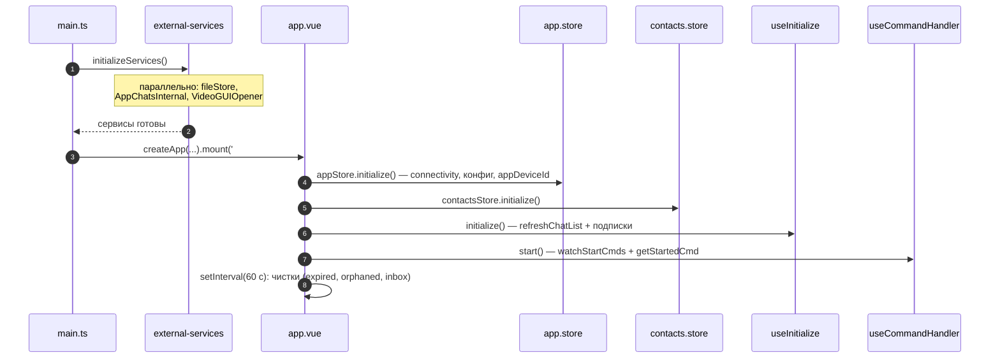
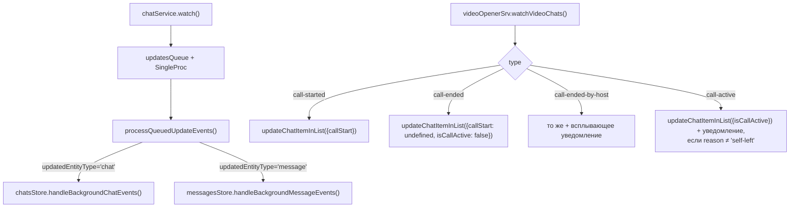
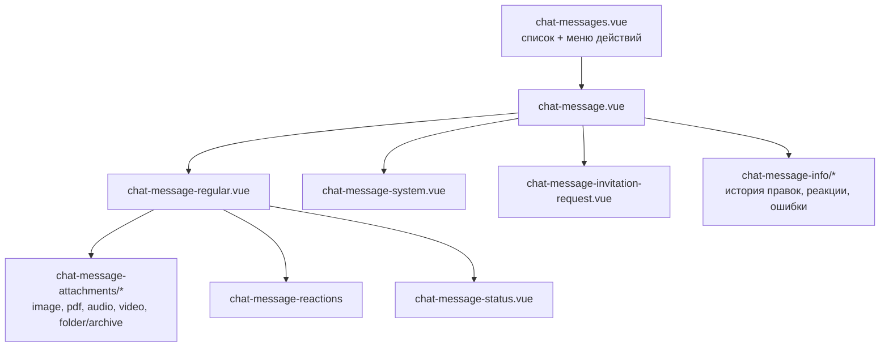
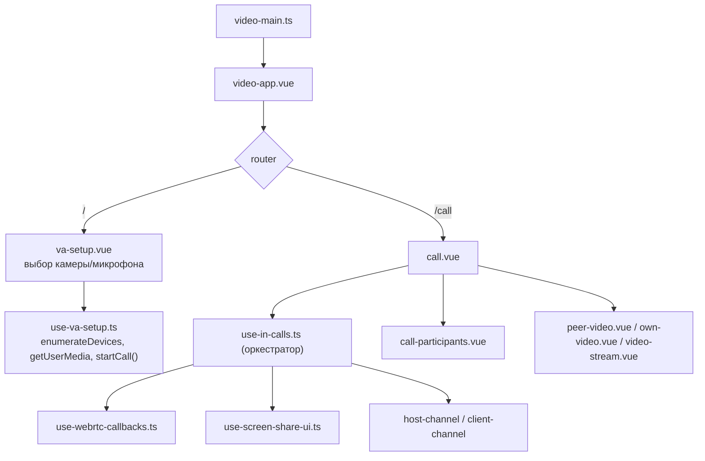

# 06. Устройство UI

[← к оглавлению](./README.md)

Стек: Vue 3 (`<script setup>`, CSS modules), Pinia, vue-router (hash history), vue-i18n, компонентная
библиотека `@v1nt1248/3nclient-lib` ([package.json:30-39](../package.json#L30-L39)).

## 1. Два формфактора, один общий слой

```
src-main/
  common/        сторы, composables, компоненты, утилиты, i18n — общее
  desktop/       main.ts, router.ts, pages/{chats,chat}, components/chat/*
  mobile/        main-mobile.ts, router.ts, pages/{chats,chat}, components/chat/*
src-video/
  common/        сторы, сервисы WebRTC, composables, компоненты
  desktop/       video-main.ts, pages/{va-setup,call}, components/*
  mobile/        video-mobile.ts, pages/{va-setup,call}
```

Разделение сделано не по «адаптивности», а по отдельным сборкам: у каждого формфактора свой HTML-вход
и своя точка входа JS ([07-build-test-run.md](./07-build-test-run.md#2-vite)). Различаются:

| | desktop | phone |
|---|---|---|
| Роутинг | `chats` c дочерним `chat` — список и переписка на одном экране ([router.ts:57-66](../src-main/desktop/router.ts#L57-L66)) | `chats` и `chat` — независимые экраны ([router.ts:22-35](../src-main/mobile/router.ts#L22-L35)) |
| Навигация | `useRouting` ([desktop/composables/useRouting.ts](../src-main/desktop/composables/useRouting.ts)) | `useNavigation` ([mobile/composables/useNavigation.ts](../src-main/mobile/composables/useNavigation.ts)) |
| Заголовок чата | [desktop/components/chat/chat-header.vue](../src-main/desktop/components/chat/chat-header.vue) | [mobile/components/chat/chat-header.vue](../src-main/mobile/components/chat/chat-header.vue) |
| Окно | 1200×600, ресайз ([manifest.json:54-60](../manifest.json#L54-L60)) | 360×768, фиксировано ([manifest.json:117-124](../manifest.json#L117-L124)) |

Общая логика экрана чата целиком лежит в `useChatView()`
([common/composables/useChatView.ts](../src-main/common/composables/useChatView.ts)): страницы
десктопа и телефона — это разная разметка над одним composable. Приём — передача «навигационных
утилит» аргументом ([useChatView.ts:86-93](../src-main/common/composables/useChatView.ts#L86-L93)),
чтобы composable не зависел от конкретного роутера.

## 2. Инициализация основного GUI



Код: [main.ts:32-45](../src-main/desktop/main.ts#L32-L45),
[useAppView.ts:65-88](../src-main/common/composables/useAppView.ts#L65-L88).

Важно: `initializeServices()` вызывается **до** монтирования приложения — сторы могут обращаться к
своим IPC-сервисам сразу, без проверок готовности.

**Кроме контактов.** `AppContacts` — единственный сервис **чужого** приложения
(`contacts.app.privacysafe.io`), и он единственный, чью скорость ответа это приложение не
контролирует: свои сервисы отвечают из фасада ещё до того, как готовы
([facadeOver](../src-deno/services/chat-service/ipc-expose.ts)), а чужому такого не навяжешь.
Платформа даёт сервису 10 секунд от спауна компонента до `exposeService()`, приложение контактов
выставляет свой только после полной инициализации (synced-FS, SQLite, первичная синхронизация с
сервером), и на нагруженной машине этого не хватает. Пока контакты стояли в общем `Promise.all`,
их медленный старт означал, что **чат не запускается вовсе**: 2026-08-14 на этом умерли все три окна
тест-прогона, а в проде тот же отказ давал пустое окно. Поэтому контакты подключаются **лениво**, при
первом обращении, с повторами (`contactsSrv()` в
[external-services.ts](../src-main/common/services/external-services.ts)), и их недоступность
деградирует ровно до «имена показываются адресами» — переписка, синхронизация и звонки контактов не
используют.

Периодическая чистка запускается и из GUI (раз в минуту), и один раз при старте фонового инстанса
([01-components-and-ipc.md](./01-components-and-ipc.md#2-порядок-старта-фонового-инстанса)).

## 3. События из бекенда

Единая точка подписки — `useInitialize()`
([useInitialize.ts:59-124](../src-main/common/composables/useInitialize.ts#L59-L124)):



Обработка событий чата ([chats.store.ts:246-375](../src-main/common/store/chats.store.ts#L246-L375)):

| Событие | Действие |
|---|---|
| `updated` | заменить элемент списка; если элемента нет — перезагрузить список |
| `added` | вставить в начало списка |
| `removed` | удалить из списка и, если открыт удалённый чат, вернуться к списку |
| `messages-removed` | применить пришедшие агрегаты к элементу списка; если чат открыт — очистить его сообщения и снять выделение |
| `webRTCCall` | создать системную запись об отмене звонка и снять состояние звонка |

Обработка событий сообщений ([messages.store.ts:287-304](../src-main/common/store/messages.store.ts#L287-L304)):
`added` / `updated` / `removed` / `removed-multiple` обновляют карту сообщений открытого чата,
`sending-progress` — прогресс отправки.

### 3.1 Ephemeral-поля списка чатов

`callStart`, `incomingCall`, `isCallActive` существуют только в памяти GUI — их нет в БД. Поэтому при
любой перезагрузке элемента из данных бекенда они переносятся руками:
`ephemeralCallFields()` ([chats.store.ts:102-112](../src-main/common/store/chats.store.ts#L102-L112)),
применяется в `refreshChatViewData()`, `refreshChatList()` и в обработчике `updated`. Без этого новое
сообщение в чате гасило бы кнопку «Join Call».

Исключение — `applyChatSummary()`: он мержит `unread`/`lastMsg` в существующий элемент списка, а не
пересобирает его, поэтому ephemeral-поля остаются на месте по построению и переносить их не требуется.

## 4. Сторы

| Стор | Ответственность | Файл |
|---|---|---|
| `app` | пользователь, версия, тема/язык, connectivity, состояние синхронизации, `appDeviceId`, размер окна | [app.store.ts](../src-main/common/store/app.store.ts) |
| `chats` | список чатов, создание чатов, входящие звонки, обработка событий чатов | [chats.store.ts](../src-main/common/store/chats.store.ts) |
| `chat` | текущий чат, отправка сообщений, переименование/удаление, участники и админы | [chat.store.ts](../src-main/common/store/chat.store.ts) |
| `messages` | сообщения открытого чата, реакции, вложения, удаление, недавние реакции | [messages.store.ts](../src-main/common/store/messages.store.ts) |
| `contacts` | список контактов из внешнего приложения | [contacts.store.ts](../src-main/common/store/contacts.store.ts) |
| `ui.incoming` | входящий звонок: рингтон, принять/отклонить, re-join | [ui.incoming.store.ts](../src-main/common/store/ui.incoming.store.ts) |
| `ui.outgoing` | прогресс отправки по сообщениям | [ui.outgoing.store.ts](../src-main/common/store/ui.outgoing.store.ts) |

Вспомогательные части `app`-стора вынесены отдельно:
[app/connectivity.ts](../src-main/common/store/app/connectivity.ts) (опрос состояния сети),
[app/system-level-app-config.ts](../src-main/common/store/app/system-level-app-config.ts)
(наблюдение за системным конфигом: язык, тема, логотип) и
[app/sync-state.ts](../src-main/common/store/app/sync-state.ts) (состояние синхронизации с другими
устройствами пользователя — индикатор в тулбаре, см.
[04-multi-device-sync.md §8](04-multi-device-sync.md#8-что-видно-снаружи-индикатор-и-подмена-устройства)).

`sync-state` — единственный стор, который **не** инициализируется в `app.store.initialize()`: тот
вызывается раньше подписки на события фона, и запрос текущего состояния оттуда оставил бы окно, в
котором изменения незаметны. Запрос делается сразу после подписки, в
[useInitialize.ts](../src-main/common/composables/useInitialize.ts); там же события `sync-state`
обрабатываются **синхронно, минуя очередь** `updatesQueue` — очередь дренируется `SingleProc` и во
время большого бэклога индикатор отставал бы на секунды, то есть ровно тогда, когда он и нужен.

Особенности:

- **`chat.store` не хранит копию чата** — `currentChat` вычисляется из `chats.chatList`
  ([chat.store.ts:38](../src-main/common/store/chat.store.ts#L38)), поэтому источник правды один.
- **`currentChatId` отдаётся только для чтения** (`toRO`,
  [chat.store.ts:277](../src-main/common/store/chat.store.ts#L277)); менять его можно лишь
  `setChatAndFetchMessages()`.
- **Сообщения хранятся словарём** `chatMessageId → view` и сортируются в computed
  ([messages.store.ts:50-57](../src-main/common/store/messages.store.ts#L50-L57)).
- **История грузится окном.** `fetchMessages()` берёт последнюю страницу (`MSGS_PAGE_SIZE`,
  [shared-libs/constants/db.ts](../shared-libs/constants/db.ts)), `fetchOlderMessages()` доливает
  предыдущую по курсору самого старого загруженного, `hasMoreOlder` говорит, есть ли что доливать.
  Исключение — чат с большим числом непрочитанных: первая загрузка берёт `unread + 50`, иначе прокрутка
  к первому непрочитанному не нашла бы элемент в DOM. Догрузку у верхней кромки запускает
  `onMessageListScroll` через `loadOlderMessagesKeepingPosition()`, который возвращает `scrollTop` на
  высоту добавленного, — иначе список прыгал бы при каждой странице.
- **Переход к цитате догружает оригинал.** `loadOlderUntilMessageIsLoaded()` тянет страницы, пока
  сообщение не окажется в наборе, но не больше `MAX_PAGES_PER_MSG_LOOKUP` — цитата очень старого
  сообщения не должна вытягивать всю историю. Если не достали (или оригинал удалён), показывается нотис.
- **`ensureCurrentChatIsSet()`** ([chat.store.ts:72-81](../src-main/common/store/chat.store.ts#L72-L81))
  — защита от операций «не над тем чатом»: методы, меняющие чат, требуют, чтобы он был открыт.
- **`unread` и `lastMsg` списка обновляются из самого события** — бекенд присылает их в `chatSummary`,
  и `applyChatSummary()` мержит их в элемент списка
  ([messages.store.ts:249-271](../src-main/common/store/messages.store.ts#L249-L271)). IPC-запрос
  `getChat` на событийном пути не делается; он остаётся лишь как fallback для обработчиков, вызванных
  напрямую, вне потока событий (`webRTCCall` в `chats.store`).

### 4.1 Имена чатов в списках

Имя чата не уникально ([02-data-model.md §4](02-data-model.md#4-бд-чатов)), поэтому различать
одноимённые чаты — задача UI. Оба признака проставляет `chatListSortedByTime`
([chats.store.ts:67-90](../src-main/common/store/chats.store.ts#L67-L90)), тип
`ChatListItemUiView` ([types/chat.types.ts:270-284](../types/chat.types.ts#L270-L284)):

- `displayName` — что показывать (`getChatName()`: у группы — её имя, у 1-1 — имя записи чата, а
  если его нет, имя контакта);
- `isNameDuplicated` — есть ли в списке ещё один чат с тем же `displayName`.

Второй признак — свойство всего списка, а не отдельной записи, поэтому считается один раз там, где
список собирается, а не в каждом элементе. Текст-различитель даёт `getChatNameHint()`
([chat-ui.helper.ts](../src-main/common/utils/chat-ui.helper.ts)): для чата 1-1 — адрес собеседника,
для группового — дата создания, потому что ни адрес, ни состав участников группы не различают (два
групповых чата с одними участниками — допустимая ситуация). Хинт показывают оба списка, где имя
чата — единственный ориентир: элемент списка чатов
([chat-list-item.vue](../src-main/common/components/chat/chat-list-item.vue)) и диалог пересылки
сообщения ([message-forward-dialog.vue](../src-main/common/components/dialogs/message-forward-dialog.vue)),
где выбор не того из двух одноимённых чатов отправляет сообщение не тем людям.

## 5. Экран чата

`useChatView()` — 735 строк, объединяет ввод, вложения, упоминания, режимы «ответить»/«править»,
прокрутку и жизненный цикл экрана. Основные блоки:

| Блок | Что делает | Код |
|---|---|---|
| Ввод и отправка | сборка текста, разметка упоминаний и ссылок, вызов `sendMessageInChat` | [useChatView.ts:497-575](../src-main/common/composables/useChatView.ts#L497-L575) |
| Вложения | выбор через диалог, drag-and-drop, вставка из буфера, конвертация `File` → 3N-файл | [useChatView.ts:355-452](../src-main/common/composables/useChatView.ts#L355-L452) |
| Упоминания | распознавание `@`, список участников, выбор клавишами | [useChatView.ts:126-281](../src-main/common/composables/useChatView.ts#L126-L281) |
| Режим только чтение | статус чата / не принятое приглашение блокируют ввод | [useChatView.ts:169-182](../src-main/common/composables/useChatView.ts#L169-L182) |
| Прокрутка | к первому непрочитанному, кнопка «вниз» | [useChatView.ts:600-636](../src-main/common/composables/useChatView.ts#L600-L636) |
| Смена чата | `doBeforeRouteUpdate` — отмена задач, сброс выделения, загрузка сообщений | [useChatView.ts:662-683](../src-main/common/composables/useChatView.ts#L662-L683) |

Текст сообщения при отправке дополняется разметкой: упоминания оборачиваются в
`<a class="mention" data-mention="...">`, URL — в `<a class="url" data-href="...">`
([useChatView.ts:542-557](../src-main/common/composables/useChatView.ts#L542-L557)). Обработка
клика по такой ссылке — [useChatMessages.ts:207-270](../src-main/common/components/messages/chat-messages/useChatMessages.ts#L207-L270):
упоминание открывает (или создаёт) чат 1-1, URL уходит в `w3n.shell.openURL`.

Поскольку в теле сообщения оказывается HTML, рендер идёт через директиву с санитизацией
`v-ui3n-html:sanitize` ([chat-message-regular.vue:148](../src-main/common/components/messages/chat-message/chat-message-regular.vue#L148),
[164](../src-main/common/components/messages/chat-message/chat-message-regular.vue#L164)) — она же
используется всюду, где выводится пользовательский текст.

### 5.1 Действия над сообщением

`useChatMessages()` ([useChatMessages.ts](../src-main/common/components/messages/chat-messages/useChatMessages.ts))
собирает меню действий и исполняет их:

| Действие | Особенности |
|---|---|
| `reaction` | диалог реакций + список недавних |
| `copy`, `select`, `info` | локальные |
| `delete_message` | диалог «удалить у себя / у всех» |
| `download` | для входящих — из inbox, для исходящих — из file-store |
| `reply`, `edit` | режимы ввода |
| `forward` | диалог выбора чата; если вложения недоступны локально — предупреждение |
| `resend` | повторная отправка с тем же `chatMessageId` |
| `cancel_sending` | берёт `deliveryId` из `ui.outgoing` |

Набор действий зависит от того, «своё» ли это устройство:
`checkIsOriginDevice()` сравнивает `msg.settings.msgOwnersDeviceId` с `appDeviceId`
([useChatMessages.ts:129-142](../src-main/common/components/messages/chat-messages/useChatMessages.ts#L129-L142)).
Для синхронизированной копии недоступны действия, требующие локальных байтов вложений.

### 5.2 Дерево компонентов сообщения



Превью вложений строятся в UI: изображения, PDF (через `pdfjs-dist`), видео
([common/utils/create-thumbnail/*](../src-main/common/utils/create-thumbnail)).

### 5.1 Запись голосовых и видео-сообщений

Кнопка `outline-voice-chat` в композере открывает
[chat-media-recorder-dialog.vue](../src-main/common/components/dialogs/chat-media-recorder/chat-media-recorder-dialog.vue)
через обычный `$openDialog`; вся логика — в
[useMediaRecorder.ts](../src-main/common/components/dialogs/chat-media-recorder/useMediaRecorder.ts)
рядом (та же пара «разметка + композабл», что у `attachment-audio-view`).

**Записанное уходит отдельным сообщением без текста, сразу после подтверждения.**
`sendRecordingAsMessage` в `useChatView` делает `fileTo3nFile()` → `sendMessageInChat()`: байты идут
тем же путём, которым идёт файл, вставленный из буфера (записи, как и вставке, не существует вне
приложения, поэтому они сперва пишутся в стор), а сообщение несёт одно вложение и пустое тело.
Композер при этом **не трогается вообще** — ни набранный текст, ни приложенные файлы, ни режим
ответа: ничто из этого не относится к этому сообщению. Из `ownedStoredIds` удаляется ровно один
элемент, а не вся коллекция, как в `sendMessage()`, — иначе вставленные и ещё не отправленные
вложения композера считались бы отданными сообщению и утекли бы при уходе из чата.

Необратимость снимается **шагом просмотра в самом диалоге** (стадия `review`): «Стоп» больше не
отправляет, а показывает запись с нативными `controls` и кнопками «Отправить» / «Записать заново» /
«Отмена»; наружу через `confirm` уходит только одобренная запись. Устройство к этому моменту уже
отпущено (`teardown()` в `onstop`), так что индикатор микрофона во время просмотра не горит.
Уведомление об упёршемся лимите (`chat.recording.stopped.*`) показывается здесь же, а не после
отправки: обрезанную лимитом запись как раз и может захотеться перезаписать.

Существенные решения внутри диалога:

- **поток запрашивается по выбору типа, а не при открытии**: индикатор устройства не должен
  загораться, пока человек читает пояснение, и отказ `getUserMedia` тогда однозначно относится к
  действию пользователя;
- **object-URL просмотра отзывается на всех выходах** (`forgetPending` в «Отмена», «Записать
  заново», X и `onBeforeUnmount`), сам blob уходит вместе с результатом и диалогу не принадлежит;
- **анализатор уровня НЕ подключается к `audioContext.destination`** — в отличие от
  `useAudioView`, где источник это проигрываемый элемент; здесь источник микрофон, и вывод на
  колонки даёт акустическую обратную связь. По той же причине `<video>` превью камеры всегда
  `muted` — плюс политика autoplay в Android WebView, где немьютированный autoplay блокируется,
  поэтому `play()` вызывается явно;
- **кадр превью снимается с живого элемента**, а не делается из файла потом: `createVideoThumbnail`
  сикает на 5-ю секунду, а запись бывает короче;
- **одна `teardown()`** на все выходы (отмена, завершение, `onBeforeUnmount`), иначе микрофон
  остаётся открытым при закрытии диалога во время записи; `closeOnEsc`/`closeOnClickOverlay`
  выключены, чтобы случайный клик мимо не обрывал запись.

Доступность записи определяется при старте приложения —
[app/media-recording.ts](../src-main/common/store/app/media-recording.ts) в `app.store.initialize()`,
с переопросом по `navigator.mediaDevices.ondevicechange`. Проверка **не** использует
`isAudioCaptureAvailable()`: почему — в
[01-components-and-ipc.md §1.1](01-components-and-ipc.md#11-ключевые-capabilities). Битрейты и
лимиты — [09-attachment-streaming.md §4.1](09-attachment-streaming.md); формат маркера —
[03-message-flows.md §1.0](03-message-flows.md#10-голосовые-и-видео-сообщения-поле-а-не-тип).

### 5.3 Отображение записи в чате

`chat-message-attachments.vue` при `recordingOfAttachments(...)` и доступном локально файле рисует
вместо чипов один компонент из
[chat-message-recording/](../src-main/common/components/messages/chat-message/chat-message-recording):

| Компонент | Что делает |
|---|---|
| `recording-voice-bubble.vue` | play/pause (`size="large"` при `isMobile`), `Ui3nProgressLinear` и время в одном ряду с линией: длительность в покое, **остаток** при проигрывании |
| `recording-video-bubble.vue` | круг с кадром; клик разворачивает его на сцене чата до 85% меньшей стороны, кольцо `Ui3nProgressCircular` показывает **остаток**, число слева под кругом — оставшееся время; клик внутри — пауза/продолжение, клик по фону — свернуть и остановить |
| `recording-quote.vue` | цитата записи: кадр ≤32 px и «Voice message 00:03» — в пузыре ответа и в баннере композера |
| `useRecordingPlayer.ts` | общий драйвер над `usePlayableAttachment` |

Решения, которые стоит знать, прежде чем что-то здесь менять:

- **файл не читается, пока не нажали play**: `usePlayableAttachment` создаётся в setup (ему нужен
  `onBeforeUnmount` для отзыва object-URL), но `attachTo(el)` откладывается до первого `toggle()` —
  иначе чат из десяти голосовых прочитал бы их все при прокрутке;
- **длительность всегда из маркера**: под MediaSource `el.duration` это `Infinity`, а
  `timeInSecondsToString(Infinity)` даёт мусор;
- **старт идёт через `el.autoplay`, а не `play()`**: `attachTo` ставит `src` асинхронно, так что
  синхронный `play()` в обработчике клика отвалился бы «no supported source»; `autoplay` же
  подхватывает и подмену MediaSource на blob-URL при фолбэке. Отказ `NotAllowedError` (Android
  WebView не даёт немьютированного старта вне жеста) переводит элемент в `muted` с пометкой
  `needsUnmute` — следующий тап включает звук уже внутри жеста;
- **реестр `useRecordingPlayback`** (provide из `useChatView`) держит один играющий элемент и
  останавливается явно из `doBeforeRouteUpdate`/`doBeforeUnMount`: **вынутый из DOM media-элемент в
  Chromium продолжает играть**, поэтому на смене чата голос звучал бы поверх следующего;
- **сцена `useChatStage`** — `<div>` внутри `.bodyWrapper` обоих шеллов, размер снимается
  собственным `ResizeObserver`. Ни `appWindowSize` (на мобильном он остаётся нулевым), ни директива
  `v-ui3n-resize` (её observer лежит в переменной модуля, второе применение перебивает первое) для
  этого не годятся;
- **`<Teleport :disabled>`, а не второй круг**: телепорт *перемещает* тот же узел, поэтому `src`,
  MediaSource и позиция переживают разворот. `v-if` вокруг круга или `:key` от `isExpanded` это
  ломают;
- **`<video>` показывается только развёрнутым** (`v-show="isExpanded"`): элемент занимает весь круг,
  и у свёрнутого он рисует поверх кадра из таблицы превью пустой прямоугольник — после остановки
  превью пропадало именно так. Скрытый элемент сохраняет и источник, и позицию; останавливает его не
  скрытие, а `stop()`;
- **`pointerdown` намеренно не перехватывается**, только `click` — как и у чипа вложения.
  `v-ui3n-long-press` на `#chat-messages` ставит таймер на `pointerdown` и снимает его на
  `pointerup`, так что обычный тап по play он не перехватывает; а перехват `pointerdown` отнял бы у
  медиа-сообщений контекстное меню, то есть ответ, пересылку и удаление.

Признак всегда берётся из маркера и **никогда из расширения файла**: приложенный кем-то `.weba` —
не голосовое сообщение, и старая сборка присылает записи вообще без маркера. Общий помощник —
`recordingLabelKey` / `recordingExcerpt` / `recordingOfAttachments` в
[chat-ui.helper.ts](../src-main/common/utils/chat-ui.helper.ts): то же нужно в списке чатов, в
цитате и в баннере композера. Чип `chat-message-attachment.vue` со своей веткой записи остаётся
живым — на него приходятся сообщения, чьи файлы лежат только на устройстве отправителя, и записи
«плюс другие файлы» из истории, которые прежний композер позволял отправить.

## 6. Звонки со стороны основного GUI

`ui.incoming` store ([ui.incoming.store.ts](../src-main/common/store/ui.incoming.store.ts)):

| Метод | Что делает |
|---|---|
| `startCall(chatId)` | `videoOpenerSrv.startVideoCallForChatRoom()` |
| `joinIncomingCall(chatId, sender)` | снять пометку входящего, остановить рингтон, `joinOrDismissCallInRoom(true)` |
| `dismissIncomingCall(chatId, withoutSystemMsg)` | `joinOrDismissCallInRoom(false, hostAddr)`, затем **сначала** своя запись через `saveAndSyncLocalSystemMsg()` (чтобы она дошла и до остальных устройств пользователя, [04 §5.1](04-multi-device-sync.md)), и только потом рассылка `webrtc-call: incoming-call-cancelled` пирам — её отказ логируется, а не рвёт функцию: когда отправка шла первой, одна отвергнутая доставка уносила с собой и локальную запись |
| `rejoinCall(chatId)` | снять `isCallActive` и начать звонок (Deno сам определит роль client) |
| `toggleRinging(flag)` | воспроизведение `ring_tone.mp3` в цикле ([shared-libs/sounds.ts](../shared-libs/sounds.ts)) |

Флаг входящего звонка приходит в UI не событием, а через query-параметр маршрута: команда
`incoming-call` открывает чат с `?call=yes`, watcher в `useChatView` записывает `incomingCall` в
элемент списка и очищает query ([useChatView.ts:584-598](../src-main/common/composables/useChatView.ts#L584-L598)).

## 7. UI окна звонка



- Сервис `VideoChatComponent` регистрируется при старте окна
  ([service-provider.ts](../src-video/common/services/service-provider.ts)), поэтому Deno может
  вызывать окно сразу после его открытия.
- `va-setup` — обязательный шаг: пока пользователь не выбрал устройства и не нажал «начать/принять»,
  никакой сигналинг не отправляется. Для входящего звонка кнопка называется «присоединиться»
  (`pendingDirection === 'incoming'`,
  [use-va-setup.ts:52-53](../src-video/common/composables/use-va-setup.ts#L52-L53)).
- Переход в `call.vue` инициализирует `starConfig`, а watcher в `use-in-calls` по его появлению
  создаёт нужный канал ([use-in-calls.ts:576-583](../src-video/common/composables/use-in-calls.ts#L576-L583)).
- Смена устройств на ходу: `navigator.mediaDevices.ondevicechange` → повторный
  `setupDeviceChoices(false)` ([use-va-setup.ts:186-193](../src-video/common/composables/use-va-setup.ts#L186-L193)).

Состояние участников в UI строится из `streams.store.remoteParticipants` — карты
`адрес → {stream, connectionStatus, audioMuted, videoMuted, reconnecting}`
([streams.store.ts:58-74](../src-video/common/store/streams.store.ts#L58-L74)). Производные:

| Computed | Смысл |
|---|---|
| `peerVideos` | плитки участников (без экранов) |
| `activePeerVideos` | те, у кого уже есть поток |
| `connectingPeers` | те, у кого потока нет и статус не скрыт из баннера |
| `activeConnectingPeers` / `waitingPeersCount` | отдельные строки против свёрнутой «ожидают» |

Код: [use-in-calls.ts:121-166](../src-video/common/composables/use-in-calls.ts#L121-L166).

Согласование адресов: ростер из БД чата и адрес в конверте ASMail могут отличаться регистром,
поэтому поиск участника идёт через `keyFor()` с канонизацией
([streams.store.ts:361-386](../src-video/common/store/streams.store.ts#L361-L386)) — иначе один и
тот же участник появился бы двумя плитками.

Ещё две буферизации на стороне UI:

- `pendingStreamStates` — состояние микрофона/камеры пришло раньше самого участника
  ([streams.store.ts:324-347](../src-video/common/store/streams.store.ts#L324-L347));
- `pendingTracks` — дорожки пришли раньше `stream-sender-info`, ждут до 10 с
  ([use-webrtc-callbacks.ts:154-181](../src-video/common/composables/use-webrtc-callbacks.ts#L154-L181)).

При объединении дорожек в поток участника **всегда создаётся новый `MediaStream`**: Vue не отслеживает
`MediaStream.addTrack`, поэтому мутация уже отрендеренного потока не обновила бы `<video>`
([use-webrtc-callbacks.ts:101-126](../src-video/common/composables/use-webrtc-callbacks.ts#L101-L126)).

## 8. Тема, язык, уведомления

- Язык и цветовая тема читаются из системного конфига лончера
  ([app/system-level-app-config.ts](../src-main/common/store/app/system-level-app-config.ts),
  доступ выдан через `shell.fsResource.otherApps` в манифесте). Поддерживаемые значения:
  `AvailableLanguage = 'en'`, `AvailableColorTheme = 'default' | 'dark' | 'dark2'`
  ([types/app.types.ts:41-43](../types/app.types.ts#L41-L43)).
- Переводы — [common/data/i18/en.ts](../src-main/common/data/i18/en.ts) (единственная локаль).
- Всплывающие уведомления внутри окна — плагин `notifications` из библиотеки; уведомления ОС
  отправляет фоновый инстанс.
- Диалоги — `Ui3nDialogProvider` + `dialog.$openDialog(...)`; набор диалогов в
  [common/components/dialogs](../src-main/common/components/dialogs).

## 9. Что стоит помнить о UI

1. **UI не источник правды.** Любое изменение проходит через IPC и возвращается событием; локальные
   правки состояния — только для мгновенной реакции (например, снятие пометки входящего звонка).
2. **Состояние звонка живёт в трёх местах**: реестры в Deno, `streams.store` в окне звонка и
   ephemeral-поля списка чатов в основном GUI. Их согласуют события `VideoChatEvent`.
3. **Очередь событий обрабатывается через `SingleProc`** — то есть строго по одному, в порядке FIFO
   (`shift()`), без параллельного применения к сторам
   ([useInitialize.ts:36-57](../src-main/common/composables/useInitialize.ts#L36-L57)). Цикл
   осушает `updatesQueue` целиком за один запуск `SingleProc`, дожидаясь (`await`) каждого
   обработчика перед переходом к следующему событию — иначе порядок применения к спискам чатов и
   сообщений не гарантирован.

---

Далее: [07-build-test-run.md](./07-build-test-run.md) — сборка, тесты, запуск.
