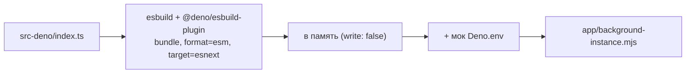

# 07. Сборка, тесты, запуск

[← к оглавлению](./README.md)

## 1. Скрипты

[package.json:6-27](../package.json#L6-L27):

| Команда | Что делает |
|---|---|
| `pnpm dev` | dev-сервер Vite (порт 3030) |
| `pnpm build:gui` | `vue-tsc --noEmit` + `vite build` → каталог `app/` |
| `pnpm build:deno` | `bash ci/bundle-deno-code.sh` → `app/background-instance.mjs` |
| `pnpm build` | `lint` + `build:gui` + `build:deno` — полная сборка |
| `pnpm lint` | ESLint (`src-main`, `src-video`) + stylelint (`.vue/.scss/.css`) |
| `pnpm bench:db` | замер записи файлов БД (см. §6) |
| `pnpm test:i18n-keys` | словарь `en.ts` против кода, который называет ключи (см. §5.4) |
| `pnpm test:db-migration` / `pnpm test:backup-restore` | deno-спеки над реальными БД (§5.4) |
| `pnpm tests:build` | сборка тестового приложения (`tests-app/compile-and-build.sh`) |
| `pnpm tests:build-all` | полная сборка + сборка тестов |
| `pnpm tests:run-on` | запуск тестов на указанной платформе |
| `pnpm serve` | предпросмотр собранного GUI |

Менеджер пакетов — pnpm (есть `pnpm-workspace.yaml` и `pnpm-lock.yaml`); для Deno-части
используется `deno.json` / `deno.lock`.

## 2. Vite

[vite.config.ts](../vite.config.ts).

Четыре входа, по одному на каждый GUI-компонент
([vite.config.ts:50-55](../vite.config.ts#L50-L55)):

| Вход | Файл | Компонент манифеста |
|---|---|---|
| `main` | [index.html](../index.html) | `/index.html` |
| `main-mobile` | [index-mobile.html](../index-mobile.html) | `/index-mobile.html` |
| `videoChat` | [video-chat.html](../video-chat.html) | `/video-chat.html` |
| `videoChat-mobile` | [video-chat-mobile.html](../video-chat-mobile.html) | `/video-chat-mobile.html` |

Алиасы путей ([vite.config.ts:69-77](../vite.config.ts#L69-L77)) — те же, что в
[tsconfig.json:31-37](../tsconfig.json#L31-L37):

| Алиас | Каталог |
|---|---|
| `@main` | `src-main` |
| `@video` | `src-video` |
| `@shared` | `shared-libs` |
| `@deno` | `src-deno` |
| `~` | `types` |

Существенное для чтения кода: GUI **импортирует типы и часть кода из `src-deno`** (алиас `@deno`) —
например, тип `ChatSrv` и `fileStoreService`
([external-services.ts:17-19](../src-main/common/services/external-services.ts#L17-L19)). То есть
`file-store-service` физически исполняется и в Deno-инстансе, и в GUI (каждый со своим local FS).

Прочие настройки:

- `outDir: 'app'`, `target: 'esnext'` — платформа исполняет современный JS без транспиляции вниз;
- `treeshake.manualPureFunctions: ['console.log']`
  ([vite.config.ts:56-58](../vite.config.ts#L56-L58)) — вызовы `console.log` вырезаются из
  **GUI**-бандлов (Deno-бандл убирает console своим способом, §3);
- `pdfjs-dist` исключён из `optimizeDeps` и обрабатывается через `commonjsOptions`
  (нужен для превью PDF-вложений).

## 3. Сборка Deno-части

[ci/bundle-deno-code.sh](../ci/bundle-deno-code.sh) вызывает
[ci/build-deno.js](../ci/build-deno.js):



Детали:

- Плагин `jsr:@deno/esbuild-plugin` разрешает импорты JSR/NPM/HTTP прямо из TS
  ([build-deno.js:2](../ci/build-deno.js#L2)) — благодаря этому в коде допустимы записи вида
  `import { excerpt } from 'jsr:@dbushell/hyperless'`
  ([msg-sending.ts:18](../src-deno/services/chat-service/utils/msg-sending.ts#L18)).
- `node:path` и `node:fs` оставлены внешними: полифилы подставит рантайм платформы
  ([build-deno.js:22](../ci/build-deno.js#L22)).
- Перед бандлом дописывается заглушка `Deno.env.get()`
  ([build-deno.js:4-10](../ci/build-deno.js#L4-L10)): зависимости могут обращаться к переменным
  окружения, которых в компоненте нет.
- `drop: ['console']` в production-сборке ([build-deno.js](../ci/build-deno.js)): в поставляемом
  бандле нет ни одного вызова `console`. Диагностика, которую стоит сохранить, идёт не через
  console, а через логгер (§3.1), поэтому ничего не теряется. Сборка с console — `pnpm
  build:deno:dev` (тот же скрипт с `--dev`).
- Результат — единый ESM-файл `app/background-instance.mjs`, ровно тот путь, который указан в
  манифесте.

### 3.1 Логирование и диагностический режим

[shared-libs/logger.ts](../shared-libs/logger.ts) — общий для Deno-инстанса и окон логгер с
уровнями: `debug` / `info` / `warn` / `error`.

- Пишет **только** в `w3n.log`, никогда в console. Поэтому `drop: ['console']` в Deno-бандле не
  уносит с собой диагностику, а в GUI логгер не зависит от того, вырезан ли `console.log`.
- `debug()` при выключенной диагностике стоит одно сравнение. Это важно для мест, где строка
  печаталась на каждый сигнал и каждое событие доставки: сигнальные каналы окна
  ([signaling-channel-core.ts](../src-video/common/services/signaling-channel-core.ts)),
  единая отправка сигналов ([webrtc-signalling.ts](../shared-libs/webrtc-signalling.ts)),
  `CallInChat`, `VideoChatService`, диспетчер inbox и монитор доставки.
- Включается флагом `allowShowingDevtool` в конфигурации приложения (лончер), то есть **без
  пересборки**. Deno-инстанс читает флаг при старте
  ([index.ts](../src-deno/index.ts)); окно звонка — при загрузке; основное GUI-окно ещё и следит за
  изменением конфигурации, поэтому там переключение действует сразу
  ([system-level-app-config.ts](../src-main/common/store/app/system-level-app-config.ts)).
- Вызовы логгера не нужно ожидать: логгер, заставляющий ждать платформенный лог, менял бы тайминг
  того, что наблюдает; ошибки самого лога проглатываются.

- **Логировать в GUI надо через `makeLogger`, а не через `w3n.log` напрямую.** Только то, что прошло
  через логгер, попадает в реле и оказывается в общем выводе (см. ниже и
  [01-components-and-ipc.md §3.4](01-components-and-ipc.md)); прямой вызов виден лишь в devtools
  своего окна.

Прочий `console.log` в окнах (WebRTC-каналы, сторы) пока остался: он вырезается из production
GUI-бандла настройкой vite (§2) и на Deno-бандл не влияет.

**Где какие строки искать.** Три источника пишут в три разных места, и это стоило целого прогона:

| Источник | Куда попадает |
|---|---|
| Deno-компонент (`w3n.log`) | stdout стенда, с префиксом компонента и pid |
| Главное окно и окно звонка (`makeLogger`) | консоль devtools своего окна **и** — через реле — stdout стенда, с меткой `[GUI:main]` / `[GUI:video]` |
| `console.log` в окнах | только консоль devtools этого окна |
| Ядро платформы | `mock-data*/util/logs/<дата>.log.txt`, уровни `warning`/`error`. **Строк приложения там нет** — проверено на прогоне 2026-08-16 |

Реле нужно прежде всего окну звонка: оно живёт ровно столько, сколько звонок, и до реле его строки
исчезали вместе с ним, если не успеть сохранить консоль. Устройство лежит в
[shared-libs/log-relay.ts](../shared-libs/log-relay.ts).

Поэтому весь прогон читается из одного потока, и его достаточно направить в файл:

```sh
env -u ELECTRON_RUN_AS_NODE bash tests-app/run-tests-on.sh <бинарник> 2>&1 | tee ~/run-$(date +%F-%H%M).log
```

**Время в каждой строке.** Все вопросы, которые реально возникают по звонку, — про **порядок и
интервалы** между событиями в трёх процессах (основное окно, окно звонка, background), а времени в
строках не было ни у окон, ни у deno. Теперь есть, в одном формате `HH:MM:SS.mmm` с обеих сторон:

- окна — [shared-libs/console-timestamps.ts](../shared-libs/console-timestamps.ts),
  `installConsoleTimestamps()` первой строкой в каждой точке входа
  ([video-main.ts](../src-video/desktop/video-main.ts),
  [video-mobile.ts](../src-video/mobile/video-mobile.ts),
  [main.ts](../src-main/desktop/main.ts), [main-mobile.ts](../src-main/mobile/main-mobile.ts));
- deno и логгер — штамп добавляется в `emit()` в [logger.ts](../shared-libs/logger.ts).

Важная деталь реализации в окнах: это **не обёртка** над `console.log`. Обёртка вызывается из своего
модуля, поэтому DevTools приписал бы все строки ей, и ссылки вида `host-channel.ts:2417` — вторая
половина того, что делает эти логи читаемыми, — исчезли бы. Вместо этого каждый метод становится
геттером, возвращающим **нативный** метод с уже привязанным первым аргументом-временем: вызов
происходит в исходном месте и нативной функцией, поэтому ссылка на источник сохраняется. Побочные
эффекты: штамп берётся в момент *чтения* `console.log` (за микросекунды до вызова) и код вида
`const log = console.log` заморозил бы штамп — в приложении такого нет.

Платформенные строки этого окна (те, что приходят через `w3n.log`) используют тот же `console`, поэтому
тоже получают время; ссылку на источник они и так теряли (`setup-w3n.bundle.js`). Диагностическим
флагом штамп не управляется: эти строки печатаются в любом случае, а время — не дополнительный вывод.

## 4. Что попадает в поставку

```
app/
  index.html, index-mobile.html
  video-chat.html, video-chat-mobile.html
  assets/…                     собранные JS/CSS
  background-instance.mjs      Deno-бандл
  ice-servers.json             конфигурация STUN/TURN (из public/, копируется vite)
manifest.json                  описание компонентов и capabilities
```

`ice-servers.json` — данные, а не код: из него платформа инициализирует ресурс, который читает
фоновый инстанс, поэтому смена кред TURN не требует пересборки
([05-video-calls.md §2.1](05-video-calls.md#21-конфигурация-stunturn)).

Каталог `app/assets` также содержит статические ресурсы приложения (логотип и т. п.,
[app/assets](../app/assets)). Публикация/упаковка выполняется скриптами CI
([ci/app_pack-n-pub_jobs.yml](../ci/app_pack-n-pub_jobs.yml),
[.gitlab-ci.yml](../.gitlab-ci.yml)).

## 5. Тесты

Тесты выполняются **внутри платформы**: собирается отдельное тестовое приложение, которое запускает
Jasmine-спеки в реальном окружении с реальными ASMail-аккаунтами.

### 5.1 Состав `tests-app/`

| Путь | Назначение |
|---|---|
| [tests-app/src/tests](../tests-app/src/tests) | спеки: `app-device-id`, `app-view`, `chat-management`, `chat-names`, `contacts-store`, `group-members`, `invitations`, `messaging`, `msg-modifications`, `sync-conflicts`, `video-chat`, `ice-config`, `utils` |
| [tests-app/src/libs-for-tests](../tests-app/src/libs-for-tests) | утилиты: `itCond` (условный `it`), пропуск спеки при недоступном сервере (§5.2.2), сравнение JSON/байт, обмен между процессами, `webrtc-mocks` |
| [tests-app/manifest-patch.json](../tests-app/manifest-patch.json) | патч манифеста для тестов |
| [tests-app/compile-and-build.sh](../tests-app/compile-and-build.sh) | сборка тестового приложения (патч манифеста + Vite-сборка спеков) |
| [tests-app/run-tests-on.sh](../tests-app/run-tests-on.sh) | запуск платформы с тест-стендом и выводом логов при падении |
| [tests-app/test-setup.json](../tests-app/test-setup.json) | описание тест-стенда: сколько пользователей создать, какие приложения поднять |

Патч манифеста делает две вещи
([manifest-patch.json](../tests-app/manifest-patch.json)):

1. убирает `launchOnSystemStartup` — фон в тестах поднимается управляемо;
2. выдаёт основному GUI полноценный `mail: {sendingTo, receivingFrom}` — спеки обращаются к ASMail
   напрямую.

### 5.2 Как выглядит спека

Спеки используют реальный IPC-сервис приложения и API тест-стенда для получения адресов тестовых
пользователей ([messaging.ts:18-40](../tests-app/src/tests/messaging.ts#L18-L40)):

```ts
const sndUserAddr = await w3n.testStand.idOfTestUser(2);
const groupChatId = await chatService.createGroupChat({ … });
```

То есть тестируется сквозной путь GUI → IPC → Deno → ASMail, а не отдельные функции. Отдельного
юнит-раннера в репозитории нет (в devDependencies есть `@vue/test-utils` и `@testing-library/vue`,
но соответствующих тестов нет) — вместо него чистые модули проверяются теми же спеками, просто
импортируются напрямую:
[call-state.ts](../src-deno/services/video-chat-service/utils/call-state.ts) в `video-chat` и
[sync-versions.ts](../src-deno/services/chat-service/utils/sync-versions.ts) в `sync-conflicts`.
Логика без `w3n`, без таймеров и со временем в аргументах проверяется так детерминированно и без
платформенных зависимостей.

### 5.2.1 Спеки, не требующие сети

**Чистая логика проверяется прямым импортом.** Решения, вынесенные из сервисов в чистые модули — без
`w3n`, без таймеров, `now` и все входные данные аргументами, — спека импортирует и вызывает напрямую,
без стенда, окна и звонка. Так покрыты:

| Модуль | Что решает |
|---|---|
| [call-state.ts](../src-deno/services/video-chat-service/utils/call-state.ts) | состояние звонка в чате и вердикт по каждому входящему сигналу (Suite 7/8) |
| [webrtc-msg-body.ts](../src-deno/services/video-chat-service/utils/webrtc-msg-body.ts) | чат сигнала по телу/конверту и `signalAgeOf()` — возраст сигнала по двум часам (Suite 9, 16) |
| [shared-libs/departure-gate.ts](../shared-libs/departure-gate.ts) | `createDepartureGate()` — повторная ли это копия ухода участника (Suite 16) |
| [call-record.ts](../src-deno/services/video-chat-service/utils/call-record.ts) | `pickCallRecordToStamp()` — в какую запись истории писать длительность звонка (Suite 16) |
| [webrtc-utils.ts](../src-video/common/services/webrtc-utils.ts) | `encodableSenderTrackIds()`, `createRetryWatcher()`, `createSdpFreshnessGate()` (Suite 14, 16) |
| [relay-slots.ts](../src-video/common/services/relay-slots.ts) | `pickSlot()`, `relaySlotOwnerToShow()`, `clearedRelaySlotOnDeparture()` — кого показывать в relay-слоте (Suite 15, 16) |
| [webrtc-signalling.ts](../shared-libs/webrtc-signalling.ts) | `isDeliveryStillInFlight()` — «доставка ещё идёт» против «доставка упала» (Suite 11) |
| [rejoin-notice.ts](../src-video/common/services/rejoin-notice.ts) | `rejoinNoticeAction()`, `rejoinNoticeExpiry()`, `participantTileOnRejoinNotice()` — что хост и участники делают с уведомлением о возвращении (Suite 17) |

Дешевизна тут не главное. Важны две вещи.

**Спеку можно написать на вердикт, а не на наблюдаемое следствие.** Регрессия P0 от 2026-08-13
(heartbeat со штампом `id: 0`, из-за которого получатель отбрасывал каждый beat) жила три коммита именно
потому, что её единственным следом был вердикт на уровне `debug`; теперь на неё стоит прямой гард в
Suite 16.

**Гонки и таймауты платформы проверяются только так.** Если условие дефекта — задержка внутри браузера
или транспорта, живой прогон и интеграционный тест на реальных `RTCPeerConnection` не воспроизводят его
надёжно, они выигрывают или проигрывают гонку. Два примера, и оба вынесены в чистые функции ровно по
этой причине: `clearedRelaySlotOnDeparture()` (спусковой крючок — задержка перехода дорожки в `muted`
после прекращения RTP) и `isDeliveryStillInFlight()` (спусковой крючок — истечение окна подтверждения на
доставке, которая ещё идёт). В обоих случаях то, что нельзя воспроизвести, становится входным
параметром, а дефект — строкой таблицы.

Третий пример показывает, что правило ловит дефекты ещё на этапе написания:
`participantTileOnRejoinNotice()`. Сигнал `participant-reconnecting` с `reconnecting: false` приходит и
когда истёк TTL уведомления о возвращении, и когда участник **успешно** подключился — во втором случае
за такт до прихода треков. Правило «снять плитку без медиа», выглядевшее очевидным, мигало бы плиткой
на каждом удачном re-join, и живой прогон показал бы это как случайный визуальный артефакт. В виде
таблицы с явным входом «плитка создана уведомлением» ошибка видна до первого запуска.

`sync-conflicts` и `chat-names` намеренно обходятся без сервера: чаты в них создаются из
фантомов-приглашений, а не через `createGroupChat()`, который пре-флайтит адреса участников.
Подавать фантомы позволяет
`handleIncomingMsg`, опубликованный по IPC, — своё же устройство фантом пропускает по
`sourceDeviceId`, а второго устройства того же пользователя на стенде нет. Синтетический `msgId`
безвреден: удаление из inbox молча игнорирует сообщение, которого там нет.

### 5.2.2 Спеки, требующие сети: пропуск вместо падения

Остальные спеки идут через живой сервер, и его недоступность раньше выглядела в отчёте как дефект
приложения. Это уже уводило разбор в неверную сторону: устойчивое падение
`Messaging › same chatMessageId` принимали за незакрытую регрессию P0-3, тогда как в логах прогона
было 2048 записей `connect ETIMEDOUT` к `c1.3nweb.net`. Поэтому недоступность сервера теперь даёт
**pending с причиной**, а не failure. Три механизма, по одному на каждый способ, которым отказ
проявляется ([jasmine-utils.ts](../tests-app/src/libs-for-tests/jasmine-utils.ts)):

| Как проявляется отказ | Что срабатывает |
|---|---|
| Платформа бросает `ConnectException` (`type: 'connect'`) | `callbackFor` сам переводит спеку в pending — правок в спеках не нужно |
| Операция не отвечает вовсе (проверка адреса через ASMail просто не возвращается) | `skipSpecIfUnresponsive(what, millis, action)` в самой спеке |
| Операция завершилась, но результат так и не стал терминальным (статус доставки остался `sending`) | проверка в спеке: `reachedTerminalStatus()` в [messaging.ts](../tests-app/src/tests/messaging.ts) |

Причина уходит в три места, потому что они видны в разных: `console.log` — **только** в devtools окна
(в stdout платформы и в файлах логов его нет, проверено), `w3n.testStand.log('info', …)` — в консоль
прогона, `pending()` — в отчёт. Репортер записывает у pending-спеки лишь имя
([boot1.js](../tests-app/public/jasmine/boot1.js)), поэтому текст причины и нужен отдельным каналом.

Две особенности, на которые стоит обратить внимание при правке этого механизма:

- **`pending()` jasmine бросает *строку*** с префиксом `=> marked Pending`, поэтому `callbackFor`
  пропускает такую строку наружу; без этого пропуск превращался обратно в `Failed: => marked
  Pending…`.
- **Операцию нужно дожидаться внутри её спеки.** Отклонение, приходящее после того как jasmine
  перешёл дальше, приписывается уже другой спеке: зависавший `addContact` в `contacts-store` ронял
  `Chat Management › should create one-to-one chat` с загадочным «Expected undefined to be true» —
  это `expect(exc.contactAlreadyExists)` на `ConnectException`, у которого такого поля нет.
- Лимит самой спеки должен быть **больше** лимита операции, иначе jasmine оборвёт её первым и вместо
  причины будет «did not complete within 5000ms».

`w3n.connectivity.isOnline()` для этого **не годится** — проверено: платформа сообщает `online_80%`,
пока конкретный сервер недоступен. Признаком служит поведение самой операции.

### 5.2.3 Нагрузочная диагностика ASMail: что идёт в обычном прогоне, а что нет

[asmail-group-call-load.ts](../tests-app/src/tests/asmail-group-call-load.ts) содержит два разных
рода кейсов, и в обычном прогоне идёт только один.

**Бёрсты** (`oto-ice-burst`, `concurrency-ramp`, `size-ramp`, …) — намеренный шторм по **реальному**
серверу: сотни сообщений, часть по 14 КБ, параллельно, около часа. Они закрыты флагом
`RUN_HEAVY_BURSTS = false` в самом файле и при выключенном флаге **не регистрируются вовсе**, чтобы
число спек в отчёте говорило о том, что действительно шло; вместо них в лог идёт строка о том, чего
не было. Включать — осознанное решение, а не побочный эффект импорта.

**`report-latency`** идёт всегда: 5 сообщений по ~300 Б, размером с heartbeat. Он меряет, за сколько
платформа сообщает исход доставки, — то, на чём держится реактивный ресенд heartbeat'а
(`MAX_TICK_AGE_MILLIS = 12 с`). Ценность у него статистическая, поэтому он и включён в каждый прогон:
одно измерение распределением не является.

Две ловушки этого кейса, обе стоили одного нечитаемого чтения (2026-08-13):

- **подписки мало.** `delivery-monitor` сносит запись доставки по `allDone` (`rmMsg`), и то же
  приложение крутит свой монитор над теми же `webrtc-call`-доставками, так что терминальное событие
  может быть съедено раньше, чем его увидит спека. Продакшн это знает и опрашивает `currentState()`
  (`finishFromCurrentState` в [asmail-utils.ts](../shared-libs/asmail-utils.ts)); кейс теперь делает
  то же, а источник каждого отчёта пишет в `via=`;
- **«сервер медленный» ≠ «механизм не сообщает».** Если на дедлайне доставки всё ещё в пути
  (`stillInFlight=`), вердикт — **NOT MEASURED**, а не приговор ресенду. Именно так выглядел прогон
  2026-08-13 вечером: `via={}`, `stillInFlight=5`, при том что и обычная спека мессенджинга ушла в
  pending с «после 20000 мс оба сообщения всё ещё `sending`».

`ice-config` тоже не требует сети: он читает поставляемый `ice-servers.json` через `fetch` и
проверяет разбор JSON в `RTCConfiguration`. Ресурс ФС он не трогает — тот выставлен только для
`/background-instance.mjs`, а спеки идут из основного окна. Поэтому же
[compile-and-build.sh](../tests-app/compile-and-build.sh) копирует `../public/ice-servers.json` в
сборку тестового приложения: манифест в тестах — патченный основной, и файл, из которого
инициализируется ресурс, должен быть на месте.

### 5.3 Запуск

```bash
pnpm tests:build-all              # полная сборка + сборка тестового приложения
pnpm tests:run-on <путь-к-платформе>
```

`run-tests-on.sh` создаёт каталог данных `test-data_<дата>`, запускает платформу с
`--test-stand=tests-app/test-setup.json`, а при ненулевом коде возврата печатает логи из
`<data_dir>/util/logs` и удаляет каталог.

**Как читать результат.** Спеки выполняются только в окне пользователя №1
([test-app.vue](../tests-app/src/test-app.vue)); окна №2 и №3 ставят `skipW3NTests` и работают
ботами, которые принимают приглашения и отмечают сообщения прочитанными. Признак настоящего прогона —
строки `▶️ Tests started …` и `✔️ Tests passed …` / `❌ Tests failed …` в stdout; полный счётчик
(passed / failed / pending) виден в devtools-консоли окна №1.

Кода возврата **недостаточно**, если прогон старый: до 2026-08-14 отказ инициализации сервисов
отменял `env.execute()` молча, стенд не видел ни одной записи и трактовал «тесты не начинались» как
успех — три прогона подряд вернули 0, не выполнив ни одной спеки. Теперь окно, у которого упал setup,
само записывает `tests-start` + `tests-fail`
([boot1.js](../tests-app/public/jasmine/boot1.js)), поэтому такой прогон падает с кодом 2, называет
причину в stdout и печатает логи платформы. Сам дефект вердикта живёт в платформе и описан в
[plans/core-platform-issues-2026-08-14.md](../plans/core-platform-issues-2026-08-14.md) §4.

Тестовые пользователи берутся из `tests-app/build/test-user-creds.json` (`"userCreds"` в
`test-setup.json`) и **переиспользуются между прогонами** — новые заводятся только если файла нет.
Их хранилище растёт от прогона к прогону, а с ним и время старта приложений; если прогон начал
упираться в таймауты подключения, свежие пользователи получаются удалением этого файла.

Платформу для локального прогона можно скачать скриптами
[ci/download-latest-mac-platform.sh](../ci/download-latest-mac-platform.sh) /
[ci/download-latest-linux-platform.sh](../ci/download-latest-linux-platform.sh).

### 5.4 Спеки вне платформы: `ci/*.test.ts`

Три спеки идут `deno test -A --no-check`, без сборки и без стенда, потому что им нужна не платформа,
а машина разработчика:

| Спека | Что проверяет |
|---|---|
| [ci/db-migration.test.ts](../ci/db-migration.test.ts) | миграция схемы БД со старых профилей |
| [ci/backup-restore.test.ts](../ci/backup-restore.test.ts) | чистые функции backup и круг над реальными БД ([08 §9](08-backup-and-restore.md)) |
| [ci/i18n-keys.test.ts](../ci/i18n-keys.test.ts) | словарь против кода, который называет ключи |

`i18n-keys` стоит **здесь, а не в `tests-app`**: она читает исходники проекта, а спека внутри
платформы до них не достаёт.

Ловит два дефекта, невидимых из кода. Ключ, который код просит, а словаря в нём нет, **печатается
пользователю своим же путём** — `t()` не бросает, ключ не типизирован, линтеру сказать нечего, и
единственный признак это пузырь с текстом `messages.info_message.autodelete.set_you`. К моменту
появления спеки таких ключей накопилось шесть, один — в системном сообщении, которое показывается при
каждом изменении таймера авто-удаления. Обратное — ключ в словаре, который никто не просит — тот же
дефект в ожидании: он читается как поддерживаемая строка, и платит за него следующий переводчик.
Таких было тринадцать.

Две тонкости, без которых проверка врёт:

- ключ считается использованным, если его **полный путь** встречается где угодно в исходниках, а не
  только внутри `t('…')`: он ездит и значением словаря (`shared-libs/call-record-wording.ts`
  отвечает ключом), и полем возвращаемого объекта;
- ключи, собираемые из префикса (`` t(`chat.recording.error.${failure}`) ``), накрываются по
  префиксу — иначе всё такое семейство читалось бы как мёртвое. Префиксы спека собирает из кода
  сама, так что новое семейство не требует правки списка.

В поиск включён и `../3n-client-lib/src`: ключ, которым пользуется только компонент библиотеки, не
должен читаться как мёртвый. Отсутствие соседнего чекаута библиотеки спеку не валит.

В CI-конвейере стадия `test` объявлена, но пуста
([ci/app_pack-n-pub_jobs.yml](../ci/app_pack-n-pub_jobs.yml)) — все три запускаются вручную.

## 6. Замер записи БД

[ci/bench-db-writes.ts](../ci/bench-db-writes.ts) — единственный замер производительности в
репозитории. Он поднимает **настоящий** `msgsDb()` из [src-deno/dataset](../src-deno/dataset) поверх
мока файловой системы 3N, поэтому платформа не нужна: wasm sql.js вшит в
`shared-libs/sqlite-on-3nstorage` base64-строкой.

```bash
pnpm bench:db                                        # 20 000 сообщений, пакет из 100
deno run -A ci/bench-db-writes.ts --seed=3000 --batch=50 --disk
```

| Флаг | Смысл |
|---|---|
| `--seed=N` | сколько сообщений положить в БД до замера (по умолчанию 20 000) |
| `--batch=N` | размер измеряемого пакета входящих (по умолчанию 100) |
| `--deletes=N` | сколько сообщений удалить во втором сценарии (по умолчанию 50) |
| `--local=N` | сколько локальных изменений сделать в третьем сценарии (по умолчанию 50) |
| `--disk` | мок пишет во временный каталог реальными файлами; без него — только в память |

Считает по каждой БД (главная и вспомогательная) число записей файла, записанные байты и время.
Инструментация живёт в моке, а не в продовом коде. Три сценария повторяют боевые пути:

| Сценарий | Что повторяет |
|---|---|
| пакет входящих | `getMessage` + `addMessage` + `scheduleInboxMsgRemoval` + `setSyncVersion`. Именно `setSyncVersion`, потому что путь **входящий**: пришедшее извне изменение записывается через `applyIfNewer()` и ничего не объявляет |
| пакетное удаление | `deleteMessage` на каждый id, затем один `queueSyncPhantom()` (все надгробия + строка журнала одной операцией) и снятие строки — как в `recordAndSyncMsgDeletions()` |
| локальные изменения | что стоит каждое локальное изменение после P2-3: `updateMessageRecord` + `queueSyncPhantom` (версия + строка журнала) + выпускающий проход (`dropExpiredSyncPhantoms` + чтение очереди + удаление строки) |

Пять проверок корректности: отложенная запись не ломает чтение сразу после записи; `update`
возвращает новую запись; после `flush()` данные переживают переоткрытие БД; **записанный фантом
переживает переоткрытие** (в этом и смысл P2-3 — потраченный токен не остаётся без своего фантома);
чистка журнала по возрасту удаляет просроченную строку и не трогает свежую.

Что важно помнить, читая числа: мок не шифрует и не пишет в реальное 3N-хранилище, поэтому
измеренный выигрыш по времени — **нижняя оценка**; число записей и объём байтов точны.

Результаты замера до/после батчинга — в
[plans/db-write-batching.md](../plans/db-write-batching.md).

## 7. Локальный запуск приложения

[run-test.sh](../test-stand-data/run-test.sh) (и `../test-stand-data/run-test-mac.sh` для macOS) запускает платформу с приложением, а
не с тестами:

```bash
./run-test.sh [путь-к-платформе]
```

- каталог данных — `../../mock-data` относительно проекта;
- конфигурация стенда — [test-setup.json](../test-setup.json);
- флаги: `--allow-multi-instances` (нужен, чтобы поднять два экземпляра и проверить обмен между
  пользователями), `--devtools`, `--signup-url=https://3nweb.net/signup/`.

Если путь к платформе не передан, скрипт ожидает символическую ссылку `test-runner` в корне проекта.

### 7.1. Как проверить поведение при мёртвом фоновом компоненте

Инцидент 2026-09-10 (компонент жив, но не отвечает; см.
[plans/core-platform-issues-2026-09-10.md](../plans/core-platform-issues-2026-09-10.md))
воспроизводится сигналом, без единой строки тестового кода:

```bash
pgrep -f "runtimes/mac/arm64/deno"   # имени бандла в командной строке нет:
                                     # платформа запускает deno с временным файлом
                                     # util/w3n-deno-*.js и сразу его удаляет.
                                     # Нужный pid платформа печатает сама:
                                     # "component starts ... pid N"
kill -STOP <pid>                     # процесс жив, канал цел, вызовы висят вечно
kill -CONT <pid>                     # вернуть к жизни
kill -9 <pid>                        # молчаливая смерть
```

Что должно получиться:

- при `-STOP` окно чата в течение минуты показывает «The chat background service is not
  responding» с кнопками «Retry» и «Close the app» — вместо бесконечного спиннера; кнопка End Call
  снимается за ~15 с;
- «Retry» после `-CONT` поднимает приложение;
- при `-9` последняя строка сердцебиения в `<data-dir>/util/logs` датирует смерть с точностью
  ≤60 с.

## 8. Качество кода

| Инструмент | Конфиг | Область |
|---|---|---|
| ESLint | [eslint.config.js](../eslint.config.js) | `src-main`, `src-video` (`.ts`, `.vue`) |
| Stylelint | [.stylelint.config.cjs](../.stylelint.config.cjs) | `.vue`, `.scss`, `.css` |
| Prettier | [.prettierrc.json](../.prettierrc.json) | форматирование |
| TypeScript | [tsconfig.json](../tsconfig.json) | `vue-tsc --noEmit` в составе `build:gui` |

`src-deno` не входит в область ESLint-скриптов: его проверяет только компилятор при сборке бандла.

---

Возврат к [оглавлению](./README.md).
