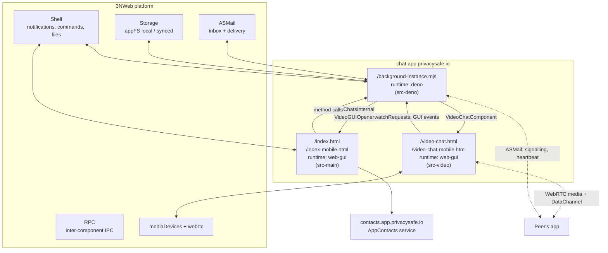

# Chat app architecture — overview (English)

Application version **0.12.2** ([package.json](../package.json), [manifest.json](../manifest.json)).

This is an overview companion to the Russian documentation set. Detailed documents are in Russian:

| Document | Topic |
|---|---|
| [01-components-and-ipc.md](./01-components-and-ipc.md) | Platform components, capabilities, startup order, IPC services, launch commands |
| [02-data-model.md](./02-data-model.md) | Two SQLite databases on 3N storage, table schemas, schema versions, attachment store |
| [03-message-flows.md](./03-message-flows.md) | ASMail chat message formats, receive/send pipelines, delivery statuses |
| [04-multi-device-sync.md](./04-multi-device-sync.md) | Same-user device sync: phantom messages, hybrid logical clock, LWW, tombstones |
| [05-video-calls.md](./05-video-calls.md) | Star-topology video calls (initiator hosts), signalling, SFU relay, heartbeat/re-join |
| [06-ui-architecture.md](./06-ui-architecture.md) | Vue 3 + Pinia, desktop and phone form factors, backend→UI event flow |
| [07-build-test-run.md](./07-build-test-run.md) | Build (Vite + Deno bundle), test app, running on the platform |

## What the app is

Chat is a 3NWeb application with **no server of its own**. Messages travel over **ASMail**, the
platform's asynchronous secure messaging protocol, granted to the app through capabilities
([manifest.json:231-235](../manifest.json#L231-L235)). ASMail knows nothing about chats,
reactions or membership — all of that lives inside the JSON body the app itself composes.

Video calls run over WebRTC in a **Star (START)** topology: the app of whoever started the call
becomes the host and works as a mini-SFU, receiving every client's tracks and relaying them to the
others.

## System map

## Responsibilities

- **`src-deno/`** — the de-facto backend, running in a separate thread (`runtime: deno`,
  [manifest.json:226](../manifest.json#L226)). It solely owns the databases, subscribes to the
  inbox, sends everything outbound, tracks call state and opens call windows. It outlives windows: it
  is launched on system startup ([manifest.json:271-278](../manifest.json#L271-L278)), so new-message
  notifications work with no window open.
- **`src-main/`** — main chat GUI (chat list, conversation, attachments, dialogs). It has no direct
  ASMail access; everything goes through the `AppChatsInternal` IPC service.
- **`src-video/`** — the call window. It is the only component granted `mediaDevices` and `webrtc`
  ([manifest.json:157-164](../manifest.json#L157-L164)); it sends signalling either itself (over the
  ASMail capability granted to it) or through the DataChannel the host opens.
- **`shared-libs/`** — code shared by Deno and browser components: addresses, chat ids, process
  helpers, constants (including the single source of truth for call constants), IPC and SQLite wrappers.
- **`types/`** — chat message formats, view models, IPC contracts; `@types/` — platform `w3n` API
  definitions.

## Three cross-cutting ideas

1. **Everything inbound and outbound goes through the Deno instance.** The GUI never writes to the
   database and never sends ASMail messages directly (the one exception being the call window, which
   sends WebRTC signalling itself). Changes flow back to the GUI as events over `ChatSrv.watch()`.

2. **Databases are not synchronised across devices.** The database files live in *local* FS and are
   saved with `skipUpload: true`
   ([02-data-model.md](./02-data-model.md#11-почему-бд-лежат-в-local-fs)). Writes of a database file
   are batched, with explicit `DB.flush()` calls wherever a change becomes observable outside the
   device. Devices of the same user converge through "phantom" ASMail messages a device sends to
   itself, plus a per-aspect last-write-wins rule.

3. **The inbox is shared by all of the user's devices**, so a message must not be removed right after
   one device processed it. Processed messages are scheduled for deferred removal (15 days,
   [db.ts:34](../shared-libs/constants/db.ts#L34)), so a device that was offline still sees them.

## Conventions

- Code references are written as `[file.ts:42](path#L42)` and are clickable in an IDE.
- Diagrams are mermaid (`flowchart`, `sequenceDiagram`, `stateDiagram-v2`).
- Only implemented behaviour is described; stubs and TODOs are called out explicitly.
