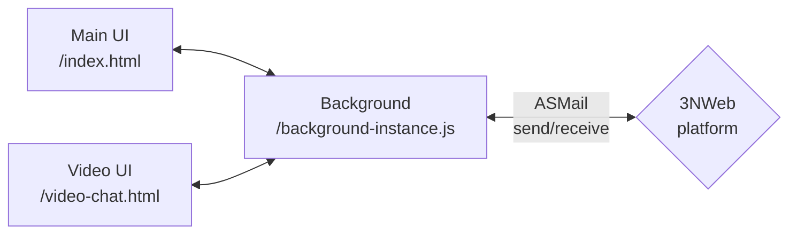

# Architecture docs

Chat is a 3NWeb app that sends messages via ASMail messaging protocol, implemented by 3NWeb platform, and provided in capabilities.

ASMail protocol has no notion of chat-related concepts like rooms, reactions, etc. All these concepts are encapsulated in messages that Background component gives to platform for sending. ["Formats and Processes" docs](./formats-and-processes.md) outline message formats and scenarios.

[Implementation docs](./implementation.md) (should) reflect most notable implementation aspects, reasoning behind, and potential quirks, if such happen.
