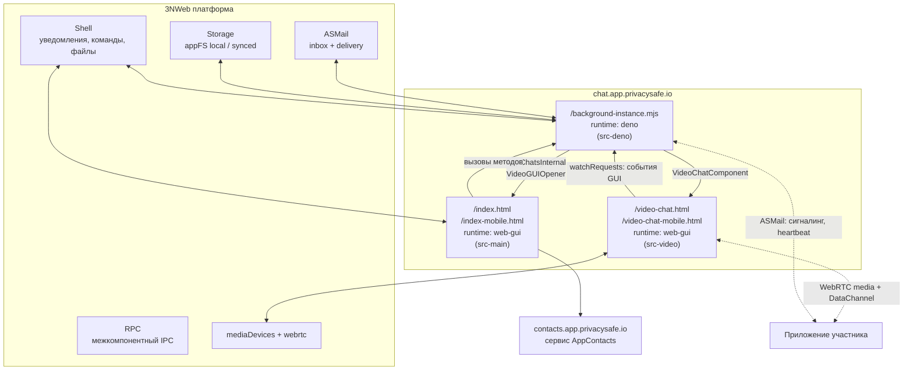

# Архитектура приложения Chat (актуальное состояние)

Версия приложения: **0.12.2** ([package.json](../package.json), [manifest.json](../manifest.json)).
Ветка, по которой составлено описание: `sync-improve`.

Этот набор документов описывает, **как приложение работает сейчас**: из чего состоит, как части
общаются между собой, какие данные хранит и какими сценариями проходят сообщения и звонки. Всё
изложенное выведено из кода; каждое утверждение снабжено ссылкой на файл и строку.

## Оглавление

| Документ | О чём |
|---|---|
| [01-components-and-ipc.md](./01-components-and-ipc.md) | Компоненты платформы, capabilities, порядок старта, IPC-сервисы и их контракты, команды запуска |
| [02-data-model.md](./02-data-model.md) | Две SQLite-БД поверх 3N storage, схемы таблиц, версии схем, хранилище вложений |
| [03-message-flows.md](./03-message-flows.md) | Форматы ASMail-сообщений чата, приём и отправка, статусы доставки, диаграммы сценариев |
| [04-multi-device-sync.md](./04-multi-device-sync.md) | Синхронизация устройств одного пользователя: фантомы, гибридные логические часы, LWW, tombstones |
| [05-video-calls.md](./05-video-calls.md) | Видеозвонки в топологии Star (хостер — инициатор), сигналинг, SFU-ретрансляция, heartbeat/re-join |
| [06-ui-architecture.md](./06-ui-architecture.md) | Vue 3 + Pinia, два формфактора (desktop/phone), поток событий из бекенда в UI |
| [07-build-test-run.md](./07-build-test-run.md) | Сборка (Vite + Deno-бандл), тестовое приложение, запуск на платформе |
| [08-backup-and-restore.md](./08-backup-and-restore.md) | Архив истории на диск и восстановление из него: формат, разделение слоёв, режимы `merge`/`replace`, анонс соседним устройствам |
| [README.en.md](./README.en.md) | Обзорный дубль этого файла на английском |

## Что это за приложение

Chat — приложение 3NWeb. У него нет собственного сервера: сообщения ходят через **ASMail** —
протокол защищённой асинхронной почты, реализованный платформой и выданный приложению в
capabilities ([manifest.json:231-235](../manifest.json#L231-L235)). ASMail не знает ничего о чатах,
реакциях и участниках — все эти понятия живут внутри JSON-тела сообщений, которое формирует само
приложение (см. [03-message-flows.md](./03-message-flows.md)).

Видеозвонки идут по WebRTC. Топология — **Star (START)**: приложение того участника, который начал
звонок, становится хостером и работает как mini-SFU — принимает потоки всех клиентов и
ретранслирует их остальным ([05-video-calls.md](./05-video-calls.md)).

## Карта системы


```mermaid
flowchart TB
  subgraph platform["3NWeb платформа"]
    ASMail["ASMail<br/>inbox + delivery"]
    Storage["Storage<br/>appFS local / synced"]
    Shell["Shell<br/>уведомления, команды, файлы"]
    RPC["RPC<br/>межкомпонентный IPC"]
    Media["mediaDevices + webrtc"]
  end

  subgraph app["chat.app.privacysafe.io"]
    BG["/background-instance.mjs<br/>runtime: deno<br/>(src-deno)"]
    MainGUI["/index.html<br/>/index-mobile.html<br/>runtime: web-gui<br/>(src-main)"]
    VideoGUI["/video-chat.html<br/>/video-chat-mobile.html<br/>runtime: web-gui<br/>(src-video)"]
  end

  Contacts["contacts.app.privacysafe.io<br/>сервис AppContacts"]

  ASMail <--> BG
  Storage <--> BG
  BG -- "AppChatsInternal<br/>VideoGUIOpener" --> MainGUI
  MainGUI -- "вызовы методов" --> BG
  BG -- "VideoChatComponent" --> VideoGUI
  VideoGUI -- "watchRequests: события GUI" --> BG
  MainGUI --> Contacts
  VideoGUI <--> Media
  VideoGUI <-. "WebRTC media + DataChannel" .-> Peer["Приложение участника"]
  BG <-. "ASMail: сигналинг, heartbeat" .-> Peer
  Shell <--> BG
  Shell <--> MainGUI
```

Ключевое разделение ответственности:

- **`src-deno/`** — «условный бекенд» в отдельном потоке (runtime `deno`,
  [manifest.json:226](../manifest.json#L226)). Он единственный владеет базами данных,
  подписан на inbox, отправляет всё исходящее, ведёт состояние звонков и открывает окна
  видеозвонков. Живёт дольше окон: запускается при старте системы
  ([manifest.json:271-278](../manifest.json#L271-L278)), поэтому уведомления о новых сообщениях
  приходят и при закрытом GUI.
- **`src-main/`** — основной GUI чата: список чатов, переписка, вложения, диалоги. Не имеет прямого
  доступа к ASMail: всё через IPC-сервис `AppChatsInternal`.
- **`src-video/`** — отдельное окно звонка. Это единственный компонент с доступом к
  `mediaDevices` и `webrtc` ([manifest.json:157-164](../manifest.json#L157-L164)); сигналинг
  наружу отправляет либо сам (через ASMail-capability, выданную окну), либо по DataChannel,
  открытому хостером.
- **`shared-libs/`** — код, общий для Deno и браузерных компонентов: адреса, id чатов, процессы
  (`SingleProc`, `sleep`, `deferred`), константы (включая единый источник констант звонка),
  обёртки IPC, обёртки SQLite.
- **`types/`** — форматы ASMail-сообщений чата, view-модели, контракты IPC-сервисов;
  `@types/` — определения платформенного API `w3n`.

## Где что искать

```
src-deno/
  index.ts                     точка входа фонового инстанса, порядок старта
  dataset/                     SQLite: messages, chats, sync_versions, orphaned, pending removals
  services/
    chat-service/              ядро чата: приём/создание/изменение/удаление, ipc-expose
      utils/                   по одному модулю на операцию (создание чата, отправка, реакции, …)
        handle-incoming-sync.ts применение фантомов от своих устройств
        sync-versions.ts       LWW: токены, tombstones
    mail-service/              подписка на inbox (inbox-dispatcher) + наблюдение доставки
    mail-sending-service/      примитивы отправки + обработчики прогресса доставки
    video-chat-service/        реестр звонков, heartbeat, CallInChat, открытие окна звонка
    file-store-service/        ссылки на вложения в local FS
    local-data-store/          appDeviceId, watermark inbox, гибридные логические часы
src-main/
  common/                      сторы, composables, компоненты, утилиты (общее для формфакторов)
  desktop/ mobile/             точки входа, роутеры, страницы, заголовки чата
src-video/
  common/services/             host-channel, client-channel, сигналинг, webrtc-utils
  common/store/streams.store.ts состояние звонка в UI
  common/composables/          use-in-calls (оркестратор), use-webrtc-callbacks, use-va-setup
  desktop/ mobile/             точки входа, страницы va-setup и call
shared-libs/  types/  @types/  общий код и типы
tests-app/                     тестовое приложение (Jasmine поверх платформы)
ci/                            сборка Deno-бандла, вспомогательные скрипты
```

## Три сквозные идеи, без которых код не читается

1. **Всё исходящее и входящее проходит через Deno-инстанс.** GUI никогда не пишет в БД и не
   отправляет ASMail-сообщения напрямую (единственное исключение — окно звонка, которое отправляет
   WebRTC-сигналинг само). Изменения возвращаются в GUI событиями через `ChatSrv.watch()`
   ([03-message-flows.md](./03-message-flows.md), [06-ui-architecture.md](./06-ui-architecture.md)).

2. **Базы данных не синхронизируются между устройствами.** Файлы БД лежат в *local* FS и
   сохраняются с `skipUpload: true` ([02-data-model.md](./02-data-model.md#11-почему-бд-лежат-в-local-fs)).
   Состояние на устройствах одного пользователя сходится за счёт «фантомных» ASMail-сообщений,
   которые устройство отправляет само себе, и правила last-write-wins по каждому аспекту сущности
   ([04-multi-device-sync.md](./04-multi-device-sync.md)).

3. **Inbox общий для всех устройств пользователя, поэтому сообщение нельзя удалять сразу после
   обработки.** Обработанные сообщения ставятся в очередь на отложенное удаление (15 дней,
   [db.ts:34](../shared-libs/constants/db.ts#L34)), чтобы устройство, бывшее вне сети, тоже их
   увидело ([02-data-model.md](./02-data-model.md#32-pending_inbox_removals)).

## Соглашения документов

- Ссылки на код даны в виде `[файл.ts:42](путь#L42)` и кликабельны в IDE.
- Диаграммы — mermaid (`flowchart`, `sequenceDiagram`, `stateDiagram-v2`).
- Описывается только реализованное поведение. Там, где в коде стоит заглушка или TODO, это указано
  явно словами «не реализовано» / «заглушка».
