# Chat messages

## Sending/Receiving via ASMail

Chat app uses value `msgType: 'chat'` in `MsgStruct` part of `OutgoingMessage` and `IncomingMessage`.
`jsonBody` field contains main structure of chat message. `jsonBody.chatMessageType` identifies type of message.

Processing of incoming message looks like:

```mermaid
flowchart TD
  nm(new message) --> t1

  t1{{"msgType"}}
  t1 -- is 'chat' --> chatId
  t1 -- is not 'chat' --> e(("🏁"))

  chatId{{"jsonBody.chatId"}}
  chatId -- none, indicating <br> one-to-one chat --> findSingleChat
  chatId -- present, indicating <br> group chat --> findGroupChat

  findSingleChat{{"lookup by sender"}}
  findSingleChat ----> singleChatNotFound
  findSingleChat -- chat found --> chatMsgType

  chatMsgType{{"jsonBody.chatMessageType"}}

  subgraph singleChatNotFound["one-to-one chat not found"]
    singleChatInvite{{"is a chat invitation <br> (system message)"}}
    singleChatInvite -- yes --> processSingleChatInvite
    singleChatInvite -- no --> senderSeen
    processSingleChatInvite("process <br> one-to-one chat <br> invitation")
    processSingleChatInvite --> sE
    sE(("🏁"))
    senderSeen{{"sender has been seen <br> by platform core"}}
    senderSeen -- no --> sE
    senderSeen -- yes --> addSingleChat
    addSingleChat("process as invitation <br> with content message")
    addSingleChat --> sE
  end

  findGroupChat{{"lookup by chatId"}}
  findGroupChat -- chat found --> isMember
  findGroupChat ----> groupChatNotFound

  isMember{{"is sender <br> a chat member"}}
  isMember -- yes --> chatMsgType
  isMember -- no --> e

  subgraph groupChatNotFound["group chat not found"]
    grChatInvite{{"is a chat invitation <br> (system message)"}}
    grChatInvite -- yes --> processGrChatInvite
    grChatInvite -- no --> findGrSender
    processGrChatInvite("process <br> group chat <br> invitation")
    processGrChatInvite --> grE
    findGrSender{{"lookup sender"}}
    findGrSender -- "have chat(s) with" --> sendNotInChat
    findGrSender -- unknown --> grE
    grE(("🏁"))
    sendNotInChat("send not-in-chat <br> system message") --> grE
  end

  chatMsgType -- is 'webrtc-call' --> PW("process WebRTC <br> signalling")
  chatMsgType -- is 'regular' --> PR("process content <br> message")
  chatMsgType -- is 'system' --> PS("process system <br> message")
```

### chats and ids

Chat, or chat room, can be group or one-to-one.

One-to-one chats have no chat ids. It allows for simpler handling, like in mail, plus an introduction stylistic expected in chat apps.

Group chats have ids. Same group of people, chat member, can have different chat rooms, i.e. chats with different ids. It is simpler to have a decision flow just based on id, and additional verification of sender being a member, hence, being allowed to send within chat's context.

### `system` messages

`system` messages are used for communicating state of chat rooms, like renaming, changing participants, etc.

ASMail protocol is just an asychronous transport. It has no concepts of chat rooms. Hence, these are carried with `system` messages.

### `regular` messages

`regular` messages carry content.

### `webrtc-call` messages

`webrtc-call` messages carry signalling to setup WebRTC communication. These are used for both setup video-chat setup messages and standard WebRTC signalling.

## Message sending, receiving and acknowledgement process

## Sites' preview generation (proposal at the moment)

## WebRTC signalling flow

All messages flow via ASMail. Several devices of same user are watching incoming messages in the same inbox. When user picks up call on one of the devices, other one's should stop ringing and ignore other siganlling messages within that call.

```mermaid
sequenceDiagram
  participant R1 as 📱 Romeo's <br> phone
  participant R2 as 💻 Romeo's <br> laptop
  participant J1 as 📱 Juliet's <br> phone
  participant J2 as 💻 Juliet's <br> laptop

  R1 --> R1 : start call

  R1 ->> J1 : message { stage: "start", id: 123 }
  activate J1
  note over J1 : phone ringing
  R1 ->> J2 : message { stage: "start", id: 123 }
  activate J2
  note over J2 : laptop ringing

  J1 --> J1 : picks up call
  deactivate J1

  J1 ->> R1 : { stage: "signalling", id: 123 }
  J1 ->> R2 : { stage: "signalling", id: 123 }
  R2 --> R2 : signal ignored

  R1 ->> J1 : { stage: "signalling", id: 123 }
  R1 ->> J2 : { stage: "signalling", id: 123 }

  deactivate J2
  J2 --> J2 : signal ignored

  R1 -> J1 : { stage: "signalling", id: 123 }
  R1 -> J2 : { stage: "signalling", id: 123 }
  J2 --> J2 : signals ignored

  J1 --> J1 : end call
  J1 ->> R1 : { stage: "disconnect", id: 123 }
  R1 --> R1 : end call
  J1 ->> R2 : { stage: "disconnect", id: 123 }
  R2 --> R2 : signal ignored

```

Simultaneous start of call uses WebRTC's perfect negotiation, with the same choice of roles, based on comparison of canonical addresses of peers. Side with "smaller" canonical address takes polite role:

```mermaid
sequenceDiagram
  participant R as 📱 Romeo's <br> phone
  participant J as 📱 Juliet's <br> phone

  R --> R : start call
  J --> J : start call
  R ->> J : message { stage: "start", id: 123 }
  J ->> R : message { stage: "start", id: 567 }
  note over R,J : "juliet@capulet.it" < "romeo@montague.it" <br> and Juliet's device takes polite role <br> continuing signalling with { id: 123 }
  J ->> R : { stage: "signalling", id: 123 }

```

