# Implementation

This is an architecture documentation. Therefore, there are a lot of diagrams, each with its own context, either structure, or steps flow, or mix of two. Implementation uses Vue, so some places assume reader's familiarity.

Most names used on diagrams should be found in code. Reader may either start with code, and find here what certain part is expected to do. Or, reader may start with document, directed into code by search for names in there.

## Components


### Background component

Background component is a singleton.

```mermaid
flowchart TD
  M[Main UI]

  subgraph B["Background (deno runtime)"]
    IpcChats[["IPC: AppChatsInternal"]]
    D("ChatDeliveryService")
    IpcVideoOpener[["IPC: VideoGUIOpener"]]
    C("ChatService")
    DS("⛁ Dataset")
    VCtrl("ChatCallsController")
    C o--o DS
    C <--> D
    C <--> VCtrl
    IpcChats o--o C
    IpcVideoOpener o----o VCtrl
  end

  M --> IpcVideoOpener
  M --> IpcChats
  C -. invoke via <br> command .-> M

  subgraph VUI["Video UI"]
    IpcVC[[IPC: VideoChatComponent]]
  end

  P{3NWeb <br> platform}

  C -- send <br> chat messages <br> in ASMail messages -----> P
  DS <-- storage --> P
  D <-- observe incoming <br> and outgoing <br> ASMail messages ---> P
  D --"WebRTC <br> signalling"---> VCtrl %% outside of subgraph to order/untangle arrows
  VCtrl-- send <br> WebRTC signaling <br> in ASMail messages --> P
  VCtrl -. invokation .-> IpcVC
  VCtrl <-- WebRTC <br> signalling --> IpcVC

  UD("Other devices <br> 📱 💻")
  W("World <br> 🌐 ")

  P <-- sync via <br> 3NStorage --> UD
  VUI <-- WebRTC --> W
  P <-- ASMail --> W
```

Background watches incoming from platform messages, and sends own messages. It also makes background a natural place for storing data state, as main automatic decisions are done here. Whatever needs human interaction is passed to other components that return back with changes to data state.

[Dataset doc](./dataset.md) talks about implementation of storage and dataset syncing processes that happen within Background component instance.


### Main UI component

Main UI component is singleton that might be off, while background is running.


#### Vue routes in Main UI

Routes on desktop.

```mermaid
flowchart TD
  s(("🟢"))
  chats("/chats") 
  chatN("/chats/[g|s]/:chatId <br> (child route)")

  s --"open Chat app"--> chats
  chats --"select chat"--> chatN
```


Additional states captured by routes on desktop.

```mermaid
flowchart TD
  s(("🟢"))
  subgraph chatsRoute[" "]
    chats("/chats")
    createNewChat("/chats?createNewChat=true <br> (chat creation dialog)")
    chats --"create new chat"--> createNewChat
  end
  subgraph chatNRoute[" "]
    chatN("/chats/[g|s]/:chatId")
    incomingCall("/chats/[g|s]/:chatId?callFrom=... <br> (incoming call dialog)")
    frwdMsg("/chats/[g|s]/:chatId?forwardedMsgId=... <br> (message composing section has <br> a forwarded message)")
    chatN --"forward message <br> (switches from one <br> chat to another)"--> frwdMsg
    frwdMsg -..-> chatN
    incomingCall -..-> chatN
  end

  s --"open Chat app"--> chats
  s --"incoming call <br> (in existing chat)"--> incomingCall
  s --"incoming message <br> (in existing chat)"--> chatN
  createNewChat --"open new chat"----> chatN
  chats --"select chat"--> chatN
```


Proposed for phone form factor.

```mermaid
flowchart TD
  s(("🟢"))
  phoneChats("/phone/chats")
  phoneChatN("/phone/chat/:chatId")

  s --"open Chat app"--> phoneChats
  phoneChats --"select chat"--> phoneChatN
```


Proposed mix of different form factor routes to allow for transitions (🔄) between form factors within the same running instance.

```mermaid
flowchart TD
  subgraph D["desktop form factor"]
    sD(("🟢"))
    chats("/chats")
    chatN("/chats/:chatId <br> (child route)")
    sD --"open Chat app"--> chats
    chats --"select chat"--> chatN
  end

  subgraph P["phone form factor"]
    sP(("🟢"))

    phoneChats("/phone/chats")
    phoneChatN("/phone/chat/:chatId")

    sP --"open Chat app"--> phoneChats
    phoneChats --"select chat"--> phoneChatN
  end

  chats <-."🔄".-> phoneChats

  chatN <-."🔄".-> phoneChatN

```



### Video UI component


#### Vue routes in Video UI, on desktop.
```mermaid
flowchart TD
  s(("🟢"))
  vaSetup("/va-setup <br> (adjusting of <br> video & audio <br> for meeting)")
  call("/call <br> (meeting itself)")

  s --"open on incoming call <br> or to initiate new call"--> vaSetup
  vaSetup --"start/join call"--> call
```


### Flow and processes when receiving messages

```mermaid
flowchart LR
  W("World <br> 🌐 ")
  AS("📬 <br> ASMail server <br> (user's inbox)")
  P{3NWeb <br> platform}

  W --"delivery of <br> new messages"-->AS
  AS --"notifications"--> P
  P <-."listing inbox <br> getting messages".-> AS

  subgraph BC["Background component (deno runtime)"]
    D("ChatDeliveryService")
    C("ChatService")
    DS("⛁ Dataset")
    VCtrl("ChatCallsController")
    ProcInit{{"⚙️ process <br> initial separation"}}
    ProcReg{{"⚙️ process <br> regular content"}}
    ProcSys{{"⚙️ process <br> system message"}}
    ProcInv{{"⚙️ process <br> chat invitation"}}

    D o--o ProcInit
    ProcInit --"webrtc-call"--> VCtrl
    ProcInit --regular, system, invitation <br> messages--> C

    C o--o ProcReg
    ProcReg --> DS
    C o--o ProcSys
    ProcSys --> DS
    C o--o ProcInv
    ProcInv --> DS

  end

  P --"notifications"--> D

  subgraph VUI["Video UI component"]
    IpcVC[[IPC: VideoChatComponent]]
  end

  VCtrl --"new call in <br> existing chat"--> CmdH
  VCtrl -- WebRTC signalling--> IpcVC

  subgraph MC["Main UI component"]
    ChatsSt("ChatsStore")
    V["Views"]
    CmdH(["ChatCommandsHandler"])

    ChatsSt --"Vue's reactivity"--> V
  end

  ProcReg --"update events"---> ChatsSt
  ProcSys --"update events"---> ChatsSt
  ProcInv --"update events"---> ChatsSt

  U(("👨‍💼"))

  V -..- U

```


Note that processing happens in Main UI component, when it is instantiated.


### Flow and processes when sending messages

```mermaid
flowchart LR
  U(("👨‍💼"))

  subgraph MC["Main UI component"]
    V["Views"]
    ChatSt("ChatStore")
    ChatsSt("ChatsStore")

    V --> ChatSt
  end

  U -..-> V

  subgraph BC["Background component (deno runtime)"]
    C("ChatService")
    DS("⛁ Dataset")
    D("ChatDeliveryService")
    ProcObsDeliv{{"⚙️ process <br> observe delivery"}}

    C o--o DS
    C --"messages to send"--> D
  end

  ChatSt <--> C
  ChatsSt <--> C
  ProcObsDeliv --> C

  P{3NWeb <br> platform}
  AS1("📬 <br> ASMail server <br> peer 1")
  AS2("📬 <br> ASMail server <br> peer 2")
  AS3("📬 <br> ASMail server <br> peer N")

  D ----> P
  P-."delivery notifications".-> D
  D -."delivery progress <br> notifications".-> ProcObsDeliv

  P --> AS1
  P --> AS2
  P --> AS3

```


Note that processing happens in Main UI component, when it is instantiated.


## Dataset and processes

Dataset is used as a source of truth on a given device, for a given user.

At high abstraction, all actions in chat can be viewed as additions, removals and updates of data, e.g. addition of a chat or a new message in a chat, update of chat name, edit of a message body, removal of a message. Dataset with database in it performs checks of correctness and of whether action is allowed. Changes are sent to other peers only after okay-ing and recording it in local dataset. Incoming changes are checked and recorded by local dataset before presenting for user view/action.

Pinia stores in Main UI component use ChatService from background component. Methods that get data return stuff in function calls. Methods that change data and trigger processes don't return anything in calls or fail on errors. Updates to data come via events.


### Creating new chat

Side that initiates chat:

```mermaid
sequenceDiagram
  participant V as 📱 views <br> (templates & states)
  participant UI as ⚙️ UI processes <br> (Pinia stores)
  participant C as ⚙️ ChatService
  participant DS as ⛁ Dataset
  participant D as ChatDeliveryService
  participant P as 3NWeb <br> platform

  V ->> UI : create new chat
  UI ->> C : 
  activate C
  C -> DS : 
  activate DS
  C -> DS : Dataset checks consistency of request, <br> saves changes to database, or throws
  deactivate DS
  C ->> UI : call returns void or <br> throws up on failure
  C ->> D : send chat invitation message to peer(s) of new chat
  C --) UI : chat added event <br> ("initiated" status)
  deactivate C
  UI -) V : reactive feedback

  D ->> P : send message to peer(s)
  P ->> D : incoming message(s)
  D ->> C : incoming message (with acceptance of chat invitation)
  activate C
  note over C : handling incoming <br> acceptance of chat invitations

  C -> DS : 
  activate DS
  C -> DS : Check legitimacy of incoming request, <br> save changes to database, or ignore
  deactivate DS
  C --) UI : chat updated event <br> (status changed)
  deactivate C
  UI -) V : reactive feedback
```


Side that accepts/joins chat:

```mermaid
sequenceDiagram
  participant P as 3NWeb <br> platform
  participant D as ChatDeliveryService
  participant DS as ⛁ Dataset <br> (via ChatService)
  participant C as ⚙️ ChatService
  participant UI as ⚙️ UI processes <br> (Pinia stores)
  participant V as 📱 views <br> (templates & states)

  P ->> D : incoming message
  D ->> C : incoming message (with chat invitation)
  activate C
  note over C : handling incoming <br> chat invitations

  C -> DS : 
  activate DS
  C -> DS : Check legitimacy of request, <br> saves change to database, or ignore
  deactivate DS
  C --) UI : chat added event <br> ("invited" status)
  deactivate C

  UI -) V : reactive feedback
  V --> V : user accepts invitation
  V ->> UI : change chat status
  UI ->> C : 
  activate C

  C -> DS : 
  activate DS
  C -> DS : Dataset checks correctness of request, <br> saves changes to database, or throws
  deactivate DS
  C --) UI : chat updated event <br> (status changed)
  C ->> D : send invitation acceptance to peers
  deactivate C
  UI -) V : reactive feedback
  D ->> P : send message to peer(s)
```


Code is structured so that `ChatService` processes sections that run on different sides but within the same feature are located in files of folder `/src-background-instance/chat-service`, with each file dedicated to one feature, like chat creation.


### Sending message in chat

Side that sends regular chat message:


Side that receives regular chat message:

```mermaid
sequenceDiagram
  participant P as 3NWeb <br> platform
  participant D as ChatDeliveryService
  participant DS as ⛁ Dataset <br> (via ChatService)
  participant C as ⚙️ ChatService
  participant UI as ⚙️ UI processes <br> (Pinia stores)
  participant V as 📱 views <br> (templates & states)

  P ->> D : incoming message
  D ->> C : incoming message (with "regular" message)
  activate C
  note over C : handling incoming <br> "regular" messages

  C -> DS : 
  activate DS
  C -> DS : Check legitimacy of request, <br> saves change to database, or ignore
  deactivate DS
  C --) UI : message added event <br> ("unread" status)
  deactivate C

  UI -) V : reactive feedback
  V --> V : user views the message
  V ->> UI : change message status to "read"
  UI ->> C : 
  activate C

  C -> DS : 
  activate DS
  C -> DS : Dataset checks correctness of request, <br> saves changes to database, or throws
  deactivate DS
  C --) UI : message updated event <br> (status changed)
  UI -) V : reactive feedback
  C ->> D : send read receipt system message
  deactivate C
  D ->> P : send message to peer
```



## Testing

In making tests there is always a tension between scope/usefulness and cost of testing. The best test suite is testing system end to end without any mocks. End to end requires emulation of human that clicks/swipes/scrolls and observes graphics. Although doable with webdrivers, this is costly, and 3NWeb platform is not a usual browser, which we also want to implicitly test by running test app.

Vue's compositional code style creates a nice split in views between "human interaction" and "view's state" parts. We follow convention to name view's state creating functions starting with `use`, like `useAppView()`. Such functions are called in respective `vue` files, and in setups of `tests-app`'s test scenarios for "views' states". Mapping between view state and template is mostly declarative in vue template and it doesn't contain complexity that needs lots of testing. Unless, of course, one goes too crazy with CSS. And even then Vue conditionals for CSS can be coded in view's state, hence, be testable in simpler/cheaper test code without webdriver-like machinery.

### tests-app


